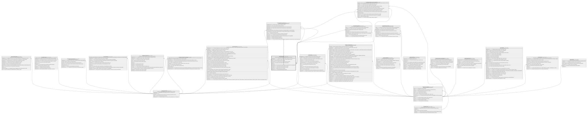

# Boveda.Boveda

## Description

Boveda de efectivo a nivel de agencia (jerarquia propia via auto-referencia).

## Columns

| Name             | Type        | Default                                      | Nullable | Children                                                                                                                                                                                | Parents                                         | Comment                                                                             |
| ---------------- | ----------- | -------------------------------------------- | -------- | --------------------------------------------------------------------------------------------------------------------------------------------------------------------------------------- | ----------------------------------------------- | ----------------------------------------------------------------------------------- |
| CodigoBoveda     | varchar(10) |                                              | false    |                                                                                                                                                                                         |                                                 | Codigo unico de la boveda, usado en transacciones y operaciones del core.           |
| CodigoMoneda     | smallint    | ((840))                                      | false    |                                                                                                                                                                                         | [Catalogo.Monedas](Catalogo.Monedas.md)         | Codigo de la moneda en la que se expresa el saldo de la boveda.                     |
| Estado           | char        | (('A') collate SQL_Latin1_General_CP1_CI_AS) | false    |                                                                                                                                                                                         |                                                 | Estado de la boveda que incluye si esta (I/A).                                      |
| FechaCreacion    | datetime2   | (sysdatetime())                              | false    |                                                                                                                                                                                         |                                                 | Fecha en la que se creo la boveda, usado en reportes.                               |
| IdAgencia        | char        |                                              | false    |                                                                                                                                                                                         | [Organizacion.Agencia](Organizacion.Agencia.md) | FK a Agencia, indica la agencia donde se ubica la boveda.                           |
| IdBoveda         | int         |                                              | false    | [Boveda.Boveda](Boveda.Boveda.md) [Boveda.MovimientoBoveda](Boveda.MovimientoBoveda.md) [Caja.DevolucionesCaja](Caja.DevolucionesCaja.md) [Caja.DotacionesCaja](Caja.DotacionesCaja.md) |                                                 |                                                                                     |
| IdBovedaSuperior | int         |                                              | true     |                                                                                                                                                                                         | [Boveda.Boveda](Boveda.Boveda.md)               | FK a Boveda, indica la boveda superior en la jerarquia (null si es boveda general). |
| LimiteMaximo     | decimal     |                                              | false    |                                                                                                                                                                                         |                                                 | Limite maximo de efectivo permitido en la boveda.                                   |
| LimiteMinimo     | decimal     |                                              | true     |                                                                                                                                                                                         |                                                 | Limite minimo de efectivo permitido en la boveda.                                   |
| SaldoActual      | decimal     | ((0))                                        | false    |                                                                                                                                                                                         |                                                 | Saldo actual de efectivo en la boveda.                                              |
| TipoBoveda       | varchar(10) |                                              | false    |                                                                                                                                                                                         |                                                 | Tipo de boveda (General, Mayor, Menor).                                             |

## Viewpoints

| Name                     | Definition                                       |
| ------------------------ | ------------------------------------------------ |
| [Boveda](viewpoint-4.md) | Efectivo a nivel boveda/agencia (no ventanilla). |

## Constraints

| Name                   | Type        | Definition                                                                                                                 |
| ---------------------- | ----------- | -------------------------------------------------------------------------------------------------------------------------- |
| CK_Boveda_Estado       | CHECK       | CHECK([Estado]='I' OR [Estado]='A')                                                                                        |
| CK_Boveda_Jerarquia    | CHECK       | CHECK([TipoBoveda]='General' AND [IdBovedaSuperior] IS NULL OR [TipoBoveda]<>'General' AND [IdBovedaSuperior] IS NOT NULL) |
| CK_Boveda_Limite       | CHECK       | CHECK([LimiteMaximo]>(0))                                                                                                  |
| CK_Boveda_LimiteMinimo | CHECK       | CHECK([LimiteMinimo] IS NULL OR [LimiteMinimo]>=(0) AND [LimiteMinimo]<[LimiteMaximo])                                     |
| CK_Boveda_Saldo        | CHECK       | CHECK([SaldoActual]>=(0) AND [SaldoActual]<=[LimiteMaximo])                                                                |
| CK_Boveda_Tipo         | CHECK       | CHECK([TipoBoveda]='General' OR [TipoBoveda]='Mayor' OR [TipoBoveda]='Menor')                                              |
| FK_Boveda_Agencia      | FOREIGN KEY | FOREIGN KEY(IdAgencia) REFERENCES Organizacion.Agencia(IdAgencia) ON UPDATE NO_ACTION ON DELETE NO_ACTION                  |
| FK_Boveda_Moneda       | FOREIGN KEY | FOREIGN KEY(CodigoMoneda) REFERENCES Catalogo.Monedas(CodigoMoneda) ON UPDATE NO_ACTION ON DELETE NO_ACTION                |
| FK_Boveda_Superior     | FOREIGN KEY | FOREIGN KEY(IdBovedaSuperior) REFERENCES Boveda.Boveda(IdBoveda) ON UPDATE NO_ACTION ON DELETE NO_ACTION                   |
| PK_Boveda              | PRIMARY KEY | CLUSTERED, unique, part of a PRIMARY KEY constraint, [ IdBoveda ]                                                          |
| UQ_Boveda_Codigo       | UNIQUE      | NONCLUSTERED, unique, part of a UNIQUE constraint, [ CodigoBoveda ]                                                        |

## Indexes

| Name               | Definition                                                          |
| ------------------ | ------------------------------------------------------------------- |
| IX_Boveda_Agencia  | NONCLUSTERED, [ IdAgencia ]                                         |
| IX_Boveda_Superior | NONCLUSTERED, [ IdBovedaSuperior ]                                  |
| PK_Boveda          | CLUSTERED, unique, part of a PRIMARY KEY constraint, [ IdBoveda ]   |
| UQ_Boveda_Codigo   | NONCLUSTERED, unique, part of a UNIQUE constraint, [ CodigoBoveda ] |

## Relations

---

> Generated by [tbls](https://github.com/k1LoW/tbls)
