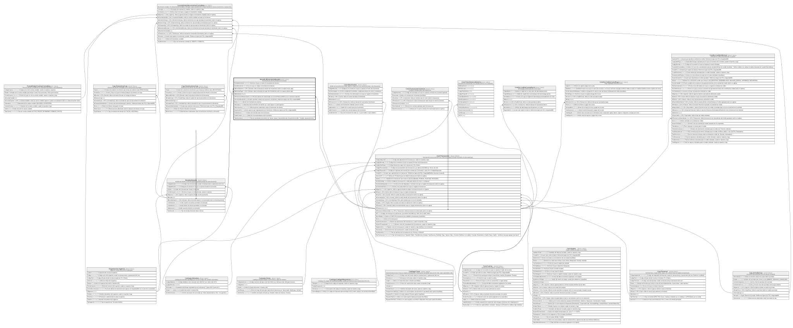

# Boveda.MovimientoBoveda

## Description

Movimiento de efectivo de/hacia una boveda.

## Columns

| Name                     | Type         | Default         | Nullable | Children                                                                  | Parents                                 | Comment                                                                                                            |
| ------------------------ | ------------ | --------------- | -------- | ------------------------------------------------------------------------- | --------------------------------------- | ------------------------------------------------------------------------------------------------------------------ |
| FechaMovimiento          | datetime2    | (sysdatetime()) | false    |                                                                           |                                         | Fecha en la que se realizo el movimiento de efectivo.                                                              |
| HoraMovimiento           | time         |                 | true     |                                                                           |                                         | Hora en la que se realizo el movimiento de efectivo.                                                               |
| IdBovedaDestino          | int          |                 | true     |                                                                           | [Boveda.Boveda](Boveda.Boveda.md)       | FK a Boveda, indica la boveda de destino del movimiento (null si es egreso hacia caja).                            |
| IdBovedaOrigen           | int          |                 | false    |                                                                           | [Boveda.Boveda](Boveda.Boveda.md)       | FK a Boveda, indica la boveda de origen del movimiento (null si es ingreso desde caja).                            |
| IdMovimiento             | bigint       |                 | false    | [Contabilidad.MovimientosContables](Contabilidad.MovimientosContables.md) |                                         |                                                                                                                    |
| IdTransaccionRelacionada | bigint       |                 | true     |                                                                           | [Core.Transaccion](Core.Transaccion.md) | ID de la transaccion relacionada con el movimiento (Verificar si es correcta la relacion).                         |
| IdUsuarioMovimiento      | int          |                 | true     |                                                                           |                                         | Usuario operativo (cajero) que ejecuta el movimiento. Referencia logica (sin FK) a SeguridadDB.                    |
| Monto                    | decimal      |                 | false    |                                                                           |                                         | Monto del movimiento de efectivo.                                                                                  |
| Naturaleza               | char         |                 | false    |                                                                           |                                         | Naturaleza del movimiento de efectivo (ej:' I para Ingreso, E para Egreso').                                       |
| Observaciones            | varchar(300) |                 | true     |                                                                           |                                         | Observaciones adicionales sobre el movimiento de efectivo.                                                         |
| RegistradoPor            | int          |                 | false    |                                                                           |                                         | Jefe de agencia que registra/autoriza el movimiento. Referencia logica (sin FK) a SeguridadDB.                     |
| SaldoAnterior            | decimal      |                 | false    |                                                                           |                                         | Saldo de la boveda antes del movimiento.                                                                           |
| SaldoPosterior           | decimal      |                 | false    |                                                                           |                                         | Saldo de la boveda despues del movimiento.                                                                         |
| TipoMovimiento           | varchar(20)  |                 | false    |                                                                           |                                         | Tipo de movimiento de efectivo (ej:' Ajuste, Arqueo, DepositoBoveda, DesembolsoCredito, Traslado, Abastecimiento). |

## Viewpoints

| Name                     | Definition                                       |
| ------------------------ | ------------------------------------------------ |
| [Boveda](viewpoint-4.md) | Efectivo a nivel boveda/agencia (no ventanilla). |

## Constraints

| Name                              | Type        | Definition                                                                                                                                                                                                     |
| --------------------------------- | ----------- | -------------------------------------------------------------------------------------------------------------------------------------------------------------------------------------------------------------- |
| CK_MovimientoBoveda_Cuadre        | CHECK       | CHECK([Naturaleza]='I' AND [SaldoPosterior]=([SaldoAnterior]+[Monto]) OR [Naturaleza]='E' AND [SaldoPosterior]=([SaldoAnterior]-[Monto]))                                                                      |
| CK_MovimientoBoveda_Desembolso    | CHECK       | CHECK([TipoMovimiento]<>'DesembolsoCredito' OR [IdTransaccionRelacionada] IS NOT NULL)                                                                                                                         |
| CK_MovimientoBoveda_Monto         | CHECK       | CHECK([Monto]>(0))                                                                                                                                                                                             |
| CK_MovimientoBoveda_Naturaleza    | CHECK       | CHECK([Naturaleza]='I' OR [Naturaleza]='E')                                                                                                                                                                    |
| CK_MovimientoBoveda_Saldos        | CHECK       | CHECK([SaldoAnterior]>=(0) AND [SaldoPosterior]>=(0))                                                                                                                                                          |
| CK_MovimientoBoveda_Tipo          | CHECK       | CHECK([TipoMovimiento]='Abastecimiento' OR [TipoMovimiento]='Traslado' OR [TipoMovimiento]='DesembolsoCredito' OR [TipoMovimiento]='DepositoBoveda' OR [TipoMovimiento]='Ajuste' OR [TipoMovimiento]='Arqueo') |
| FK_MovimientoBoveda_BovedaDestino | FOREIGN KEY | FOREIGN KEY(IdBovedaDestino) REFERENCES Boveda.Boveda(IdBoveda) ON UPDATE NO_ACTION ON DELETE NO_ACTION                                                                                                        |
| FK_MovimientoBoveda_BovedaOrigen  | FOREIGN KEY | FOREIGN KEY(IdBovedaOrigen) REFERENCES Boveda.Boveda(IdBoveda) ON UPDATE NO_ACTION ON DELETE NO_ACTION                                                                                                         |
| FK_MovimientoBoveda_Transaccion   | FOREIGN KEY | FOREIGN KEY(IdTransaccionRelacionada) REFERENCES Core.Transaccion(IdTransaccion) ON UPDATE NO_ACTION ON DELETE NO_ACTION                                                                                       |
| PK_MovimientoBoveda               | PRIMARY KEY | CLUSTERED, unique, part of a PRIMARY KEY constraint, [ IdMovimiento ]                                                                                                                                          |

## Indexes

| Name                                   | Definition                                                            |
| -------------------------------------- | --------------------------------------------------------------------- |
| IX_MovimientoBoveda_BovedaOrigen_Fecha | NONCLUSTERED, [ IdBovedaOrigen, FechaMovimiento ]                     |
| IX_MovimientoBoveda_Transaccion        | NONCLUSTERED, [ IdTransaccionRelacionada ]                            |
| PK_MovimientoBoveda                    | CLUSTERED, unique, part of a PRIMARY KEY constraint, [ IdMovimiento ] |

## Relations

---

> Generated by [tbls](https://github.com/k1LoW/tbls)
