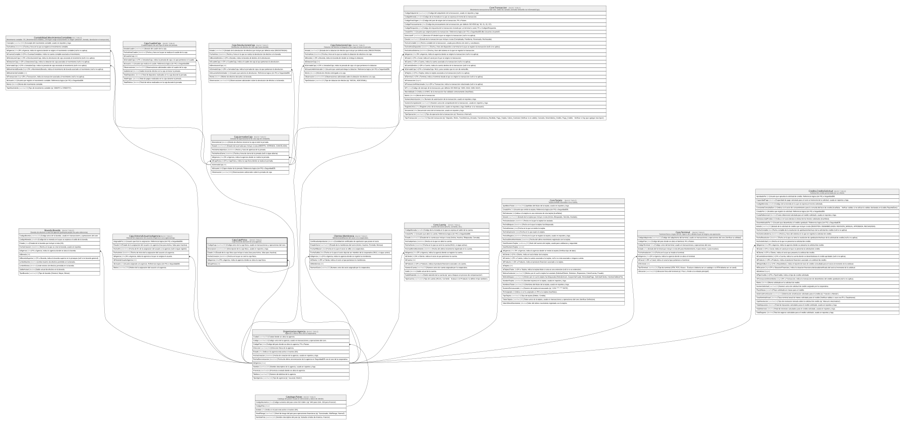

# Caja.CajaFisica

## Description

Caja fisica de atencion en una agencia.

## Columns

| Name          | Type         | Default         | Nullable | Children                                  | Parents                                         | Comment                                                                               |
| ------------- | ------------ | --------------- | -------- | ----------------------------------------- | ----------------------------------------------- | ------------------------------------------------------------------------------------- |
| CodigoCaja    | varchar(30)  |                 | false    |                                           |                                                 | Codigo unico de la caja fisica, usado en transacciones y operaciones del core.        |
| Descripcion   | varchar(150) |                 | true     |                                           |                                                 | Descripcion de la caja fisica, usado en reportes y logs.                              |
| Estado        | bit          | ((1))           | false    |                                           |                                                 | Estado de la caja fisica que incluye si esta (true para Activa, false para Inactiva). |
| FechaCreacion | datetime2    | (sysdatetime()) | false    |                                           |                                                 | Fecha en la que se creó la caja fisica.                                               |
| IdAgencia     | char         |                 | false    |                                           | [Organizacion.Agencia](Organizacion.Agencia.md) | FK a Agencia, indica la agencia donde se ubica la caja fisica.                        |
| IdCajaFisica  | int          |                 | false    | [Caja.JornadasCaja](Caja.JornadasCaja.md) |                                                 |                                                                                       |

## Viewpoints

| Name                   | Definition                                               |
| ---------------------- | -------------------------------------------------------- |
| [Caja](viewpoint-5.md) | Operacion de ventanilla, jornadas, dotaciones y cuadres. |

## Constraints

| Name                         | Type        | Definition                                                                                                |
| ---------------------------- | ----------- | --------------------------------------------------------------------------------------------------------- |
| FK_CajaFisica_Agencia        | FOREIGN KEY | FOREIGN KEY(IdAgencia) REFERENCES Organizacion.Agencia(IdAgencia) ON UPDATE NO_ACTION ON DELETE NO_ACTION |
| PK_CajaFisica                | PRIMARY KEY | CLUSTERED, unique, part of a PRIMARY KEY constraint, [ IdCajaFisica ]                                     |
| UQ_CajaFisica_Agencia_Codigo | UNIQUE      | NONCLUSTERED, unique, part of a UNIQUE constraint, [ IdAgencia, CodigoCaja ]                              |

## Indexes

| Name                         | Definition                                                                   |
| ---------------------------- | ---------------------------------------------------------------------------- |
| PK_CajaFisica                | CLUSTERED, unique, part of a PRIMARY KEY constraint, [ IdCajaFisica ]        |
| UQ_CajaFisica_Agencia_Codigo | NONCLUSTERED, unique, part of a UNIQUE constraint, [ IdAgencia, CodigoCaja ] |

## Relations

---

> Generated by [tbls](https://github.com/k1LoW/tbls)
