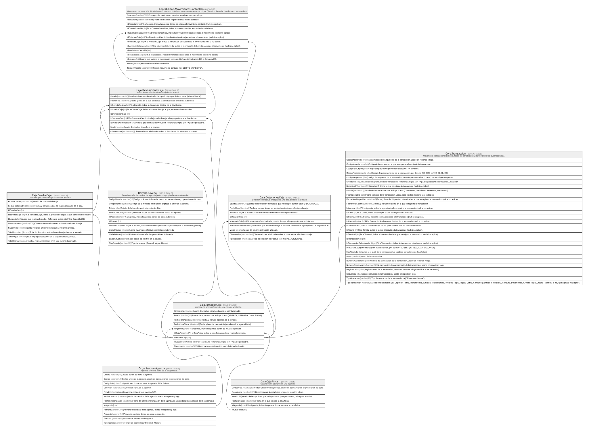

# Caja.CuadreCaja

## Description

Cuadre/arqueo de una caja al cierre de jornada.

## Columns

| Name            | Type         | Default         | Nullable | Children                                          | Parents                                   | Comment                                                                    |
| --------------- | ------------ | --------------- | -------- | ------------------------------------------------- | ----------------------------------------- | -------------------------------------------------------------------------- |
| EstadoCuadre    | varchar(20)  |                 | false    |                                                   |                                           | Estado del cuadre de la caja.                                              |
| FechaHoraCuadre | datetime2    | (sysdatetime()) | false    |                                                   |                                           | Fecha y hora en la que se realiza el cuadre de la caja.                    |
| IdCuadreCaja    | int          |                 | false    | [Caja.DevolucionesCaja](Caja.DevolucionesCaja.md) |                                           |                                                                            |
| IdJornadaCaja   | int          |                 | false    |                                                   | [Caja.JornadasCaja](Caja.JornadasCaja.md) | FK a JornadasCaja, indica la jornada de caja a la que pertenece el cuadre. |
| IdUsuario       | int          |                 | false    |                                                   |                                           | Usuario que realiza el cuadre. Referencia logica (sin FK) a SeguridadDB.   |
| Observaciones   | varchar(500) |                 | true     |                                                   |                                           | Observaciones adicionales sobre el cuadre de la caja.                      |
| SaldoInicial    | decimal      |                 | false    |                                                   |                                           | Saldo inicial de efectivo en la caja al iniciar la jornada.                |
| TotalDepositos  | decimal      | ((0))           | false    |                                                   |                                           | Total de depositos realizados en la caja durante la jornada.               |
| TotalPagos      | decimal      | ((0))           | false    |                                                   |                                           | Total de pagos realizados en la caja durante la jornada.                   |
| TotalRetiros    | decimal      | ((0))           | false    |                                                   |                                           | Total de retiros realizados en la caja durante la jornada.                 |

## Viewpoints

| Name                   | Definition                                               |
| ---------------------- | -------------------------------------------------------- |
| [Caja](viewpoint-5.md) | Operacion de ventanilla, jornadas, dotaciones y cuadres. |

## Constraints

| Name                  | Type        | Definition                                                                                                     |
| --------------------- | ----------- | -------------------------------------------------------------------------------------------------------------- |
| FK_CuadreCaja_Jornada | FOREIGN KEY | FOREIGN KEY(IdJornadaCaja) REFERENCES Caja.JornadasCaja(IdJornadaCaja) ON UPDATE NO_ACTION ON DELETE NO_ACTION |
| PK_CuadreCaja         | PRIMARY KEY | CLUSTERED, unique, part of a PRIMARY KEY constraint, [ IdCuadreCaja ]                                          |
| UQ_CuadreCaja_Jornada | UNIQUE      | NONCLUSTERED, unique, part of a UNIQUE constraint, [ IdJornadaCaja ]                                           |

## Indexes

| Name                  | Definition                                                            |
| --------------------- | --------------------------------------------------------------------- |
| PK_CuadreCaja         | CLUSTERED, unique, part of a PRIMARY KEY constraint, [ IdCuadreCaja ] |
| UQ_CuadreCaja_Jornada | NONCLUSTERED, unique, part of a UNIQUE constraint, [ IdJornadaCaja ]  |

## Relations

---

> Generated by [tbls](https://github.com/k1LoW/tbls)
