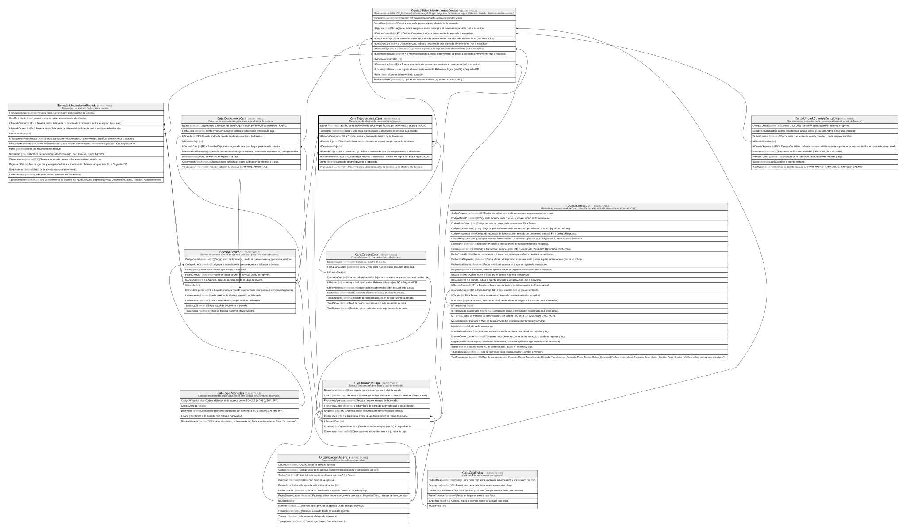

# Caja.DevolucionesCaja

## Description

Devolucion de efectivo de una caja hacia boveda.

## Columns

| Name                   | Type         | Default                                               | Nullable | Children                                                                  | Parents                                   | Comment                                                                         |
| ---------------------- | ------------ | ----------------------------------------------------- | -------- | ------------------------------------------------------------------------- | ----------------------------------------- | ------------------------------------------------------------------------------- |
| Estado                 | varchar(20)  | (('REGISTRADA') collate SQL_Latin1_General_CP1_CI_AS) | false    |                                                                           |                                           | Estado de la devolucion de efectivo que incluye por defecto estar (REGISTRADA). |
| FechaHora              | datetime2    | (sysdatetime())                                       | false    |                                                                           |                                           | Fecha y hora en la que se realiza la devolucion de efectivo a la boveda.        |
| IdBovedaDestino        | int          |                                                       | false    |                                                                           | [Boveda.Boveda](Boveda.Boveda.md)         | FK a Boveda, indica la boveda de destino de la devolucion.                      |
| IdCuadreCaja           | int          |                                                       | false    |                                                                           | [Caja.CuadreCaja](Caja.CuadreCaja.md)     | FK a CuadreCaja, indica el cuadre de caja al que pertenece la devolucion.       |
| IdDevolucionCaja       | int          |                                                       | false    | [Contabilidad.MovimientosContables](Contabilidad.MovimientosContables.md) |                                           |                                                                                 |
| IdJornadaCaja          | int          |                                                       | false    |                                                                           | [Caja.JornadasCaja](Caja.JornadasCaja.md) | FK a JornadasCaja, indica la jornada de caja a la que pertenece la devolucion.  |
| IdUsuarioAdministrador | int          |                                                       | false    |                                                                           |                                           | Usuario que autoriza la devolucion. Referencia logica (sin FK) a SeguridadDB.   |
| Monto                  | decimal      |                                                       | false    |                                                                           |                                           | Monto de efectivo devuelto a la boveda.                                         |
| Observacion            | varchar(500) |                                                       | true     |                                                                           |                                           | Observaciones adicionales sobre la devolucion de efectivo a la boveda.          |

## Viewpoints

| Name                   | Definition                                               |
| ---------------------- | -------------------------------------------------------- |
| [Caja](viewpoint-5.md) | Operacion de ventanilla, jornadas, dotaciones y cuadres. |

## Constraints

| Name                        | Type        | Definition                                                                                                     |
| --------------------------- | ----------- | -------------------------------------------------------------------------------------------------------------- |
| CK_DevolucionesCaja_Monto   | CHECK       | CHECK([Monto]>(0))                                                                                             |
| FK_DevolucionesCaja_Boveda  | FOREIGN KEY | FOREIGN KEY(IdBovedaDestino) REFERENCES Boveda.Boveda(IdBoveda) ON UPDATE NO_ACTION ON DELETE NO_ACTION        |
| FK_DevolucionesCaja_Cuadre  | FOREIGN KEY | FOREIGN KEY(IdCuadreCaja) REFERENCES Caja.CuadreCaja(IdCuadreCaja) ON UPDATE NO_ACTION ON DELETE NO_ACTION     |
| FK_DevolucionesCaja_Jornada | FOREIGN KEY | FOREIGN KEY(IdJornadaCaja) REFERENCES Caja.JornadasCaja(IdJornadaCaja) ON UPDATE NO_ACTION ON DELETE NO_ACTION |
| PK_DevolucionesCaja         | PRIMARY KEY | CLUSTERED, unique, part of a PRIMARY KEY constraint, [ IdDevolucionCaja ]                                      |

## Indexes

| Name                        | Definition                                                                |
| --------------------------- | ------------------------------------------------------------------------- |
| IX_DevolucionesCaja_Boveda  | NONCLUSTERED, [ IdBovedaDestino ]                                         |
| IX_DevolucionesCaja_Cuadre  | NONCLUSTERED, [ IdCuadreCaja ]                                            |
| IX_DevolucionesCaja_Jornada | NONCLUSTERED, [ IdJornadaCaja ]                                           |
| PK_DevolucionesCaja         | CLUSTERED, unique, part of a PRIMARY KEY constraint, [ IdDevolucionCaja ] |

## Relations

---

> Generated by [tbls](https://github.com/k1LoW/tbls)
