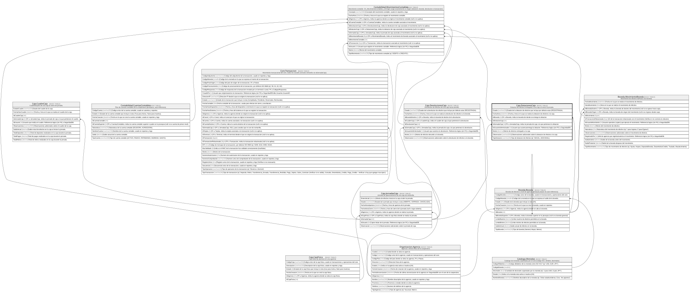

# Caja.DotacionesCaja

## Description

Dotacion de efectivo entregada a una caja al iniciar la jornada.

## Columns

| Name                   | Type         | Default                                               | Nullable | Children                                                                  | Parents                                   | Comment                                                                             |
| ---------------------- | ------------ | ----------------------------------------------------- | -------- | ------------------------------------------------------------------------- | ----------------------------------------- | ----------------------------------------------------------------------------------- |
| Estado                 | varchar(20)  | (('REGISTRADA') collate SQL_Latin1_General_CP1_CI_AS) | false    |                                                                           |                                           | Estado de la dotacion de efectivo que incluye por defecto estar (REGISTRADA).       |
| FechaHora              | datetime2    | (sysdatetime())                                       | false    |                                                                           |                                           | Fecha y hora en la que se realiza la dotacion de efectivo a la caja.                |
| IdBoveda               | int          |                                                       | false    |                                                                           | [Boveda.Boveda](Boveda.Boveda.md)         | FK a Boveda, indica la boveda de donde se entrega la dotacion.                      |
| IdDotacionCaja         | int          |                                                       | false    | [Contabilidad.MovimientosContables](Contabilidad.MovimientosContables.md) |                                           |                                                                                     |
| IdJornadaCaja          | int          |                                                       | false    |                                                                           | [Caja.JornadasCaja](Caja.JornadasCaja.md) | FK a JornadasCaja, indica la jornada de caja a la que pertenece la dotacion.        |
| IdUsuarioAdministrador | int          |                                                       | false    |                                                                           |                                           | Usuario que autoriza/entrega la dotacion. Referencia logica (sin FK) a SeguridadDB. |
| Monto                  | decimal      |                                                       | false    |                                                                           |                                           | Monto de efectivo entregado a la caja.                                              |
| Observacion            | varchar(500) |                                                       | true     |                                                                           |                                           | Observaciones adicionales sobre la dotacion de efectivo a la caja.                  |
| TipoDotacion           | varchar(20)  |                                                       | false    |                                                                           |                                           | Tipo de dotacion de efectivo (ej:' INICIAL, ADICIONAL).                             |

## Viewpoints

| Name                   | Definition                                               |
| ---------------------- | -------------------------------------------------------- |
| [Caja](viewpoint-5.md) | Operacion de ventanilla, jornadas, dotaciones y cuadres. |

## Constraints

| Name                      | Type        | Definition                                                                                                     |
| ------------------------- | ----------- | -------------------------------------------------------------------------------------------------------------- |
| CK_DotacionesCaja_Monto   | CHECK       | CHECK([Monto]>(0))                                                                                             |
| CK_DotacionesCaja_Tipo    | CHECK       | CHECK([TipoDotacion]='INICIAL' OR [TipoDotacion]='ADICIONAL')                                                  |
| FK_DotacionesCaja_Boveda  | FOREIGN KEY | FOREIGN KEY(IdBoveda) REFERENCES Boveda.Boveda(IdBoveda) ON UPDATE NO_ACTION ON DELETE NO_ACTION               |
| FK_DotacionesCaja_Jornada | FOREIGN KEY | FOREIGN KEY(IdJornadaCaja) REFERENCES Caja.JornadasCaja(IdJornadaCaja) ON UPDATE NO_ACTION ON DELETE NO_ACTION |
| PK_DotacionesCaja         | PRIMARY KEY | CLUSTERED, unique, part of a PRIMARY KEY constraint, [ IdDotacionCaja ]                                        |

## Indexes

| Name                      | Definition                                                              |
| ------------------------- | ----------------------------------------------------------------------- |
| IX_DotacionesCaja_Boveda  | NONCLUSTERED, [ IdBoveda ]                                              |
| IX_DotacionesCaja_Jornada | NONCLUSTERED, [ IdJornadaCaja ]                                         |
| PK_DotacionesCaja         | CLUSTERED, unique, part of a PRIMARY KEY constraint, [ IdDotacionCaja ] |

## Relations

---

> Generated by [tbls](https://github.com/k1LoW/tbls)
