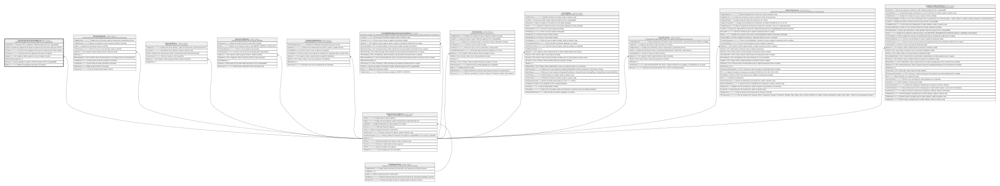

# Caja.HistorialUsuariosAgencia

## Description

Historial de asignacion de usuarios (cajeros) a una agencia/caja.

## Columns

| Name                      | Type         | Default | Nullable | Children | Parents                                         | Comment                                                                                   |
| ------------------------- | ------------ | ------- | -------- | -------- | ----------------------------------------------- | ----------------------------------------------------------------------------------------- |
| AsignadoPor               | int          |         | true     |          |                                                 | Usuario que hizo la asignacion. Referencia logica (sin FK) a SeguridadDB.                 |
| Estado                    | bit          | ((1))   | false    |          |                                                 | Estado de la asignacion del usuario a la agencia (true para Activa, false para Inactiva). |
| FechaFin                  | datetime2    |         | true     |          |                                                 | Fecha de fin de la asignacion del usuario a la agencia (null si sigue vigente).           |
| FechaInicio               | datetime2    |         | false    |          |                                                 | Fecha de inicio de la asignacion del usuario a la agencia.                                |
| IdAgencia                 | char         |         | false    |          | [Organizacion.Agencia](Organizacion.Agencia.md) | FK a Agencia, indica la agencia a la que se asigna el usuario.                            |
| IdHistorialUsuarioAgencia | int          |         | false    |          |                                                 |                                                                                           |
| IdUsuario                 | int          |         | false    |          |                                                 | Usuario asignado a la agencia. Referencia logica (sin FK) a SeguridadDB.                  |
| Motivo                    | varchar(250) |         | true     |          |                                                 | Motivo de la asignacion del usuario a la agencia.                                         |

## Viewpoints

| Name                   | Definition                                               |
| ---------------------- | -------------------------------------------------------- |
| [Caja](viewpoint-5.md) | Operacion de ventanilla, jornadas, dotaciones y cuadres. |

## Constraints

| Name                                | Type        | Definition                                                                                                |
| ----------------------------------- | ----------- | --------------------------------------------------------------------------------------------------------- |
| CK_HistorialUsuariosAgencia_Fechas  | CHECK       | CHECK([FechaFin] IS NULL OR [FechaFin]>=[FechaInicio])                                                    |
| FK_HistorialUsuariosAgencia_Agencia | FOREIGN KEY | FOREIGN KEY(IdAgencia) REFERENCES Organizacion.Agencia(IdAgencia) ON UPDATE NO_ACTION ON DELETE NO_ACTION |
| PK_HistorialUsuariosAgencia         | PRIMARY KEY | CLUSTERED, unique, part of a PRIMARY KEY constraint, [ IdHistorialUsuarioAgencia ]                        |

## Indexes

| Name                                | Definition                                                                         |
| ----------------------------------- | ---------------------------------------------------------------------------------- |
| IX_HistorialUsuariosAgencia_Agencia | NONCLUSTERED, [ IdAgencia ]                                                        |
| PK_HistorialUsuariosAgencia         | CLUSTERED, unique, part of a PRIMARY KEY constraint, [ IdHistorialUsuarioAgencia ] |

## Relations

---

> Generated by [tbls](https://github.com/k1LoW/tbls)
