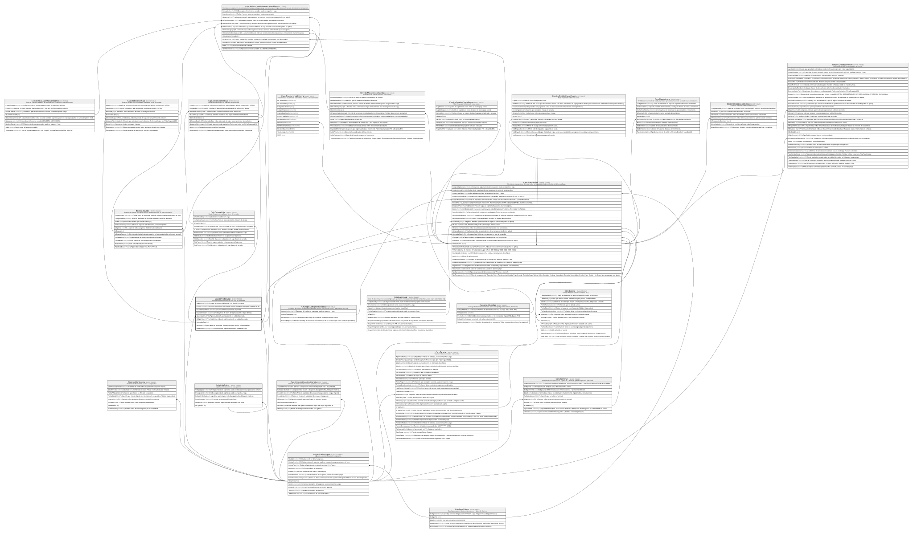

# Caja.JornadasCaja

## Description

Jornada de apertura/cierre de una caja de ventanilla.

## Columns

| Name              | Type         | Default                                            | Nullable | Children                                                                                                                                                                                                                                                | Parents                                         | Comment                                                                 |
| ----------------- | ------------ | -------------------------------------------------- | -------- | ------------------------------------------------------------------------------------------------------------------------------------------------------------------------------------------------------------------------------------------------------- | ----------------------------------------------- | ----------------------------------------------------------------------- |
| DineroInicial     | decimal      |                                                    | false    |                                                                                                                                                                                                                                                         |                                                 | Monto de efectivo inicial en la caja al abrir la jornada.               |
| Estado            | varchar(20)  | (('ABIERTA') collate SQL_Latin1_General_CP1_CI_AS) | false    |                                                                                                                                                                                                                                                         |                                                 | Estado de la jornada que incluye si esta (ABIERTA, CERRADA, CANCELADA). |
| FechaHoraApertura | datetime2    | (sysdatetime())                                    | false    |                                                                                                                                                                                                                                                         |                                                 | Fecha y hora de apertura de la jornada.                                 |
| FechaHoraCierre   | datetime2    |                                                    | true     |                                                                                                                                                                                                                                                         |                                                 | Fecha y hora de cierre de la jornada (null si sigue abierta).           |
| IdAgencia         | char         |                                                    | false    |                                                                                                                                                                                                                                                         | [Organizacion.Agencia](Organizacion.Agencia.md) | FK a Agencia, indica la agencia donde se realiza la jornada.            |
| IdCajaFisica      | int          |                                                    | false    |                                                                                                                                                                                                                                                         | [Caja.CajaFisica](Caja.CajaFisica.md)           | FK a CajaFisica, indica la caja fisica donde se realiza la jornada.     |
| IdJornadaCaja     | int          |                                                    | false    | [Caja.CuadreCaja](Caja.CuadreCaja.md) [Caja.DevolucionesCaja](Caja.DevolucionesCaja.md) [Caja.DotacionesCaja](Caja.DotacionesCaja.md) [Contabilidad.MovimientosContables](Contabilidad.MovimientosContables.md) [Core.Transaccion](Core.Transaccion.md) |                                                 |                                                                         |
| IdUsuario         | int          |                                                    | false    |                                                                                                                                                                                                                                                         |                                                 | Cajero titular de la jornada. Referencia logica (sin FK) a SeguridadDB. |
| Observacion       | varchar(500) |                                                    | true     |                                                                                                                                                                                                                                                         |                                                 | Observaciones adicionales sobre la jornada de caja.                     |

## Viewpoints

| Name                   | Definition                                               |
| ---------------------- | -------------------------------------------------------- |
| [Caja](viewpoint-5.md) | Operacion de ventanilla, jornadas, dotaciones y cuadres. |

## Constraints

| Name                          | Type        | Definition                                                                                                 |
| ----------------------------- | ----------- | ---------------------------------------------------------------------------------------------------------- |
| CK_JornadasCaja_DineroInicial | CHECK       | CHECK([DineroInicial]>=(0))                                                                                |
| CK_JornadasCaja_Estado        | CHECK       | CHECK([Estado]='ABIERTA' OR [Estado]='CERRADA' OR [Estado]='CANCELADA')                                    |
| CK_JornadasCaja_Fechas        | CHECK       | CHECK([FechaHoraCierre] IS NULL OR [FechaHoraCierre]>=[FechaHoraApertura])                                 |
| FK_JornadasCaja_Agencia       | FOREIGN KEY | FOREIGN KEY(IdAgencia) REFERENCES Organizacion.Agencia(IdAgencia) ON UPDATE NO_ACTION ON DELETE NO_ACTION  |
| FK_JornadasCaja_Caja          | FOREIGN KEY | FOREIGN KEY(IdCajaFisica) REFERENCES Caja.CajaFisica(IdCajaFisica) ON UPDATE NO_ACTION ON DELETE NO_ACTION |
| PK_JornadasCaja               | PRIMARY KEY | CLUSTERED, unique, part of a PRIMARY KEY constraint, [ IdJornadaCaja ]                                     |

## Indexes

| Name                            | Definition                                                             |
| ------------------------------- | ---------------------------------------------------------------------- |
| IX_JornadasCaja_Agencia         | NONCLUSTERED, [ IdAgencia ]                                            |
| PK_JornadasCaja                 | CLUSTERED, unique, part of a PRIMARY KEY constraint, [ IdJornadaCaja ] |
| UX_JornadasCaja_Caja_Abierta    | NONCLUSTERED, unique, [ IdCajaFisica ]                                 |
| UX_JornadasCaja_Usuario_Abierta | NONCLUSTERED, unique, [ IdUsuario ]                                    |

## Relations

---

> Generated by [tbls](https://github.com/k1LoW/tbls)
