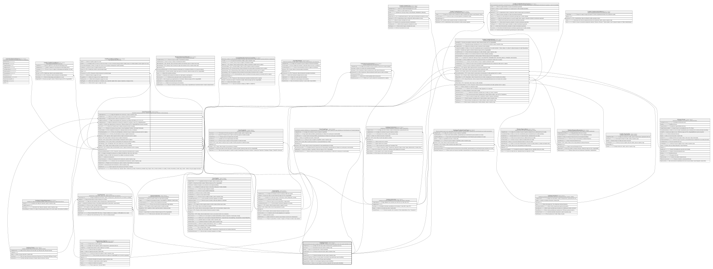

# Catalogo.Canal

## Description

Canal de atencion por el que se origina una operacion o transaccion (ventanilla, banca movil, web, cajero automatico, etc).

## Columns

| Name                | Type         | Default                                      | Nullable | Children                                                                                                                                                                                                                                                                                                              | Parents | Comment                                                                                |
| ------------------- | ------------ | -------------------------------------------- | -------- | --------------------------------------------------------------------------------------------------------------------------------------------------------------------------------------------------------------------------------------------------------------------------------------------------------------------- | ------- | -------------------------------------------------------------------------------------- |
| CodigoCanal         | varchar(10)  |                                              | false    |                                                                                                                                                                                                                                                                                                                       |         | Codigo unico del canal, usado en transacciones y operaciones del core.                 |
| Descripcion         | varchar(200) |                                              | true     |                                                                                                                                                                                                                                                                                                                       |         | Descripcion del canal, usado en reportes y logs.                                       |
| Estado              | char         | (('A') collate SQL_Latin1_General_CP1_CI_AS) | false    |                                                                                                                                                                                                                                                                                                                       |         | Indica si el canal esta activo o inactivo (true/false).                                |
| FechaCreacion       | datetime2    | (sysdatetime())                              | false    |                                                                                                                                                                                                                                                                                                                       |         | Fecha de creacion del canal, usado en reportes y logs.                                 |
| IdCanal             | int          |                                              | false    | [Catalogo.Comisiones](Catalogo.Comisiones.md) [Catalogo.ProductoCanalCupo](Catalogo.ProductoCanalCupo.md) [Core.CanalCupo](Core.CanalCupo.md) [Core.TarjetaHis](Core.TarjetaHis.md) [Core.Terminal](Core.Terminal.md) [Core.Transaccion](Core.Transaccion.md) [Credito.CreditoSolicitud](Credito.CreditoSolicitud.md) |         |                                                                                        |
| NombreCanal         | varchar(50)  |                                              | false    |                                                                                                                                                                                                                                                                                                                       |         | Nombre descriptivo del canal, usado en reportes y logs.                                |
| RequiereJornadaCaja | bit          | ((0))                                        | false    |                                                                                                                                                                                                                                                                                                                       |         | Indica si el canal requiere una jornada de caja abierta para operar (true/false).      |
| RequierePin         | bit          | ((0))                                        | false    |                                                                                                                                                                                                                                                                                                                       |         | Indica si el canal requiere PIN para operar (true/false).                              |
| RequiereTarjeta     | bit          | ((0))                                        | false    |                                                                                                                                                                                                                                                                                                                       |         | Indica si el canal requiere tarjeta para operar (true/false).                          |
| RequiereTerminal    | bit          | ((0))                                        | false    |                                                                                                                                                                                                                                                                                                                       |         | Indica si el canal requiere un terminal o dispositivo fisico para operar (true/false). |

## Viewpoints

| Name                       | Definition                                                            |
| -------------------------- | --------------------------------------------------------------------- |
| [Catalogo](viewpoint-0.md) | Catalogos y dominios transversales compartidos por todos los modulos. |

## Constraints

| Name            | Type        | Definition                                                         |
| --------------- | ----------- | ------------------------------------------------------------------ |
| CK_Canal_Estado | CHECK       | CHECK([Estado]='I' OR [Estado]='A')                                |
| CK_Canal_Pin    | CHECK       | CHECK([RequierePin]=(0) OR [RequiereTarjeta]=(1))                  |
| PK_Canal        | PRIMARY KEY | CLUSTERED, unique, part of a PRIMARY KEY constraint, [ IdCanal ]   |
| UQ_Canal_Codigo | UNIQUE      | NONCLUSTERED, unique, part of a UNIQUE constraint, [ CodigoCanal ] |
| UQ_Canal_Nombre | UNIQUE      | NONCLUSTERED, unique, part of a UNIQUE constraint, [ NombreCanal ] |

## Indexes

| Name            | Definition                                                         |
| --------------- | ------------------------------------------------------------------ |
| PK_Canal        | CLUSTERED, unique, part of a PRIMARY KEY constraint, [ IdCanal ]   |
| UQ_Canal_Codigo | NONCLUSTERED, unique, part of a UNIQUE constraint, [ CodigoCanal ] |
| UQ_Canal_Nombre | NONCLUSTERED, unique, part of a UNIQUE constraint, [ NombreCanal ] |

## Relations

---

> Generated by [tbls](https://github.com/k1LoW/tbls)
