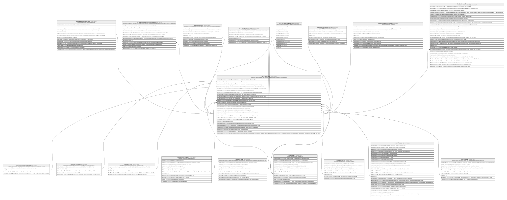

# Catalogo.CodigosRespuesta

## Description

Catalogo de codigos de respuesta/resultado usados por transacciones y operaciones del core.

## Columns

| Name            | Type         | Default | Nullable | Children                                | Parents | Comment                                                                                             |
| --------------- | ------------ | ------- | -------- | --------------------------------------- | ------- | --------------------------------------------------------------------------------------------------- |
| Categoria       | varchar(20)  |         | false    |                                         |         | Categoria del codigo de respuesta, usado en reportes y logs.                                        |
| CodigoRespuesta | char         |         | false    | [Core.Transaccion](Core.Transaccion.md) |         |                                                                                                     |
| Descripcion     | varchar(100) |         | false    |                                         |         | Descripcion del codigo de respuesta, usado en reportes y logs.                                      |
| GeneraBloqueo   | bit          | ((0))   | false    |                                         |         | Indica si el codigo de respuesta genera bloqueo de la cuenta, tarjeta u otro producto (true/false). |

## Viewpoints

| Name                       | Definition                                                            |
| -------------------------- | --------------------------------------------------------------------- |
| [Catalogo](viewpoint-0.md) | Catalogos y dominios transversales compartidos por todos los modulos. |

## Constraints

| Name                          | Type        | Definition                                                                                                                                                                                  |
| ----------------------------- | ----------- | ------------------------------------------------------------------------------------------------------------------------------------------------------------------------------------------- |
| CK_CodigosRespuesta_Categoria | CHECK       | CHECK([Categoria]='ErrorSistema' OR [Categoria]='RechazoLimite' OR [Categoria]='RechazoSeguridad' OR [Categoria]='RechazoTarjeta' OR [Categoria]='RechazoFondos' OR [Categoria]='Aprobada') |
| PK_CodigosRespuesta           | PRIMARY KEY | CLUSTERED, unique, part of a PRIMARY KEY constraint, [ CodigoRespuesta ]                                                                                                                    |

## Indexes

| Name                | Definition                                                               |
| ------------------- | ------------------------------------------------------------------------ |
| PK_CodigosRespuesta | CLUSTERED, unique, part of a PRIMARY KEY constraint, [ CodigoRespuesta ] |

## Relations

---

> Generated by [tbls](https://github.com/k1LoW/tbls)
