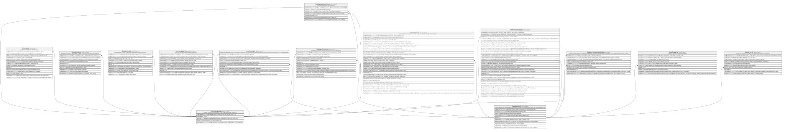

# Catalogo.Comisiones

## Description

Catalogo de comisiones aplicables a productos, canales u operaciones.

## Columns

| Name           | Type         | Default                                      | Nullable | Children                                                | Parents                                 | Comment                                                                                                             |
| -------------- | ------------ | -------------------------------------------- | -------- | ------------------------------------------------------- | --------------------------------------- | ------------------------------------------------------------------------------------------------------------------- |
| CodigoComision | varchar(10)  |                                              | false    |                                                         |                                         | Codigo unico de la comision, usado en transacciones y operaciones del core.                                         |
| CodigoMoneda   | smallint     | ((840))                                      | false    |                                                         | [Catalogo.Monedas](Catalogo.Monedas.md) | Codigo de la moneda en la que se expresa la comision.                                                               |
| Descripcion    | varchar(250) |                                              | true     |                                                         |                                         | Descripcion de la comision, usado en reportes y logs.                                                               |
| Estado         | char         | (('A') collate SQL_Latin1_General_CP1_CI_AS) | false    |                                                         |                                         | Indica si la comision esta activa o inactiva (I/A).                                                                 |
| IdCanal        | int          |                                              | true     |                                                         | [Catalogo.Canal](Catalogo.Canal.md)     | FK a Canal, indica el canal al que aplica la comision.                                                              |
| IdComision     | int          |                                              | false    | [Core.TransaccionComision](Core.TransaccionComision.md) |                                         |                                                                                                                     |
| MontoMaximo    | decimal      |                                              | true     |                                                         |                                         | Monto maximo de la comision.                                                                                        |
| MontoMinimo    | decimal      |                                              | true     |                                                         |                                         | Monto minimo de la comision.                                                                                        |
| TipoCalculo    | varchar(10)  |                                              | false    |                                                         |                                         | Tipo de calculo de la comision (ej:' Porcentaje o Fijo').                                                           |
| TipoComision   | varchar(30)  |                                              | false    |                                                         |                                         | Tipo de comision (ej:' Retiro, Transferencia, Reposicion Tarjeta, Emision Tarjeta, Mantenimiento, Consulta, Otro'). |
| Valor          | decimal      |                                              | false    |                                                         |                                         | Valor de la comision (ej:' 0.5 para 0.5% o 1000 para 1000 unidades de la moneda').                                  |
| VigenciaDesde  | date         |                                              | false    |                                                         |                                         | Fecha desde la cual la comision esta vigente.                                                                       |
| VigenciaHasta  | date         |                                              | true     |                                                         |                                         | Fecha hasta la cual la comision esta vigente.                                                                       |

## Viewpoints

| Name                       | Definition                                                            |
| -------------------------- | --------------------------------------------------------------------- |
| [Catalogo](viewpoint-0.md) | Catalogos y dominios transversales compartidos por todos los modulos. |

## Constraints

| Name                     | Type        | Definition                                                                                                                                                                                                                          |
| ------------------------ | ----------- | ----------------------------------------------------------------------------------------------------------------------------------------------------------------------------------------------------------------------------------- |
| CK_Comisiones_Calculo    | CHECK       | CHECK([TipoCalculo]='Porcentaje' OR [TipoCalculo]='Fijo')                                                                                                                                                                           |
| CK_Comisiones_Estado     | CHECK       | CHECK([Estado]='I' OR [Estado]='A')                                                                                                                                                                                                 |
| CK_Comisiones_Porcentaje | CHECK       | CHECK([TipoCalculo]<>'Porcentaje' OR [Valor]<=(100))                                                                                                                                                                                |
| CK_Comisiones_Rango      | CHECK       | CHECK([MontoMinimo] IS NULL OR [MontoMaximo] IS NULL OR [MontoMaximo]>=[MontoMinimo])                                                                                                                                               |
| CK_Comisiones_Tipo       | CHECK       | CHECK([TipoComision]='Otro' OR [TipoComision]='Consulta' OR [TipoComision]='Mantenimiento' OR [TipoComision]='Reposicion Tarjeta' OR [TipoComision]='Emision Tarjeta' OR [TipoComision]='Retiro' OR [TipoComision]='Transferencia') |
| CK_Comisiones_Valor      | CHECK       | CHECK([Valor]>=(0))                                                                                                                                                                                                                 |
| CK_Comisiones_Vigencia   | CHECK       | CHECK([VigenciaHasta] IS NULL OR [VigenciaHasta]>[VigenciaDesde])                                                                                                                                                                   |
| FK_Comisiones_Canal      | FOREIGN KEY | FOREIGN KEY(IdCanal) REFERENCES Catalogo.Canal(IdCanal) ON UPDATE NO_ACTION ON DELETE NO_ACTION                                                                                                                                     |
| FK_Comisiones_Moneda     | FOREIGN KEY | FOREIGN KEY(CodigoMoneda) REFERENCES Catalogo.Monedas(CodigoMoneda) ON UPDATE NO_ACTION ON DELETE NO_ACTION                                                                                                                         |
| PK_Comisiones            | PRIMARY KEY | CLUSTERED, unique, part of a PRIMARY KEY constraint, [ IdComision ]                                                                                                                                                                 |
| UQ_Comisiones_Codigo     | UNIQUE      | NONCLUSTERED, unique, part of a UNIQUE constraint, [ CodigoComision ]                                                                                                                                                               |

## Indexes

| Name                  | Definition                                                            |
| --------------------- | --------------------------------------------------------------------- |
| IX_Comisiones_IdCanal | NONCLUSTERED, [ IdCanal ]                                             |
| PK_Comisiones         | CLUSTERED, unique, part of a PRIMARY KEY constraint, [ IdComision ]   |
| UQ_Comisiones_Codigo  | NONCLUSTERED, unique, part of a UNIQUE constraint, [ CodigoComision ] |

## Relations

---

> Generated by [tbls](https://github.com/k1LoW/tbls)
