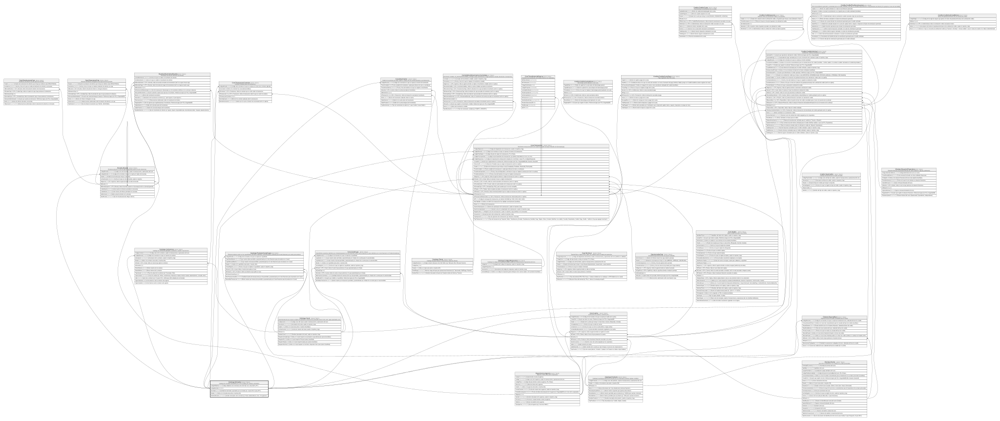

# Catalogo.Monedas

## Description

Catalogo de monedas soportadas por el core (codigo ISO, simbolo, decimales).

## Columns

| Name             | Type        | Default                                      | Nullable | Children                                                                                                                                                                                                                                                                                                                                                                                                                                                    | Parents | Comment                                                                          |
| ---------------- | ----------- | -------------------------------------------- | -------- | ----------------------------------------------------------------------------------------------------------------------------------------------------------------------------------------------------------------------------------------------------------------------------------------------------------------------------------------------------------------------------------------------------------------------------------------------------------- | ------- | -------------------------------------------------------------------------------- |
| CodigoAlfabetico | char        |                                              | false    |                                                                                                                                                                                                                                                                                                                                                                                                                                                             |         | Codigo alfabetico de la moneda como ISO 4217 (ej:' USD, EUR, JPY').              |
| CodigoMoneda     | smallint    |                                              | false    | [Boveda.Boveda](Boveda.Boveda.md) [Catalogo.Comisiones](Catalogo.Comisiones.md) [Catalogo.ProductoCanalCupo](Catalogo.ProductoCanalCupo.md) [Clientes.ReporteBuro](Clientes.ReporteBuro.md) [Core.CanalCupo](Core.CanalCupo.md) [Core.Cuenta](Core.Cuenta.md) [Core.Movimiento](Core.Movimiento.md) [Core.Transaccion](Core.Transaccion.md) [Core.TransaccionComision](Core.TransaccionComision.md) [Credito.CreditoSolicitud](Credito.CreditoSolicitud.md) |         |                                                                                  |
| Decimales        | tinyint     | ((2))                                        | false    |                                                                                                                                                                                                                                                                                                                                                                                                                                                             |         | Cantidad de decimales soportados por la moneda (ej:' 2 para USD, 0 para JPY').   |
| Estado           | char        | (('A') collate SQL_Latin1_General_CP1_CI_AS) | false    |                                                                                                                                                                                                                                                                                                                                                                                                                                                             |         | Indica si la moneda esta activa o inactiva (I/A).                                |
| NombreMoneda     | varchar(50) |                                              | false    |                                                                                                                                                                                                                                                                                                                                                                                                                                                             |         | Nombre descriptivo de la moneda (ej:' Dolar estadounidense, Euro, Yen japones'). |

## Viewpoints

| Name                       | Definition                                                            |
| -------------------------- | --------------------------------------------------------------------- |
| [Catalogo](viewpoint-0.md) | Catalogos y dominios transversales compartidos por todos los modulos. |

## Constraints

| Name                  | Type        | Definition                                                              |
| --------------------- | ----------- | ----------------------------------------------------------------------- |
| CK_Monedas_Decimales  | CHECK       | CHECK([Decimales]>=(0) AND [Decimales]<=(4))                            |
| CK_Monedas_Estado     | CHECK       | CHECK([Estado]='I' OR [Estado]='A')                                     |
| PK_Monedas            | PRIMARY KEY | CLUSTERED, unique, part of a PRIMARY KEY constraint, [ CodigoMoneda ]   |
| UQ_Monedas_Alfabetico | UNIQUE      | NONCLUSTERED, unique, part of a UNIQUE constraint, [ CodigoAlfabetico ] |

## Indexes

| Name                  | Definition                                                              |
| --------------------- | ----------------------------------------------------------------------- |
| PK_Monedas            | CLUSTERED, unique, part of a PRIMARY KEY constraint, [ CodigoMoneda ]   |
| UQ_Monedas_Alfabetico | NONCLUSTERED, unique, part of a UNIQUE constraint, [ CodigoAlfabetico ] |

## Relations

---

> Generated by [tbls](https://github.com/k1LoW/tbls)
