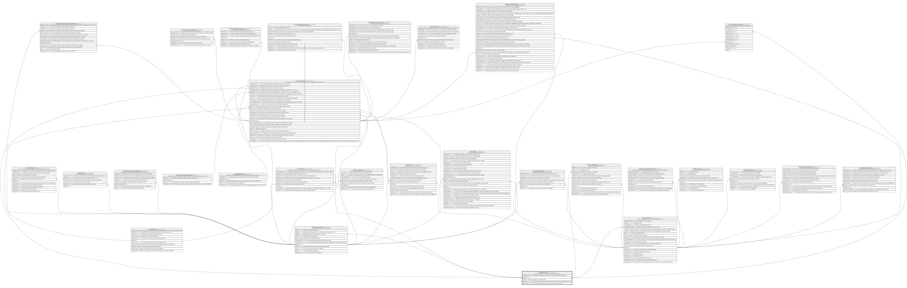

# Catalogo.Paises

## Description

Catalogo de paises usado en direcciones y datos de clientes.

## Columns

| Name           | Type         | Default                                           | Nullable | Children                                                                                                                                                                                                                                                                    | Parents | Comment                                                                                       |
| -------------- | ------------ | ------------------------------------------------- | -------- | --------------------------------------------------------------------------------------------------------------------------------------------------------------------------------------------------------------------------------------------------------------------------- | ------- | --------------------------------------------------------------------------------------------- |
| CodigoNumerico | char         |                                                   | false    |                                                                                                                                                                                                                                                                             |         | Codigo numerico del pais como ISO 3166-1 (ej:' 840 para USA, 250 para Francia').              |
| CodigoPais     | char         |                                                   | false    | [Clientes.Cliente](Clientes.Cliente.md) [Clientes.Direcciones](Clientes.Direcciones.md) [Core.Terminal](Core.Terminal.md) [Core.Transaccion](Core.Transaccion.md) [Core.TransferenciaExterna](Core.TransferenciaExterna.md) [Organizacion.Agencia](Organizacion.Agencia.md) |         |                                                                                               |
| Estado         | char         | (('A') collate SQL_Latin1_General_CP1_CI_AS)      | false    |                                                                                                                                                                                                                                                                             |         | Indica si el pais esta activo o inactivo (I/A).                                               |
| NivelRiesgo    | varchar(12)  | (('Normal') collate SQL_Latin1_General_CP1_CI_AS) | false    |                                                                                                                                                                                                                                                                             |         | Nivel de riesgo del pais para operaciones financieras (ej:' Sancionado, AltoRiesgo, Normal'). |
| NombrePais     | varchar(100) |                                                   | false    |                                                                                                                                                                                                                                                                             |         | Nombre descriptivo del pais (ej:' Estados Unidos de America, Francia').                       |

## Viewpoints

| Name                       | Definition                                                            |
| -------------------------- | --------------------------------------------------------------------- |
| [Catalogo](viewpoint-0.md) | Catalogos y dominios transversales compartidos por todos los modulos. |

## Constraints

| Name               | Type        | Definition                                                                                |
| ------------------ | ----------- | ----------------------------------------------------------------------------------------- |
| CK_Paises_Estado   | CHECK       | CHECK([Estado]='I' OR [Estado]='A')                                                       |
| CK_Paises_Riesgo   | CHECK       | CHECK([NivelRiesgo]='Sancionado' OR [NivelRiesgo]='AltoRiesgo' OR [NivelRiesgo]='Normal') |
| PK_Paises          | PRIMARY KEY | CLUSTERED, unique, part of a PRIMARY KEY constraint, [ CodigoPais ]                       |
| UQ_Paises_Numerico | UNIQUE      | NONCLUSTERED, unique, part of a UNIQUE constraint, [ CodigoNumerico ]                     |

## Indexes

| Name               | Definition                                                            |
| ------------------ | --------------------------------------------------------------------- |
| PK_Paises          | CLUSTERED, unique, part of a PRIMARY KEY constraint, [ CodigoPais ]   |
| UQ_Paises_Numerico | NONCLUSTERED, unique, part of a UNIQUE constraint, [ CodigoNumerico ] |

## Relations

---

> Generated by [tbls](https://github.com/k1LoW/tbls)
