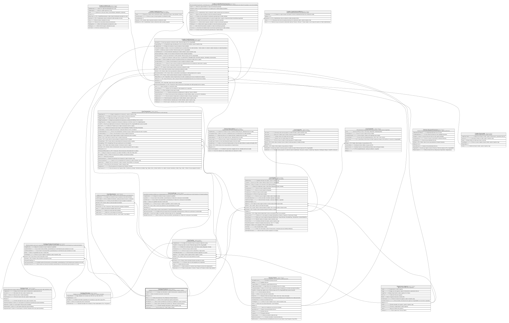

# Catalogo.Producto

## Description

Catalogo de productos financieros ofrecidos por la cooperativa (cuentas, tarjetas, creditos).

## Columns

| Name                | Type         | Default                                      | Nullable | Children                                                                                                                                                                          | Parents | Comment                                                                         |
| ------------------- | ------------ | -------------------------------------------- | -------- | --------------------------------------------------------------------------------------------------------------------------------------------------------------------------------- | ------- | ------------------------------------------------------------------------------- |
| CodigoProducto      | varchar(10)  |                                              | false    |                                                                                                                                                                                   |         | Codigo unico del producto, usado en transacciones y operaciones del core.       |
| Estado              | char         | (('A') collate SQL_Latin1_General_CP1_CI_AS) | false    |                                                                                                                                                                                   |         | Indica si el producto esta activo o inactivo (I/A).                             |
| IdProducto          | int          |                                              | false    | [Catalogo.ProductoCanalCupo](Catalogo.ProductoCanalCupo.md) [Core.Cuenta](Core.Cuenta.md) [Core.Tarjeta](Core.Tarjeta.md) [Credito.CreditoSolicitud](Credito.CreditoSolicitud.md) |         |                                                                                 |
| Marca               | varchar(20)  |                                              | true     |                                                                                                                                                                                   |         | Marca del producto (ej:' Visa, Mastercard, American Express').                  |
| MontoAperturaMinimo | decimal      | ((0))                                        | false    |                                                                                                                                                                                   |         | Monto minimo requerido para apertura del producto.                              |
| MontoMaximo         | decimal      |                                              | true     |                                                                                                                                                                                   |         | Monto maximo permitido para el producto (ej:' 100000 para cuentas corrientes'). |
| MontoMinimo         | decimal      |                                              | true     |                                                                                                                                                                                   |         | Monto minimo permitido para el producto (ej:' 1000 para cuentas de ahorro').    |
| NombreProducto      | varchar(100) |                                              | false    |                                                                                                                                                                                   |         | Nombre descriptivo del producto, usado en reportes y logs.                      |
| TipoProducto        | varchar(10)  |                                              | false    |                                                                                                                                                                                   |         | Tipo de producto (ej:' Credito, Tarjeta, Cuenta').                              |

## Viewpoints

| Name                       | Definition                                                            |
| -------------------------- | --------------------------------------------------------------------- |
| [Catalogo](viewpoint-0.md) | Catalogos y dominios transversales compartidos por todos los modulos. |

## Constraints

| Name                       | Type        | Definition                                                                                                                                                 |
| -------------------------- | ----------- | ---------------------------------------------------------------------------------------------------------------------------------------------------------- |
| CK_Producto_Estado         | CHECK       | CHECK([Estado]='I' OR [Estado]='A')                                                                                                                        |
| CK_Producto_LimitesCredito | CHECK       | CHECK([TipoProducto]<>'Credito' OR [MontoMinimo] IS NOT NULL AND [MontoMaximo] IS NOT NULL AND [MontoMaximo]>=[MontoMinimo])                               |
| CK_Producto_Marca          | CHECK       | CHECK([Marca] IS NULL OR [Marca]='Visa' OR [Marca]='Mastercard' OR [Marca]='Diners' OR [Marca]='American Express' OR [Marca]='Discover' OR [Marca]='Otro') |
| CK_Producto_MarcaRequerida | CHECK       | CHECK([TipoProducto]<>'Tarjeta' OR [Marca] IS NOT NULL)                                                                                                    |
| CK_Producto_Monto          | CHECK       | CHECK([MontoAperturaMinimo]>=(0))                                                                                                                          |
| CK_Producto_Tipo           | CHECK       | CHECK([TipoProducto]='Credito' OR [TipoProducto]='Tarjeta' OR [TipoProducto]='Cuenta')                                                                     |
| PK_Producto                | PRIMARY KEY | CLUSTERED, unique, part of a PRIMARY KEY constraint, [ IdProducto ]                                                                                        |
| UQ_Producto_Codigo         | UNIQUE      | NONCLUSTERED, unique, part of a UNIQUE constraint, [ CodigoProducto ]                                                                                      |

## Indexes

| Name               | Definition                                                            |
| ------------------ | --------------------------------------------------------------------- |
| PK_Producto        | CLUSTERED, unique, part of a PRIMARY KEY constraint, [ IdProducto ]   |
| UQ_Producto_Codigo | NONCLUSTERED, unique, part of a UNIQUE constraint, [ CodigoProducto ] |

## Relations

---

> Generated by [tbls](https://github.com/k1LoW/tbls)
