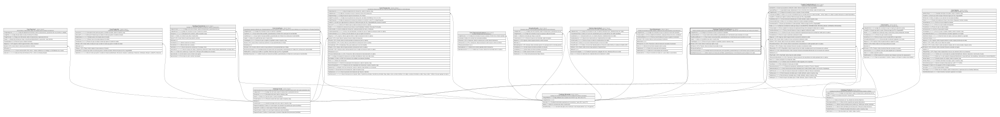

# Catalogo.ProductoCanalCupo

## Description

Relacion producto-canal con los cupos/limites operativos habilitados, parametrizados y definidos por el ente financiero; por canal y por producto.

## Columns

| Name                | Type      | Default                                      | Nullable | Children | Parents                                   | Comment                                                                                                                 |
| ------------------- | --------- | -------------------------------------------- | -------- | -------- | ----------------------------------------- | ----------------------------------------------------------------------------------------------------------------------- |
| CodigoMoneda        | smallint  | ((840))                                      | false    |          | [Catalogo.Monedas](Catalogo.Monedas.md)   | Codigo de la moneda en la que se expresa el cupo/limite.                                                                |
| CupoDiarioMaximo    | decimal   |                                              | false    |          |                                           | Cupo maximo diario permitido y parametrizado por el ente financiero para el producto en el canal.                       |
| CupoMensualMaximo   | decimal   |                                              | false    |          |                                           | Cupo maximo mensual permitido y parametrizado por el ente financiero para el producto en el canal.                      |
| Estado              | char      | (('A') collate SQL_Latin1_General_CP1_CI_AS) | false    |          |                                           | Indica si el cupo/limite esta activo o inactivo (I/A).                                                                  |
| FechaRegistro       | datetime2 | (sysdatetime())                              | false    |          |                                           | Fecha en la que se registro el cupo/limite, usado en reportes y logs.                                                   |
| IdCanal             | int       |                                              | false    |          | [Catalogo.Canal](Catalogo.Canal.md)       | FK a Canal, indica el canal al que aplica el cupo.                                                                      |
| IdProducto          | int       |                                              | false    |          | [Catalogo.Producto](Catalogo.Producto.md) | FK a Producto, indica el producto al que aplica el cupo.                                                                |
| IdProductoCanalCupo | int       |                                              | false    |          |                                           |                                                                                                                         |
| MaxTransaccionesDia | smallint  |                                              | false    |          |                                           | Cantidad maxima de transacciones por dia permitido y parametrizado por el ente financiero para el producto en el canal. |
| MontoMaxTransaccion | decimal   |                                              | false    |          |                                           | Monto maximo por transaccion permitido y parametrizado por el ente financiero para el producto en el canal.             |

## Viewpoints

| Name                       | Definition                                                            |
| -------------------------- | --------------------------------------------------------------------- |
| [Catalogo](viewpoint-0.md) | Catalogos y dominios transversales compartidos por todos los modulos. |

## Constraints

| Name                          | Type        | Definition                                                                                                                                            |
| ----------------------------- | ----------- | ----------------------------------------------------------------------------------------------------------------------------------------------------- |
| CK_ProductoCanalCupo_Cupos    | CHECK       | CHECK([CupoDiarioMaximo]>(0) AND [CupoMensualMaximo]>=[CupoDiarioMaximo] AND [MontoMaxTransaccion]>(0) AND [MontoMaxTransaccion]<=[CupoDiarioMaximo]) |
| CK_ProductoCanalCupo_Estado   | CHECK       | CHECK([Estado]='I' OR [Estado]='A')                                                                                                                   |
| CK_ProductoCanalCupo_NumMax   | CHECK       | CHECK([MaxTransaccionesDia]>(0))                                                                                                                      |
| FK_ProductoCanalCupo_Canal    | FOREIGN KEY | FOREIGN KEY(IdCanal) REFERENCES Catalogo.Canal(IdCanal) ON UPDATE NO_ACTION ON DELETE NO_ACTION                                                       |
| FK_ProductoCanalCupo_Moneda   | FOREIGN KEY | FOREIGN KEY(CodigoMoneda) REFERENCES Catalogo.Monedas(CodigoMoneda) ON UPDATE NO_ACTION ON DELETE NO_ACTION                                           |
| FK_ProductoCanalCupo_Producto | FOREIGN KEY | FOREIGN KEY(IdProducto) REFERENCES Catalogo.Producto(IdProducto) ON UPDATE NO_ACTION ON DELETE NO_ACTION                                              |
| PK_ProductoCanalCupo          | PRIMARY KEY | CLUSTERED, unique, part of a PRIMARY KEY constraint, [ IdProductoCanalCupo ]                                                                          |
| UQ_ProductoCanalCupo          | UNIQUE      | NONCLUSTERED, unique, part of a UNIQUE constraint, [ IdProducto, IdCanal ]                                                                            |

## Indexes

| Name                       | Definition                                                                   |
| -------------------------- | ---------------------------------------------------------------------------- |
| IX_ProductoCanalCupo_Canal | NONCLUSTERED, [ IdCanal ]                                                    |
| PK_ProductoCanalCupo       | CLUSTERED, unique, part of a PRIMARY KEY constraint, [ IdProductoCanalCupo ] |
| UQ_ProductoCanalCupo       | NONCLUSTERED, unique, part of a UNIQUE constraint, [ IdProducto, IdCanal ]   |

## Relations

---

> Generated by [tbls](https://github.com/k1LoW/tbls)
