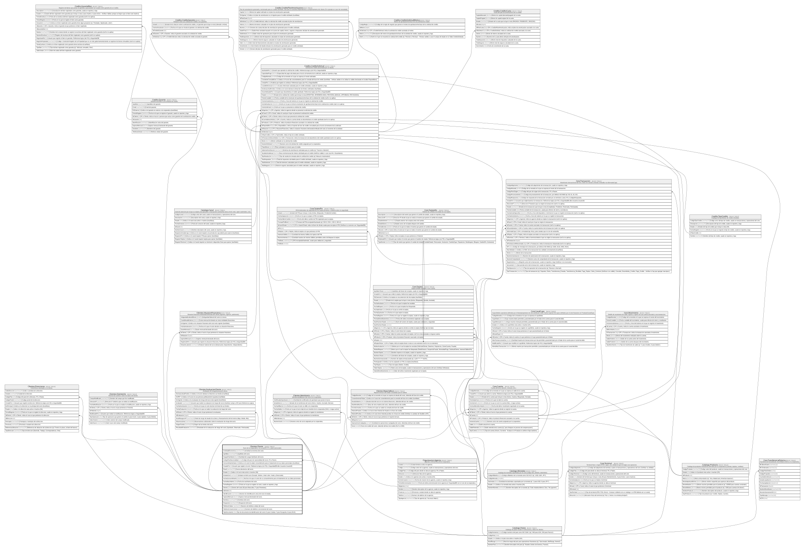

# Clientes.Cliente

## Description

Socio de la cooperativa, con su perfil KYC y datos personales.

## Columns

| Name                   | Type         | Default                                        | Nullable | Children                                                                                                                                                                                                                                                                                                                                                                                                                                                                            | Parents                               | Comment                                                                                             |
| ---------------------- | ------------ | ---------------------------------------------- | -------- | ----------------------------------------------------------------------------------------------------------------------------------------------------------------------------------------------------------------------------------------------------------------------------------------------------------------------------------------------------------------------------------------------------------------------------------------------------------------------------------- | ------------------------------------- | --------------------------------------------------------------------------------------------------- |
| ActividadEconomica     | varchar(100) |                                                | true     |                                                                                                                                                                                                                                                                                                                                                                                                                                                                                     |                                       | Actividad economica del socio.                                                                      |
| Apellidos              | varchar(250) |                                                | true     |                                                                                                                                                                                                                                                                                                                                                                                                                                                                                     |                                       | Apellidos del socio.                                                                                |
| CargasFamiliares       | tinyint      | ((0))                                          | false    |                                                                                                                                                                                                                                                                                                                                                                                                                                                                                     |                                       | Cantidad de cargas familiares del socio.                                                            |
| CodigoPaisNacionalidad | char         | (('ECU') collate SQL_Latin1_General_CP1_CI_AS) | false    |                                                                                                                                                                                                                                                                                                                                                                                                                                                                                     | [Catalogo.Paises](Catalogo.Paises.md) | Codigo del pais de nacionalidad del socio, FK a Paises.                                             |
| ConsentimientoDatos    | bit          | ((0))                                          | false    |                                                                                                                                                                                                                                                                                                                                                                                                                                                                                     |                                       | Indica si el socio ha dado consentimiento para el tratamiento de sus datos personales (true/false). |
| CreadoPor              | int          |                                                | false    |                                                                                                                                                                                                                                                                                                                                                                                                                                                                                     |                                       | Usuario que registro al socio. Referencia logica (sin FK) a SeguridadDB.dbo.Usuarios.UsuarioID.     |
| Email                  | varchar(150) |                                                | false    |                                                                                                                                                                                                                                                                                                                                                                                                                                                                                     |                                       | Correo electronico del socio.                                                                       |
| Estado                 | char         | (('A') collate SQL_Latin1_General_CP1_CI_AS)   | false    |                                                                                                                                                                                                                                                                                                                                                                                                                                                                                     |                                       | Indica si el socio esta activo o inactivo (I/A).                                                    |
| EstadoCivil            | varchar(20)  |                                                | true     |                                                                                                                                                                                                                                                                                                                                                                                                                                                                                     |                                       | Estado civil del socio (Casado, Soltero, Union Libre, Viudo y Divorciado).                          |
| FechaConsentimiento    | datetime2    |                                                | true     |                                                                                                                                                                                                                                                                                                                                                                                                                                                                                     |                                       | Fecha en la que el socio dio su consentimiento para el tratamiento de sus datos personales.         |
| FechaNacimiento        | date         |                                                | false    |                                                                                                                                                                                                                                                                                                                                                                                                                                                                                     |                                       | Fecha de nacimiento del socio.                                                                      |
| FechaRegistro          | datetime2    | (sysdatetime())                                | false    |                                                                                                                                                                                                                                                                                                                                                                                                                                                                                     |                                       | Fecha en la que se registro al socio, usado en reportes y logs.                                     |
| Genero                 | char         |                                                | true     |                                                                                                                                                                                                                                                                                                                                                                                                                                                                                     |                                       | Genero del socio (M para Masculino, F para Femenino).                                               |
| IdCliente              | int          |                                                | false    | [Clientes.ClientesHis](Clientes.ClientesHis.md) [Clientes.Direcciones](Clientes.Direcciones.md) [Clientes.EvaluacionCliente](Clientes.EvaluacionCliente.md) [Clientes.Membresia](Clientes.Membresia.md) [Clientes.ReporteBuro](Clientes.ReporteBuro.md) [Clientes.SituacionFinanciera](Clientes.SituacionFinanciera.md) [Core.Cuenta](Core.Cuenta.md) [Core.Tarjeta](Core.Tarjeta.md) [Credito.CreditoSolicitud](Credito.CreditoSolicitud.md) [Credito.Garante](Credito.Garante.md) |                                       |                                                                                                     |
| Identificacion         | varchar(13)  |                                                | false    |                                                                                                                                                                                                                                                                                                                                                                                                                                                                                     |                                       | Numero de identificacion unica del socio (Cedula).                                                  |
| IngresoMensual         | decimal      |                                                | true     |                                                                                                                                                                                                                                                                                                                                                                                                                                                                                     |                                       | Ingreso mensual declarado del socio.                                                                |
| Nombres                | varchar(250) |                                                | false    |                                                                                                                                                                                                                                                                                                                                                                                                                                                                                     |                                       | Nombres del socio.                                                                                  |
| Ocupacion              | varchar(100) |                                                | true     |                                                                                                                                                                                                                                                                                                                                                                                                                                                                                     |                                       | Ocupacion del socio.                                                                                |
| TelefonoCelular        | varchar(15)  |                                                | false    |                                                                                                                                                                                                                                                                                                                                                                                                                                                                                     |                                       | Numero de telefono celular del socio.                                                               |
| TelefonoConvencional   | varchar(15)  |                                                | true     |                                                                                                                                                                                                                                                                                                                                                                                                                                                                                     |                                       | Numero de telefono convencional del socio.                                                          |
| TipoDocumento          | char         |                                                | false    |                                                                                                                                                                                                                                                                                                                                                                                                                                                                                     |                                       | Tipo de documento de identificacion del socio (C para Cedula, P para Pasaporte, R para RUC).        |

## Viewpoints

| Name                       | Definition                                          |
| -------------------------- | --------------------------------------------------- |
| [Clientes](viewpoint-2.md) | Datos del socio y su perfil de riesgo/cumplimiento. |

## Constraints

| Name                      | Type        | Definition                                                                                                                                                                             |
| ------------------------- | ----------- | -------------------------------------------------------------------------------------------------------------------------------------------------------------------------------------- |
| CK_Cliente_Consentimiento | CHECK       | CHECK([ConsentimientoDatos]=(0) OR [FechaConsentimiento] IS NOT NULL)                                                                                                                  |
| CK_Cliente_Estado         | CHECK       | CHECK([Estado]='I' OR [Estado]='A')                                                                                                                                                    |
| CK_Cliente_EstadoCivil    | CHECK       | CHECK([EstadoCivil]='Union Libre' OR [EstadoCivil]='Viudo' OR [EstadoCivil]='Divorciado' OR [EstadoCivil]='Casado' OR [EstadoCivil]='Soltero')                                         |
| CK_Cliente_Genero         | CHECK       | CHECK([Genero]='F' OR [Genero]='M')                                                                                                                                                    |
| CK_Cliente_Ingreso        | CHECK       | CHECK([IngresoMensual] IS NULL OR [IngresoMensual]>=(0))                                                                                                                               |
| CK_Cliente_Nacimiento     | CHECK       | CHECK([FechaNacimiento]<CONVERT([date],sysdatetime()))                                                                                                                                 |
| CK_Cliente_PersonaNatural | CHECK       | CHECK(([TipoDocumento]='P' OR [TipoDocumento]='C') AND [Apellidos] IS NOT NULL AND [EstadoCivil] IS NOT NULL OR [TipoDocumento]='R' AND [Apellidos] IS NULL AND [EstadoCivil] IS NULL) |
| CK_Cliente_TipoDocumento  | CHECK       | CHECK([TipoDocumento]='R' OR [TipoDocumento]='P' OR [TipoDocumento]='C')                                                                                                               |
| FK_Cliente_Pais           | FOREIGN KEY | FOREIGN KEY(CodigoPaisNacionalidad) REFERENCES Catalogo.Paises(CodigoPais) ON UPDATE NO_ACTION ON DELETE NO_ACTION                                                                     |
| PK_Cliente                | PRIMARY KEY | CLUSTERED, unique, part of a PRIMARY KEY constraint, [ IdCliente ]                                                                                                                     |
| UQ_Cliente_Identificacion | UNIQUE      | NONCLUSTERED, unique, part of a UNIQUE constraint, [ Identificacion ]                                                                                                                  |

## Indexes

| Name                      | Definition                                                            |
| ------------------------- | --------------------------------------------------------------------- |
| IX_Cliente_CodigoPais     | NONCLUSTERED, [ CodigoPaisNacionalidad ]                              |
| PK_Cliente                | CLUSTERED, unique, part of a PRIMARY KEY constraint, [ IdCliente ]    |
| UQ_Cliente_Identificacion | NONCLUSTERED, unique, part of a UNIQUE constraint, [ Identificacion ] |

## Relations

---

> Generated by [tbls](https://github.com/k1LoW/tbls)
