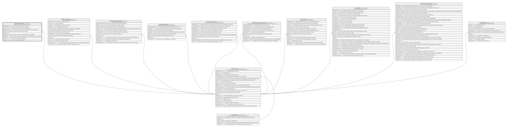

# Clientes.ClientesHis

## Description

Historial de cambios sobre los datos del cliente.

## Columns

| Name              | Type         | Default         | Nullable | Children | Parents                                 | Comment                                                                               |
| ----------------- | ------------ | --------------- | -------- | -------- | --------------------------------------- | ------------------------------------------------------------------------------------- |
| CampoModificado   | varchar(100) |                 | false    |          |                                         | Nombre del campo que fue modificado.                                                  |
| DireccionIP       | varchar(45)  |                 | true     |          |                                         | Direccion IP desde la que se realizo la modificacion.                                 |
| FechaModificacion | datetime2    | (sysdatetime()) | false    |          |                                         | Fecha en la que se realizo la modificacion, usado en reportes y logs.                 |
| IdCliente         | int          |                 | false    |          | [Clientes.Cliente](Clientes.Cliente.md) | FK a Cliente, indica el socio al que pertenece el historial.                          |
| IdHistorial       | bigint       |                 | false    |          |                                         |                                                                                       |
| ModificadoPor     | int          |                 | false    |          |                                         | Usuario que realizo la modificacion. Referencia logica a SeguridadDB.                 |
| TipoOperacion     | char         |                 | false    |          |                                         | Tipo de operacion que genero el cambio (I para Insert, U para Update, D para Delete). |
| ValorAnterior     | varchar(500) |                 | true     |          |                                         | Valor anterior del campo modificado.                                                  |
| ValorNuevo        | varchar(500) |                 | true     |          |                                         | Valor nuevo del campo modificado.                                                     |

## Viewpoints

| Name                       | Definition                                          |
| -------------------------- | --------------------------------------------------- |
| [Clientes](viewpoint-2.md) | Datos del socio y su perfil de riesgo/cumplimiento. |

## Constraints

| Name                         | Type        | Definition                                                                                            |
| ---------------------------- | ----------- | ----------------------------------------------------------------------------------------------------- |
| CK_ClientesHis_TipoOperacion | CHECK       | CHECK([TipoOperacion]='D' OR [TipoOperacion]='U' OR [TipoOperacion]='I')                              |
| CK_ClientesHis_Valores       | CHECK       | CHECK([TipoOperacion]<>'U' OR [ValorAnterior] IS NOT NULL OR [ValorNuevo] IS NOT NULL)                |
| FK_ClientesHis_Cliente       | FOREIGN KEY | FOREIGN KEY(IdCliente) REFERENCES Clientes.Cliente(IdCliente) ON UPDATE NO_ACTION ON DELETE NO_ACTION |
| PK_ClientesHis               | PRIMARY KEY | CLUSTERED, unique, part of a PRIMARY KEY constraint, [ IdHistorial ]                                  |

## Indexes

| Name                         | Definition                                                           |
| ---------------------------- | -------------------------------------------------------------------- |
| IX_ClientesHis_Cliente_Fecha | NONCLUSTERED, [ IdCliente, FechaModificacion ]                       |
| PK_ClientesHis               | CLUSTERED, unique, part of a PRIMARY KEY constraint, [ IdHistorial ] |

## Relations

---

> Generated by [tbls](https://github.com/k1LoW/tbls)
