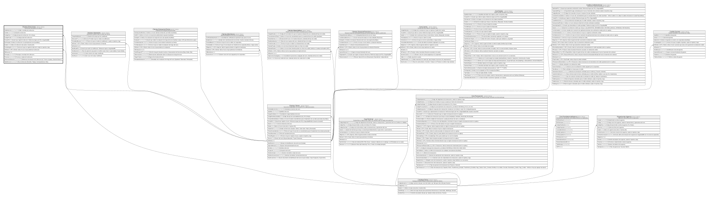

# Clientes.Direcciones

## Description

Direcciones asociadas a un cliente.

## Columns

| Name                | Type         | Default                                        | Nullable | Children | Parents                                 | Comment                                                                               |
| ------------------- | ------------ | ---------------------------------------------- | -------- | -------- | --------------------------------------- | ------------------------------------------------------------------------------------- |
| CalleDireccion      | varchar(250) |                                                | false    |          |                                         | Calle o avenida de la direccion.                                                      |
| Ciudad              | varchar(50)  |                                                | false    |          |                                         | Ciudad de la direccion.                                                               |
| CodigoPais          | char         | (('ECU') collate SQL_Latin1_General_CP1_CI_AS) | false    |          | [Catalogo.Paises](Catalogo.Paises.md)   | Codigo del pais de la direccion, FK a Paises.                                         |
| CodigoPostal        | varchar(10)  |                                                | true     |          |                                         | Codigo postal de la direccion.                                                        |
| CreadoPor           | int          |                                                | false    |          |                                         | Usuario que registro la direccion. Referencia logica (sin FK) a SeguridadDB.          |
| EsPrincipal         | bit          | ((0))                                          | false    |          |                                         | Indica si la direccion es la principal del socio (true/false).                        |
| Estado              | char         | (('A') collate SQL_Latin1_General_CP1_CI_AS)   | false    |          |                                         | Indica si la direccion esta activa o inactiva (I/A).                                  |
| FechaRegistro       | datetime2    | (sysdatetime())                                | false    |          |                                         | Fecha en la que se registro la direccion, usado en reportes y logs.                   |
| IdCliente           | int          |                                                | false    |          | [Clientes.Cliente](Clientes.Cliente.md) | FK a Cliente, indica el socio al que pertenece la direccion.                          |
| IdDireccion         | int          |                                                | false    |          |                                         |                                                                                       |
| Parroquia           | varchar(50)  |                                                | true     |          |                                         | Parroquia o municipio de la direccion.                                                |
| Provincia           | varchar(50)  |                                                | false    |          |                                         | Provincia o estado de la direccion.                                                   |
| ReferenciaUbicacion | varchar(250) |                                                | true     |          |                                         | Referencia de ubicacion de la direccion (ej:' Frente a la plaza, al lado del banco'). |
| TipoDireccion       | varchar(20)  |                                                | false    |          |                                         | Tipo de direccion (Domicilio, Trabajo, Correspondencia, Otra).                        |

## Viewpoints

| Name                       | Definition                                          |
| -------------------------- | --------------------------------------------------- |
| [Clientes](viewpoint-2.md) | Datos del socio y su perfil de riesgo/cumplimiento. |

## Constraints

| Name                   | Type        | Definition                                                                                                                     |
| ---------------------- | ----------- | ------------------------------------------------------------------------------------------------------------------------------ |
| CK_Direcciones_Estado  | CHECK       | CHECK([Estado]='I' OR [Estado]='A')                                                                                            |
| CK_Direcciones_Tipo    | CHECK       | CHECK([TipoDireccion]='Otra' OR [TipoDireccion]='Correspondencia' OR [TipoDireccion]='Trabajo' OR [TipoDireccion]='Domicilio') |
| FK_Direcciones_Cliente | FOREIGN KEY | FOREIGN KEY(IdCliente) REFERENCES Clientes.Cliente(IdCliente) ON UPDATE NO_ACTION ON DELETE NO_ACTION                          |
| FK_Direcciones_Pais    | FOREIGN KEY | FOREIGN KEY(CodigoPais) REFERENCES Catalogo.Paises(CodigoPais) ON UPDATE NO_ACTION ON DELETE NO_ACTION                         |
| PK_Direcciones         | PRIMARY KEY | CLUSTERED, unique, part of a PRIMARY KEY constraint, [ IdDireccion ]                                                           |

## Indexes

| Name                     | Definition                                                           |
| ------------------------ | -------------------------------------------------------------------- |
| IX_Direcciones_IdCliente | NONCLUSTERED, [ IdCliente ]                                          |
| PK_Direcciones           | CLUSTERED, unique, part of a PRIMARY KEY constraint, [ IdDireccion ] |
| UX_Direcciones_Principal | NONCLUSTERED, unique, [ IdCliente ]                                  |

## Relations

---

> Generated by [tbls](https://github.com/k1LoW/tbls)
