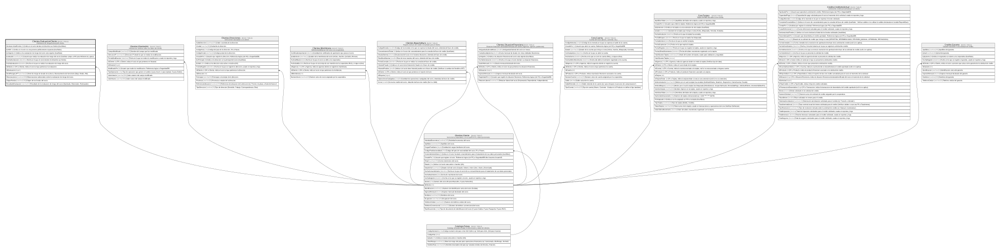

# Clientes.EvaluacionCliente

## Description

Evaluacion de riesgo/scoring del cliente.

## Columns

| Name                 | Type         | Default         | Nullable | Children | Parents                                 | Comment                                                                                             |
| -------------------- | ------------ | --------------- | -------- | -------- | --------------------------------------- | --------------------------------------------------------------------------------------------------- |
| DeclaraLicitudFondos | bit          | ((0))           | false    |          |                                         | Indica si el socio declara la licitud de sus fondos (true/false).                                   |
| EsPEP                | bit          | ((0))           | false    |          |                                         | Indica si el socio es una persona politicamente expuesta (true/false).                              |
| EsVigente            | bit          | ((1))           | false    |          |                                         | Indica si la evaluacion de riesgo del socio esta vigente (true/false).                              |
| Evaluador            | varchar(100) |                 | false    |          |                                         | Usuario que realizo la evaluacion de riesgo del socio (Cambiar campo a INT para Referencia Logica). |
| FechaDeclaracion     | datetime2    |                 | true     |          |                                         | Fecha en la que el socio declaro la licitud de sus fondos.                                          |
| FechaEvaluacion      | datetime2    | (sysdatetime()) | false    |          |                                         | Fecha en la que se realizo la evaluacion de riesgo del socio.                                       |
| IdCliente            | int          |                 | false    |          | [Clientes.Cliente](Clientes.Cliente.md) | FK a Cliente, indica el socio al que pertenece la evaluacion.                                       |
| IdEvaluacion         | bigint       |                 | false    |          |                                         |                                                                                                     |
| NivelRiesgoLAFT      | varchar(10)  |                 | false    |          |                                         | Nivel de riesgo de lavado de activos y financiamiento del terrorismo (Bajo, Medio, Alto).           |
| Observaciones        | varchar(300) |                 | true     |          |                                         | Observaciones adicionales sobre la evaluacion de riesgo del socio.                                  |
| OrigenFondos         | varchar(200) |                 | true     |          |                                         | Origen de los fondos del socio.                                                                     |
| ResultadoEvaluacion  | varchar(12)  |                 | false    |          |                                         | Resultado de la evaluacion de riesgo del socio (Aprobado, Observado, Rechazado).                    |

## Viewpoints

| Name                       | Definition                                          |
| -------------------------- | --------------------------------------------------- |
| [Clientes](viewpoint-2.md) | Datos del socio y su perfil de riesgo/cumplimiento. |

## Constraints

| Name                           | Type        | Definition                                                                                                        |
| ------------------------------ | ----------- | ----------------------------------------------------------------------------------------------------------------- |
| CK_EvaluacionCliente_Licitud   | CHECK       | CHECK([DeclaraLicitudFondos]=(0) OR [FechaDeclaracion] IS NOT NULL)                                               |
| CK_EvaluacionCliente_Resultado | CHECK       | CHECK([ResultadoEvaluacion]='Rechazado' OR [ResultadoEvaluacion]='Observado' OR [ResultadoEvaluacion]='Aprobado') |
| CK_EvaluacionCliente_Riesgo    | CHECK       | CHECK([NivelRiesgoLAFT]='Alto' OR [NivelRiesgoLAFT]='Medio' OR [NivelRiesgoLAFT]='Bajo')                          |
| FK_EvaluacionCliente_Cliente   | FOREIGN KEY | FOREIGN KEY(IdCliente) REFERENCES Clientes.Cliente(IdCliente) ON UPDATE NO_ACTION ON DELETE NO_ACTION             |
| PK_EvaluacionCliente           | PRIMARY KEY | CLUSTERED, unique, part of a PRIMARY KEY constraint, [ IdEvaluacion ]                                             |

## Indexes

| Name                           | Definition                                                            |
| ------------------------------ | --------------------------------------------------------------------- |
| IX_EvaluacionCliente_IdCliente | NONCLUSTERED, [ IdCliente ]                                           |
| PK_EvaluacionCliente           | CLUSTERED, unique, part of a PRIMARY KEY constraint, [ IdEvaluacion ] |
| UX_EvaluacionCliente_Vigente   | NONCLUSTERED, unique, [ IdCliente ]                                   |

## Relations

---

> Generated by [tbls](https://github.com/k1LoW/tbls)
