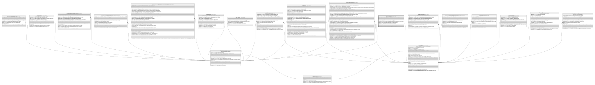

# Clientes.Membresia

## Description

Membresia/afiliacion del socio a la cooperativa.

## Columns

| Name                   | Type        | Default                                           | Nullable | Children | Parents                                         | Comment                                                                                |
| ---------------------- | ----------- | ------------------------------------------------- | -------- | -------- | ----------------------------------------------- | -------------------------------------------------------------------------------------- |
| CertificadosAportacion | decimal     | ((0))                                             | false    |          |                                                 | Cantidad de certificados de aportacion que posee el socio.                             |
| EstadoSocio            | varchar(12) | (('Activo') collate SQL_Latin1_General_CP1_CI_AS) | false    |          |                                                 | Estado de la membresia del socio (Activo, Inactivo, Excluido, Moroso).                 |
| FechaAfiliacion        | date        |                                                   | false    |          |                                                 | Fecha en la que el socio se afilio a la cooperativa.                                   |
| FechaSalida            | date        |                                                   | true     |          |                                                 | Fecha en la que el socio dejo de ser miembro de la cooperativa (NULL si sigue activo). |
| IdAgencia              | char        |                                                   | false    |          | [Organizacion.Agencia](Organizacion.Agencia.md) | FK a Agencia, indica la agencia donde se registro la membresia.                        |
| IdCliente              | int         |                                                   | false    |          | [Clientes.Cliente](Clientes.Cliente.md)         | FK a Cliente, indica el socio al que pertenece la membresia.                           |
| IdMembresia            | int         |                                                   | false    |          |                                                 |                                                                                        |
| NumeroSocio            | varchar(20) |                                                   | false    |          |                                                 | Numero unico de socio asignado por la cooperativa.                                     |

## Viewpoints

| Name                       | Definition                                          |
| -------------------------- | --------------------------------------------------- |
| [Clientes](viewpoint-2.md) | Datos del socio y su perfil de riesgo/cumplimiento. |

## Constraints

| Name                     | Type        | Definition                                                                                                      |
| ------------------------ | ----------- | --------------------------------------------------------------------------------------------------------------- |
| CK_Membresia_Aportacion  | CHECK       | CHECK([CertificadosAportacion]>=(0))                                                                            |
| CK_Membresia_Estado      | CHECK       | CHECK([EstadoSocio]='Excluido' OR [EstadoSocio]='Moroso' OR [EstadoSocio]='Inactivo' OR [EstadoSocio]='Activo') |
| CK_Membresia_Salida      | CHECK       | CHECK([FechaSalida] IS NULL OR [FechaSalida]>[FechaAfiliacion])                                                 |
| FK_Membresia_Agencia     | FOREIGN KEY | FOREIGN KEY(IdAgencia) REFERENCES Organizacion.Agencia(IdAgencia) ON UPDATE NO_ACTION ON DELETE NO_ACTION       |
| FK_Membresia_Cliente     | FOREIGN KEY | FOREIGN KEY(IdCliente) REFERENCES Clientes.Cliente(IdCliente) ON UPDATE NO_ACTION ON DELETE NO_ACTION           |
| PK_Membresia             | PRIMARY KEY | CLUSTERED, unique, part of a PRIMARY KEY constraint, [ IdMembresia ]                                            |
| UQ_Membresia_NumeroSocio | UNIQUE      | NONCLUSTERED, unique, part of a UNIQUE constraint, [ NumeroSocio ]                                              |

## Indexes

| Name                     | Definition                                                           |
| ------------------------ | -------------------------------------------------------------------- |
| IX_Membresia_IdCliente   | NONCLUSTERED, [ IdCliente ]                                          |
| PK_Membresia             | CLUSTERED, unique, part of a PRIMARY KEY constraint, [ IdMembresia ] |
| UQ_Membresia_NumeroSocio | NONCLUSTERED, unique, part of a UNIQUE constraint, [ NumeroSocio ]   |

## Relations

---

> Generated by [tbls](https://github.com/k1LoW/tbls)
