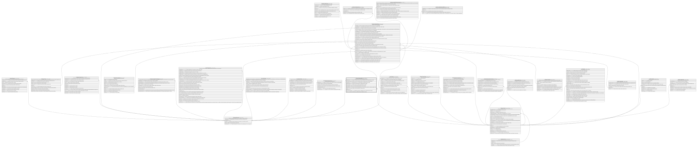

# Clientes.ReporteBuro

## Description

Reporte de buro de credito consultado para el cliente.

## Columns

| Name                  | Type      | Default         | Nullable | Children                                                | Parents                                 | Comment                                                                                                     |
| --------------------- | --------- | --------------- | -------- | ------------------------------------------------------- | --------------------------------------- | ----------------------------------------------------------------------------------------------------------- |
| CodigoMoneda          | smallint  | ((840))         | false    |                                                         | [Catalogo.Monedas](Catalogo.Monedas.md) | Codigo de la moneda en la que se expresa la deuda del socio, obtenida del buro de credito.                  |
| ConsentimientoTitular | bit       |                 | false    |                                                         |                                         | Indica si el socio dio consentimiento para la consulta del buro de credito (true/false).                    |
| DeudaSistema          | decimal   | ((0))           | false    |                                                         |                                         | Deuda total del socio en el sistema financiero, obtenida del buro de credito.                               |
| DiasMoraMaxima        | smallint  | ((0))           | false    |                                                         |                                         | Dias de mora maxima del socio, obtenido del buro de credito.                                                |
| FechaConsulta         | datetime2 | (sysdatetime()) | false    |                                                         |                                         | Fecha en la que se realizo la consulta del buro de credito.                                                 |
| HistorialFraude       | bit       | ((0))           | false    |                                                         |                                         | Indica si el socio tiene historial de fraude en el buro de credito.                                         |
| HistorialPositivo     | smallint  | ((0))           | false    |                                                         |                                         | Indica si el socio tiene historial positivo en el buro de credito (Verificar si cambiar de Smallint a BIT). |
| IdCliente             | int       |                 | false    |                                                         | [Clientes.Cliente](Clientes.Cliente.md) | FK a Cliente, indica el socio al que pertenece el reporte de buro.                                          |
| IdReporte             | bigint    |                 | false    | [Credito.CreditoSolicitud](Credito.CreditoSolicitud.md) |                                         |                                                                                                             |
| OperacionesCastigadas | smallint  | ((0))           | false    |                                                         |                                         | Cantidad de operaciones castigadas del socio, obtenidas del buro de credito.                                |
| Score                 | smallint  |                 | false    |                                                         |                                         | Score de credito del socio, obtenido del buro de credito (De 0 a 1000).                                     |

## Viewpoints

| Name                       | Definition                                          |
| -------------------------- | --------------------------------------------------- |
| [Clientes](viewpoint-2.md) | Datos del socio y su perfil de riesgo/cumplimiento. |

## Constraints

| Name                          | Type        | Definition                                                                                                         |
| ----------------------------- | ----------- | ------------------------------------------------------------------------------------------------------------------ |
| CK_ReporteBuro_Consentimiento | CHECK       | CHECK([ConsentimientoTitular]=(1))                                                                                 |
| CK_ReporteBuro_Score          | CHECK       | CHECK([Score]>=(0) AND [Score]<=(1000))                                                                            |
| CK_ReporteBuro_Valores        | CHECK       | CHECK([DiasMoraMaxima]>=(0) AND [OperacionesCastigadas]>=(0) AND [DeudaSistema]>=(0) AND [HistorialPositivo]>=(0)) |
| FK_ReporteBuro_Cliente        | FOREIGN KEY | FOREIGN KEY(IdCliente) REFERENCES Clientes.Cliente(IdCliente) ON UPDATE NO_ACTION ON DELETE NO_ACTION              |
| FK_ReporteBuro_Moneda         | FOREIGN KEY | FOREIGN KEY(CodigoMoneda) REFERENCES Catalogo.Monedas(CodigoMoneda) ON UPDATE NO_ACTION ON DELETE NO_ACTION        |
| PK_ReporteBuro                | PRIMARY KEY | CLUSTERED, unique, part of a PRIMARY KEY constraint, [ IdReporte ]                                                 |

## Indexes

| Name                         | Definition                                                         |
| ---------------------------- | ------------------------------------------------------------------ |
| IX_ReporteBuro_Cliente_Fecha | NONCLUSTERED, [ IdCliente, FechaConsulta ]                         |
| PK_ReporteBuro               | CLUSTERED, unique, part of a PRIMARY KEY constraint, [ IdReporte ] |

## Relations

---

> Generated by [tbls](https://github.com/k1LoW/tbls)
