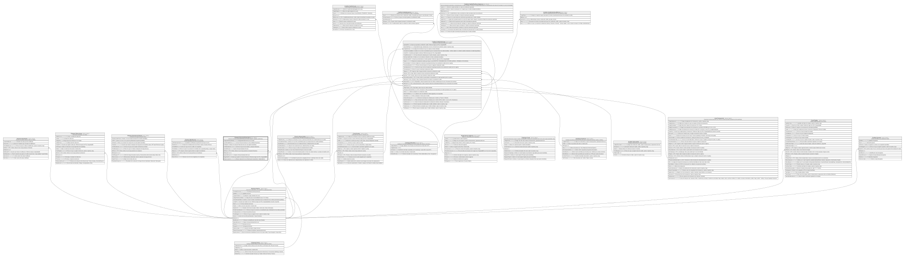

# Clientes.SituacionFinanciera

## Description

Situacion financiera declarada/verificada del cliente (ingresos, egresos, patrimonio).

## Columns

| Name                   | Type        | Default         | Nullable | Children                                                | Parents                                 | Comment                                                                                 |
| ---------------------- | ----------- | --------------- | -------- | ------------------------------------------------------- | --------------------------------------- | --------------------------------------------------------------------------------------- |
| AntiguedadLaboralMeses | smallint    |                 | false    |                                                         |                                         | Antiguedad laboral del socio en meses.                                                  |
| CuotaDeudaExterna      | decimal     | ((0))           | false    |                                                         |                                         | Cuota mensual de deuda con otras entidades financieras.                                 |
| EsVigente              | bit         | ((1))           | false    |                                                         |                                         | Indica si la situacion financiera del socio esta vigente (true/false).                  |
| FechaDeclaracion       | datetime2   | (sysdatetime()) | false    |                                                         |                                         | Fecha en la que el socio declaro su situacion financiera.                               |
| GastoMensual           | decimal     |                 | false    |                                                         |                                         | Gasto mensual declarado del socio.                                                      |
| IdCliente              | int         |                 | false    |                                                         | [Clientes.Cliente](Clientes.Cliente.md) | FK a Cliente, indica el socio al que pertenece la situacion financiera.                 |
| IdSituacion            | bigint      |                 | false    | [Credito.CreditoSolicitud](Credito.CreditoSolicitud.md) |                                         |                                                                                         |
| IngresoMensual         | decimal     |                 | false    |                                                         |                                         | Ingreso mensual declarado del socio.                                                    |
| RegistradoPor          | int         |                 | false    |                                                         |                                         | Usuario que registro la situacion financiera. Referencia logica (sin FK) a SeguridadDB. |
| RelacionLaboral        | varchar(15) |                 | false    |                                                         |                                         | Relacion laboral del socio (Empresarial, Dependiente, Independiente).                   |

## Viewpoints

| Name                       | Definition                                          |
| -------------------------- | --------------------------------------------------- |
| [Clientes](viewpoint-2.md) | Datos del socio y su perfil de riesgo/cumplimiento. |

## Constraints

| Name                              | Type        | Definition                                                                                                     |
| --------------------------------- | ----------- | -------------------------------------------------------------------------------------------------------------- |
| CK_SituacionFinanciera_Antiguedad | CHECK       | CHECK([AntiguedadLaboralMeses]>=(0))                                                                           |
| CK_SituacionFinanciera_Relacion   | CHECK       | CHECK([RelacionLaboral]='EMPRESARIAL' OR [RelacionLaboral]='INDEPENDIENTE' OR [RelacionLaboral]='DEPENDIENTE') |
| CK_SituacionFinanciera_Valores    | CHECK       | CHECK([IngresoMensual]>(0) AND [GastoMensual]>=(0) AND [CuotaDeudaExterna]>=(0))                               |
| FK_SituacionFinanciera_Cliente    | FOREIGN KEY | FOREIGN KEY(IdCliente) REFERENCES Clientes.Cliente(IdCliente) ON UPDATE NO_ACTION ON DELETE NO_ACTION          |
| PK_SituacionFinanciera            | PRIMARY KEY | CLUSTERED, unique, part of a PRIMARY KEY constraint, [ IdSituacion ]                                           |

## Indexes

| Name                             | Definition                                                           |
| -------------------------------- | -------------------------------------------------------------------- |
| IX_SituacionFinanciera_IdCliente | NONCLUSTERED, [ IdCliente ]                                          |
| PK_SituacionFinanciera           | CLUSTERED, unique, part of a PRIMARY KEY constraint, [ IdSituacion ] |
| UX_SituacionFinanciera_Vigente   | NONCLUSTERED, unique, [ IdCliente ]                                  |

## Relations

---

> Generated by [tbls](https://github.com/k1LoW/tbls)
