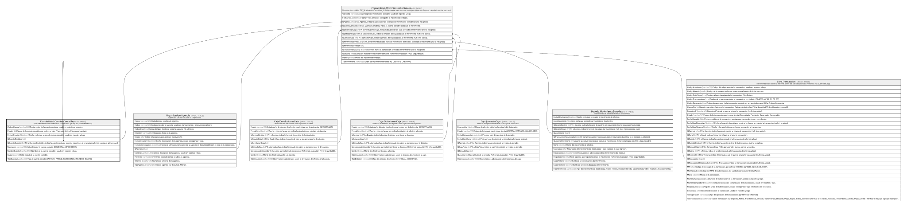

# Contabilidad.CuentasContables

## Description

Plan de cuentas contables de la cooperativa (jerarquico, auto-referencia).

## Columns

| Name             | Type         | Default         | Nullable | Children                                                                                                                                    | Parents                                                           | Comment                                                                                                                |
| ---------------- | ------------ | --------------- | -------- | ------------------------------------------------------------------------------------------------------------------------------------------- | ----------------------------------------------------------------- | ---------------------------------------------------------------------------------------------------------------------- |
| CodigoCuenta     | varchar(30)  |                 | false    |                                                                                                                                             |                                                                   | Codigo unico de la cuenta contable, usado en asientos y reportes.                                                      |
| Estado           | bit          | ((1))           | false    |                                                                                                                                             |                                                                   | Estado de la cuenta contable que incluye si esta (True para Activa, False para Inactiva).                              |
| FechaCreacion    | datetime2    | (sysdatetime()) | false    |                                                                                                                                             |                                                                   | Fecha en la que se creo la cuenta contable, usado en reportes y logs.                                                  |
| IdCuentaContable | int          |                 | false    | [Contabilidad.CuentasContables](Contabilidad.CuentasContables.md) [Contabilidad.MovimientosContables](Contabilidad.MovimientosContables.md) |                                                                   |                                                                                                                        |
| IdCuentaSuperior | int          |                 | true     |                                                                                                                                             | [Contabilidad.CuentasContables](Contabilidad.CuentasContables.md) | FK a CuentasContables, indica la cuenta contable superior o padre en la jerarquia (null si es cuenta de primer nivel). |
| Naturaleza       | varchar(20)  |                 | true     |                                                                                                                                             |                                                                   | Naturaleza de la cuenta contable (DEUDORA, ACREEDORA).                                                                 |
| NombreCuenta     | varchar(150) |                 | false    |                                                                                                                                             |                                                                   | Nombre de la cuenta contable, usado en reportes y logs.                                                                |
| Saldo            | decimal      | ((0))           | false    |                                                                                                                                             |                                                                   | Saldo actual de la cuenta contable.                                                                                    |
| TipoCuenta       | varchar(30)  |                 | false    |                                                                                                                                             |                                                                   | Tipo de cuenta contable (ACTIVO, PASIVO, PATRIMONIO, INGRESO, GASTO).                                                  |

## Viewpoints

| Name                           | Definition                            |
| ------------------------------ | ------------------------------------- |
| [Contabilidad](viewpoint-6.md) | Plan de cuentas y asientos contables. |

## Constraints

| Name                           | Type        | Definition                                                                                                                           |
| ------------------------------ | ----------- | ------------------------------------------------------------------------------------------------------------------------------------ |
| CK_CuentasContables_Naturaleza | CHECK       | CHECK([Naturaleza] IS NULL OR [Naturaleza]='DEUDORA' OR [Naturaleza]='ACREEDORA')                                                    |
| CK_CuentasContables_Tipo       | CHECK       | CHECK([TipoCuenta]='ACTIVO' OR [TipoCuenta]='PASIVO' OR [TipoCuenta]='PATRIMONIO' OR [TipoCuenta]='INGRESO' OR [TipoCuenta]='GASTO') |
| FK_CuentasContables_Superior   | FOREIGN KEY | FOREIGN KEY(IdCuentaSuperior) REFERENCES Contabilidad.CuentasContables(IdCuentaContable) ON UPDATE NO_ACTION ON DELETE NO_ACTION     |
| PK_CuentasContables            | PRIMARY KEY | CLUSTERED, unique, part of a PRIMARY KEY constraint, [ IdCuentaContable ]                                                            |
| UQ_CuentasContables_Codigo     | UNIQUE      | NONCLUSTERED, unique, part of a UNIQUE constraint, [ CodigoCuenta ]                                                                  |

## Indexes

| Name                       | Definition                                                                |
| -------------------------- | ------------------------------------------------------------------------- |
| PK_CuentasContables        | CLUSTERED, unique, part of a PRIMARY KEY constraint, [ IdCuentaContable ] |
| UQ_CuentasContables_Codigo | NONCLUSTERED, unique, part of a UNIQUE constraint, [ CodigoCuenta ]       |

## Relations

---

> Generated by [tbls](https://github.com/k1LoW/tbls)
