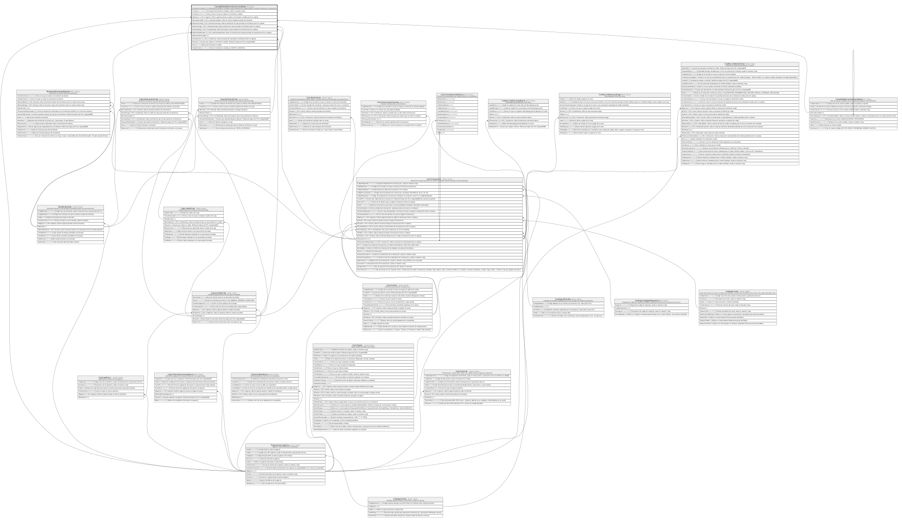

# Contabilidad.MovimientosContables

## Description

Movimiento contable. CK_MovimientosContables_UnOrigen exige exactamente un origen (dotacion, boveda, devolucion o transaccion).

## Columns

| Name                 | Type         | Default         | Nullable | Children | Parents                                                           | Comment                                                                                           |
| -------------------- | ------------ | --------------- | -------- | -------- | ----------------------------------------------------------------- | ------------------------------------------------------------------------------------------------- |
| Concepto             | varchar(500) |                 | true     |          |                                                                   | Concepto del movimiento contable, usado en reportes y logs.                                       |
| FechaHora            | datetime2    | (sysdatetime()) | false    |          |                                                                   | Fecha y hora en la que se registro el movimiento contable.                                        |
| IdAgencia            | char         |                 | true     |          | [Organizacion.Agencia](Organizacion.Agencia.md)                   | FK a Agencia, indica la agencia donde se origino el movimiento contable (null si no aplica).      |
| IdCuentaContable     | int          |                 | false    |          | [Contabilidad.CuentasContables](Contabilidad.CuentasContables.md) | FK a CuentasContables, indica la cuenta contable asociada al movimiento.                          |
| IdDevolucionCaja     | int          |                 | true     |          | [Caja.DevolucionesCaja](Caja.DevolucionesCaja.md)                 | FK a DevolucionesCaja, indica la devolucion de caja asociada al movimiento (null si no aplica).   |
| IdDotacionCaja       | int          |                 | true     |          | [Caja.DotacionesCaja](Caja.DotacionesCaja.md)                     | FK a DotacionesCaja, indica la dotacion de caja asociada al movimiento (null si no aplica).       |
| IdJornadaCaja        | int          |                 | true     |          | [Caja.JornadasCaja](Caja.JornadasCaja.md)                         | FK a JornadasCaja, indica la jornada de caja asociada al movimiento (null si no aplica).          |
| IdMovimientoBoveda   | bigint       |                 | true     |          | [Boveda.MovimientoBoveda](Boveda.MovimientoBoveda.md)             | FK a MovimientoBoveda, indica el movimiento de boveda asociado al movimiento (null si no aplica). |
| IdMovimientoContable | int          |                 | false    |          |                                                                   |                                                                                                   |
| IdTransaccion        | bigint       |                 | true     |          | [Core.Transaccion](Core.Transaccion.md)                           | FK a Transaccion, indica la transaccion asociada al movimiento (null si no aplica).               |
| IdUsuario            | int          |                 | true     |          |                                                                   | Usuario que registro el movimiento contable. Referencia logica (sin FK) a SeguridadDB.            |
| Monto                | decimal      |                 | true     |          |                                                                   | Monto del movimiento contable.                                                                    |
| TipoMovimiento       | varchar(30)  |                 | false    |          |                                                                   | Tipo de movimiento contable (ej:' DEBITO o CREDITO').                                             |

## Viewpoints

| Name                           | Definition                            |
| ------------------------------ | ------------------------------------- |
| [Contabilidad](viewpoint-6.md) | Plan de cuentas y asientos contables. |

## Constraints

| Name                                   | Type        | Definition                                                                                                                                                                                                                                                                |
| -------------------------------------- | ----------- | ------------------------------------------------------------------------------------------------------------------------------------------------------------------------------------------------------------------------------------------------------------------------- |
| CK_MovimientosContables_TipoMovimiento | CHECK       | CHECK([TipoMovimiento]='DEBITO' OR [TipoMovimiento]='CREDITO')                                                                                                                                                                                                            |
| CK_MovimientosContables_UnOrigen       | CHECK       | CHECK((((case when [IdDotacionCaja] IS NOT NULL then (1) else (0) end+case when [IdMovimientoBoveda] IS NOT NULL then (1) else (0) end)+case when [IdDevolucionCaja] IS NOT NULL then (1) else (0) end)+case when [IdTransaccion] IS NOT NULL then (1) else (0) end)=(1)) |
| FK_MovimientosContables_Agencia        | FOREIGN KEY | FOREIGN KEY(IdAgencia) REFERENCES Organizacion.Agencia(IdAgencia) ON UPDATE NO_ACTION ON DELETE NO_ACTION                                                                                                                                                                 |
| FK_MovimientosContables_Boveda         | FOREIGN KEY | FOREIGN KEY(IdMovimientoBoveda) REFERENCES Boveda.MovimientoBoveda(IdMovimiento) ON UPDATE NO_ACTION ON DELETE NO_ACTION                                                                                                                                                  |
| FK_MovimientosContables_Cuenta         | FOREIGN KEY | FOREIGN KEY(IdCuentaContable) REFERENCES Contabilidad.CuentasContables(IdCuentaContable) ON UPDATE NO_ACTION ON DELETE NO_ACTION                                                                                                                                          |
| FK_MovimientosContables_Devolucion     | FOREIGN KEY | FOREIGN KEY(IdDevolucionCaja) REFERENCES Caja.DevolucionesCaja(IdDevolucionCaja) ON UPDATE NO_ACTION ON DELETE NO_ACTION                                                                                                                                                  |
| FK_MovimientosContables_Dotacion       | FOREIGN KEY | FOREIGN KEY(IdDotacionCaja) REFERENCES Caja.DotacionesCaja(IdDotacionCaja) ON UPDATE NO_ACTION ON DELETE NO_ACTION                                                                                                                                                        |
| FK_MovimientosContables_Jornada        | FOREIGN KEY | FOREIGN KEY(IdJornadaCaja) REFERENCES Caja.JornadasCaja(IdJornadaCaja) ON UPDATE NO_ACTION ON DELETE NO_ACTION                                                                                                                                                            |
| FK_MovimientosContables_Transaccion    | FOREIGN KEY | FOREIGN KEY(IdTransaccion) REFERENCES Core.Transaccion(IdTransaccion) ON UPDATE NO_ACTION ON DELETE NO_ACTION                                                                                                                                                             |
| PK_MovimientosContables                | PRIMARY KEY | CLUSTERED, unique, part of a PRIMARY KEY constraint, [ IdMovimientoContable ]                                                                                                                                                                                             |

## Indexes

| Name                                | Definition                                                                    |
| ----------------------------------- | ----------------------------------------------------------------------------- |
| IX_MovimientosContables_Agencia     | NONCLUSTERED, [ IdAgencia ]                                                   |
| IX_MovimientosContables_Cuenta      | NONCLUSTERED, [ IdCuentaContable ]                                            |
| IX_MovimientosContables_Transaccion | NONCLUSTERED, [ IdTransaccion ]                                               |
| PK_MovimientosContables             | CLUSTERED, unique, part of a PRIMARY KEY constraint, [ IdMovimientoContable ] |

## Relations

---

> Generated by [tbls](https://github.com/k1LoW/tbls)
