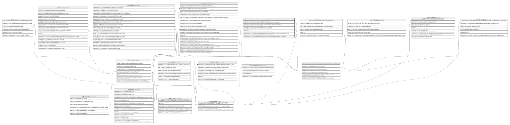

# Core.CanalCupo

## Description

Cupos/limites operativos definidos por el titular/propietario de una cuenta por canal. Nunca superan los cupos definidos por el ente financiero en ProductoCanalCupo.

## Columns

| Name                | Type      | Default                                      | Nullable | Children | Parents                                 | Comment                                                                                                                |
| ------------------- | --------- | -------------------------------------------- | -------- | -------- | --------------------------------------- | ---------------------------------------------------------------------------------------------------------------------- |
| CodigoMoneda        | smallint  | ((840))                                      | false    |          | [Catalogo.Monedas](Catalogo.Monedas.md) | Codigo de la moneda en la que se expresa el cupo/limite.                                                               |
| CupoDiario          | decimal   |                                              | false    |          |                                         | Cupo maximo diario permitido y parametrizado por el titular de la cuenta para el canal decidido.                       |
| CupoMensual         | decimal   |                                              | false    |          |                                         | Cupo maximo mensual permitido y parametrizado por el titular de la cuenta para el canal decidido.                      |
| Estado              | char      | (('A') collate SQL_Latin1_General_CP1_CI_AS) | false    |          |                                         | Indica si el cupo/limite esta activo o inactivo (I/A).                                                                 |
| FechaRegistro       | datetime2 | (sysdatetime())                              | false    |          |                                         | Fecha en la que se registro el cupo/limite, usado en reportes y logs.                                                  |
| IdCanal             | int       |                                              | false    |          | [Catalogo.Canal](Catalogo.Canal.md)     | FK a Canal, indica el canal al que pertenece el cupo parametrizado por el titular.                                     |
| IdCanalCupo         | int       |                                              | false    |          |                                         |                                                                                                                        |
| IdCuenta            | int       |                                              | false    |          | [Core.Cuenta](Core.Cuenta.md)           | FK a Cuenta, indica la cuenta a la que pertenece el cupo parametrizado por el titular.                                 |
| MaxTransaccionesDia | smallint  |                                              | false    |          |                                         | Cantidad maxima de transacciones por dia permitido y parametrizado por el titular de la cuenta para el canal decidido. |
| ModificadoPor       | int       |                                              | true     |          |                                         | Usuario que modifico el cupo/limite. Referencia logica (sin FK) a SeguridadDB.                                         |
| MontoMaxTransaccion | decimal   |                                              | false    |          |                                         | Monto maximo por transaccion permitido y parametrizado por el titular de la cuenta para el canal decidido.             |

## Viewpoints

| Name                   | Definition                                           |
| ---------------------- | ---------------------------------------------------- |
| [Core](viewpoint-3.md) | Cuentas, tarjetas, canales y el motor transaccional. |

## Constraints

| Name                | Type        | Definition                                                                                                                    |
| ------------------- | ----------- | ----------------------------------------------------------------------------------------------------------------------------- |
| CK_CanalCupo_Cupos  | CHECK       | CHECK([CupoDiario]>(0) AND [CupoMensual]>=[CupoDiario] AND [MontoMaxTransaccion]>(0) AND [MontoMaxTransaccion]<=[CupoDiario]) |
| CK_CanalCupo_Estado | CHECK       | CHECK([Estado]='I' OR [Estado]='A')                                                                                           |
| CK_CanalCupo_NumMax | CHECK       | CHECK([MaxTransaccionesDia]>(0))                                                                                              |
| FK_CanalCupo_Canal  | FOREIGN KEY | FOREIGN KEY(IdCanal) REFERENCES Catalogo.Canal(IdCanal) ON UPDATE NO_ACTION ON DELETE NO_ACTION                               |
| FK_CanalCupo_Cuenta | FOREIGN KEY | FOREIGN KEY(IdCuenta) REFERENCES Core.Cuenta(IdCuenta) ON UPDATE NO_ACTION ON DELETE NO_ACTION                                |
| FK_CanalCupo_Moneda | FOREIGN KEY | FOREIGN KEY(CodigoMoneda) REFERENCES Catalogo.Monedas(CodigoMoneda) ON UPDATE NO_ACTION ON DELETE NO_ACTION                   |
| PK_CanalCupo        | PRIMARY KEY | CLUSTERED, unique, part of a PRIMARY KEY constraint, [ IdCanalCupo ]                                                          |
| UQ_CanalCupo        | UNIQUE      | NONCLUSTERED, unique, part of a UNIQUE constraint, [ IdCuenta, IdCanal ]                                                      |

## Indexes

| Name               | Definition                                                               |
| ------------------ | ------------------------------------------------------------------------ |
| IX_CanalCupo_Canal | NONCLUSTERED, [ IdCanal ]                                                |
| PK_CanalCupo       | CLUSTERED, unique, part of a PRIMARY KEY constraint, [ IdCanalCupo ]     |
| UQ_CanalCupo       | NONCLUSTERED, unique, part of a UNIQUE constraint, [ IdCuenta, IdCanal ] |

## Relations

---

> Generated by [tbls](https://github.com/k1LoW/tbls)
