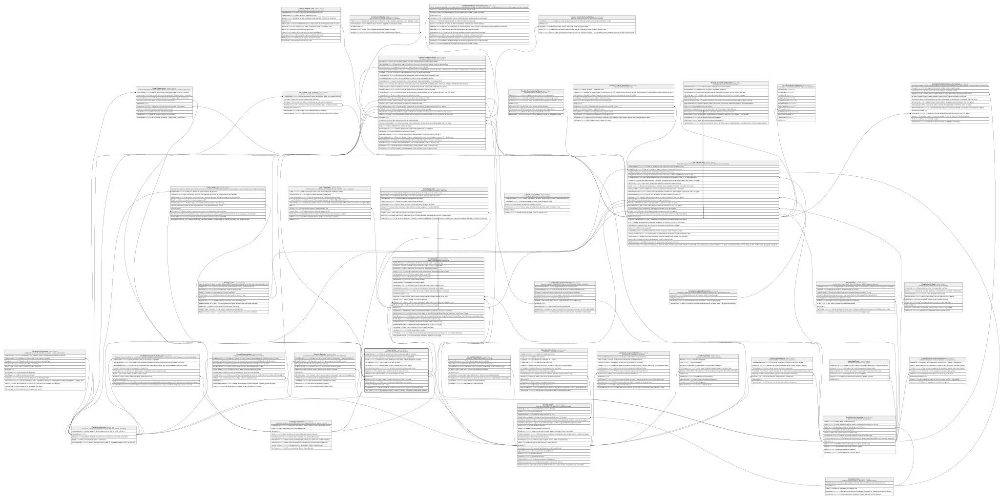

# Core.Cuenta

## Description

Cuenta del socio (ahorro, corriente, etc.).

## Columns

| Name                  | Type        | Default                                           | Nullable | Children                                                                                                                                                                                                  | Parents                                         | Comment                                                                                |
| --------------------- | ----------- | ------------------------------------------------- | -------- | --------------------------------------------------------------------------------------------------------------------------------------------------------------------------------------------------------- | ----------------------------------------------- | -------------------------------------------------------------------------------------- |
| CodigoMoneda          | smallint    | ((840))                                           | false    |                                                                                                                                                                                                           | [Catalogo.Monedas](Catalogo.Monedas.md)         | Codigo de la moneda en la que se expresa el saldo de la cuenta.                        |
| CreadoPor             | int         |                                                   | false    |                                                                                                                                                                                                           |                                                 | Usuario que abrio la cuenta. Referencia logica (sin FK) a SeguridadDB.                 |
| Estado                | varchar(10) | (('Activa') collate SQL_Latin1_General_CP1_CI_AS) | false    |                                                                                                                                                                                                           |                                                 | Estado de la cuenta que incluye si esta (Activa, Inactiva, Bloqueada, Cerrada).        |
| FechaApertura         | datetime2   | (sysdatetime())                                   | false    |                                                                                                                                                                                                           |                                                 | Fecha en la que se abrio la cuenta.                                                    |
| FechaCierre           | datetime2   |                                                   | true     |                                                                                                                                                                                                           |                                                 | Fecha en la que se cerro la cuenta (NULL si sigue activa).                             |
| FechaUltimoMovimiento | datetime2   |                                                   | true     |                                                                                                                                                                                                           |                                                 | Fecha del ultimo movimiento registrado en la cuenta.                                   |
| IdAgencia             | char        |                                                   | false    |                                                                                                                                                                                                           | [Organizacion.Agencia](Organizacion.Agencia.md) | FK a Agencia, indica la agencia donde se registro la cuenta.                           |
| IdCliente             | int         |                                                   | false    |                                                                                                                                                                                                           | [Clientes.Cliente](Clientes.Cliente.md)         | FK a Cliente, indica el socio al que pertenece la cuenta.                              |
| IdCuenta              | int         |                                                   | false    | [Core.CanalCupo](Core.CanalCupo.md) [Core.Movimiento](Core.Movimiento.md) [Core.Tarjeta](Core.Tarjeta.md) [Core.Transaccion](Core.Transaccion.md) [Credito.CreditoSolicitud](Credito.CreditoSolicitud.md) |                                                 |                                                                                        |
| IdProducto            | int         |                                                   | false    |                                                                                                                                                                                                           | [Catalogo.Producto](Catalogo.Producto.md)       | FK a Producto, indica el producto financiero asociado a la cuenta.                     |
| NumeroCuenta          | varchar(20) |                                                   | false    |                                                                                                                                                                                                           |                                                 | Numero unico de cuenta asignado por la cooperativa.                                    |
| Saldo                 | decimal     | ((0))                                             | false    |                                                                                                                                                                                                           |                                                 | Saldo actual de la cuenta.                                                             |
| SaldoRetenido         | decimal     | ((0))                                             | false    |                                                                                                                                                                                                           |                                                 | Saldo retenido de la cuenta (ej:' para cheques en proceso de compensacion').           |
| TipoCuenta            | varchar(20) |                                                   | false    |                                                                                                                                                                                                           |                                                 | Tipo de cuenta (Ahorro, Corriente - Evaluar si el Producto no define el tipo tambien). |

## Viewpoints

| Name                   | Definition                                           |
| ---------------------- | ---------------------------------------------------- |
| [Core](viewpoint-3.md) | Cuentas, tarjetas, canales y el motor transaccional. |

## Constraints

| Name               | Type        | Definition                                                                                                  |
| ------------------ | ----------- | ----------------------------------------------------------------------------------------------------------- |
| CK_Cuenta_Cierre   | CHECK       | CHECK([Estado]<>'Cerrada' OR [FechaCierre] IS NOT NULL)                                                     |
| CK_Cuenta_Estado   | CHECK       | CHECK([Estado]='Cerrada' OR [Estado]='Bloqueada' OR [Estado]='Inactiva' OR [Estado]='Activa')               |
| CK_Cuenta_Retenido | CHECK       | CHECK([SaldoRetenido]>=(0) AND [SaldoRetenido]<=[Saldo])                                                    |
| CK_Cuenta_Saldo    | CHECK       | CHECK([Saldo]>=(0))                                                                                         |
| CK_Cuenta_Tipo     | CHECK       | CHECK([TipoCuenta]='Corriente' OR [TipoCuenta]='Ahorro')                                                    |
| FK_Cuenta_Agencia  | FOREIGN KEY | FOREIGN KEY(IdAgencia) REFERENCES Organizacion.Agencia(IdAgencia) ON UPDATE NO_ACTION ON DELETE NO_ACTION   |
| FK_Cuenta_Cliente  | FOREIGN KEY | FOREIGN KEY(IdCliente) REFERENCES Clientes.Cliente(IdCliente) ON UPDATE NO_ACTION ON DELETE NO_ACTION       |
| FK_Cuenta_Moneda   | FOREIGN KEY | FOREIGN KEY(CodigoMoneda) REFERENCES Catalogo.Monedas(CodigoMoneda) ON UPDATE NO_ACTION ON DELETE NO_ACTION |
| FK_Cuenta_Producto | FOREIGN KEY | FOREIGN KEY(IdProducto) REFERENCES Catalogo.Producto(IdProducto) ON UPDATE NO_ACTION ON DELETE NO_ACTION    |
| PK_Cuenta          | PRIMARY KEY | CLUSTERED, unique, part of a PRIMARY KEY constraint, [ IdCuenta ]                                           |
| UQ_Cuenta_Numero   | UNIQUE      | NONCLUSTERED, unique, part of a UNIQUE constraint, [ NumeroCuenta ]                                         |

## Indexes

| Name                 | Definition                                                          |
| -------------------- | ------------------------------------------------------------------- |
| IX_Cuenta_IdAgencia  | NONCLUSTERED, [ IdAgencia ]                                         |
| IX_Cuenta_IdCliente  | NONCLUSTERED, [ IdCliente ]                                         |
| IX_Cuenta_IdProducto | NONCLUSTERED, [ IdProducto ]                                        |
| PK_Cuenta            | CLUSTERED, unique, part of a PRIMARY KEY constraint, [ IdCuenta ]   |
| UQ_Cuenta_Numero     | NONCLUSTERED, unique, part of a UNIQUE constraint, [ NumeroCuenta ] |

## Relations

---

> Generated by [tbls](https://github.com/k1LoW/tbls)
