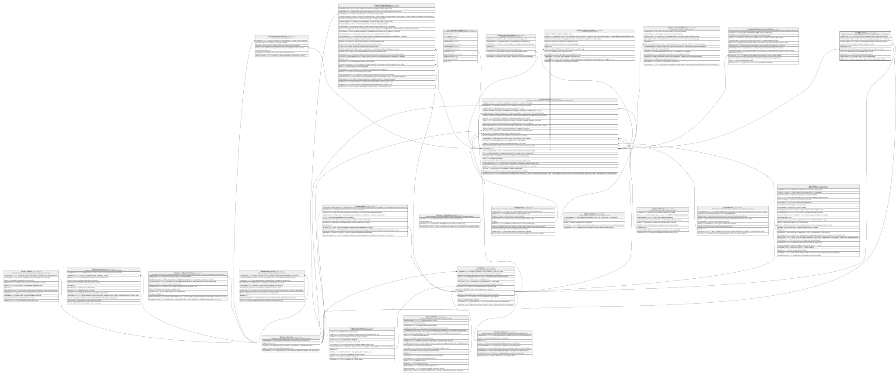

# Core.Movimiento

## Description

Detalle de movimiento de saldo, ingreso o egreso de una cuenta asociado a una transaccion.

## Columns

| Name             | Type      | Default         | Nullable | Children | Parents                                 | Comment                                                                     |
| ---------------- | --------- | --------------- | -------- | -------- | --------------------------------------- | --------------------------------------------------------------------------- |
| CodigoMoneda     | smallint  | ((840))         | false    |          | [Catalogo.Monedas](Catalogo.Monedas.md) | Codigo de la moneda en la que se expresa el monto del movimiento.           |
| FechaContable    | date      |                 | false    |          |                                         | Fecha contable del movimiento, usada para efectos de cierre y conciliacion. |
| FechaHoraSistema | datetime2 | (sysdatetime()) | false    |          |                                         | Fecha y hora del sistema en la que se registro el movimiento.               |
| IdCuenta         | int       |                 | false    |          | [Core.Cuenta](Core.Cuenta.md)           | FK a Cuenta, indica la cuenta asociada al movimiento.                       |
| IdMovimiento     | bigint    |                 | false    |          |                                         |                                                                             |
| IdTransaccion    | bigint    |                 | false    |          | [Core.Transaccion](Core.Transaccion.md) | FK a Transaccion, indica la transaccion asociada al movimiento.             |
| Monto            | decimal   |                 | false    |          |                                         | Monto del movimiento realizado sobre la cuenta.                             |
| SaldoAnterior    | decimal   |                 | false    |          |                                         | Saldo de la cuenta antes del movimiento.                                    |
| SaldoPosterior   | decimal   |                 | false    |          |                                         | Saldo de la cuenta despues del movimiento.                                  |
| TipoMovimiento   | char      |                 | false    |          |                                         | Tipo de movimiento de saldo (ej:' C para Credito, D para Debito').          |

## Viewpoints

| Name                   | Definition                                           |
| ---------------------- | ---------------------------------------------------- |
| [Core](viewpoint-3.md) | Cuentas, tarjetas, canales y el motor transaccional. |

## Constraints

| Name                      | Type        | Definition                                                                                                                                        |
| ------------------------- | ----------- | ------------------------------------------------------------------------------------------------------------------------------------------------- |
| CK_Movimiento_Cuadre      | CHECK       | CHECK([TipoMovimiento]='C' AND [SaldoPosterior]=([SaldoAnterior]+[Monto]) OR [TipoMovimiento]='D' AND [SaldoPosterior]=([SaldoAnterior]-[Monto])) |
| CK_Movimiento_Monto       | CHECK       | CHECK([Monto]>(0))                                                                                                                                |
| CK_Movimiento_Saldos      | CHECK       | CHECK([SaldoAnterior]>=(0) AND [SaldoPosterior]>=(0))                                                                                             |
| CK_Movimiento_Tipo        | CHECK       | CHECK([TipoMovimiento]='C' OR [TipoMovimiento]='D')                                                                                               |
| FK_Movimiento_Cuenta      | FOREIGN KEY | FOREIGN KEY(IdCuenta) REFERENCES Core.Cuenta(IdCuenta) ON UPDATE NO_ACTION ON DELETE NO_ACTION                                                    |
| FK_Movimiento_Moneda      | FOREIGN KEY | FOREIGN KEY(CodigoMoneda) REFERENCES Catalogo.Monedas(CodigoMoneda) ON UPDATE NO_ACTION ON DELETE NO_ACTION                                       |
| FK_Movimiento_Transaccion | FOREIGN KEY | FOREIGN KEY(IdTransaccion) REFERENCES Core.Transaccion(IdTransaccion) ON UPDATE NO_ACTION ON DELETE NO_ACTION                                     |
| PK_Movimiento             | PRIMARY KEY | CLUSTERED, unique, part of a PRIMARY KEY constraint, [ IdMovimiento ]                                                                             |

## Indexes

| Name                        | Definition                                                            |
| --------------------------- | --------------------------------------------------------------------- |
| IX_Movimiento_Cuenta_Fecha  | NONCLUSTERED, [ IdCuenta, FechaContable ]                             |
| IX_Movimiento_IdTransaccion | NONCLUSTERED, [ IdTransaccion ]                                       |
| PK_Movimiento               | CLUSTERED, unique, part of a PRIMARY KEY constraint, [ IdMovimiento ] |

## Relations

---

> Generated by [tbls](https://github.com/k1LoW/tbls)
