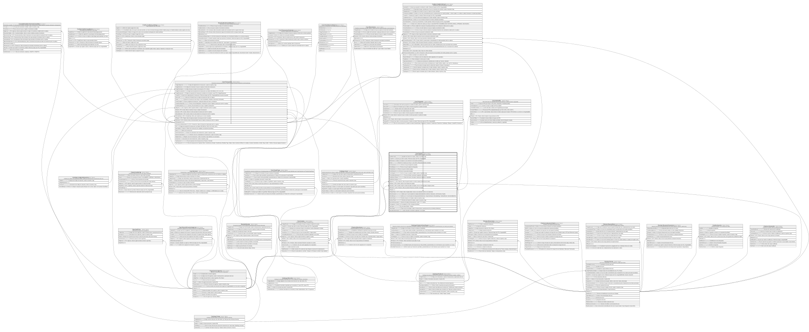

# Core.Tarjeta

## Description

Tarjeta emitida asociada a una cuenta.

## Columns

| Name                  | Type          | Default                                           | Nullable | Children                                                                                                                                            | Parents                                         | Comment                                                                                                                           |
| --------------------- | ------------- | ------------------------------------------------- | -------- | --------------------------------------------------------------------------------------------------------------------------------------------------- | ----------------------------------------------- | --------------------------------------------------------------------------------------------------------------------------------- |
| ApellidosTitular      | varchar(250)  |                                                   | false    |                                                                                                                                                     |                                                 | Apellidos del titular de la tarjeta, usado en reportes y logs.                                                                    |
| CreadoPor             | int           |                                                   | false    |                                                                                                                                                     |                                                 | Usuario que emitio la tarjeta. Referencia logica (sin FK) a SeguridadDB.                                                          |
| EsExtension           | bit           | ((0))                                             | false    |                                                                                                                                                     |                                                 | Indica si la tarjeta es una extension de otra tarjeta (true/false).                                                               |
| Estado                | varchar(10)   | (('Activa') collate SQL_Latin1_General_CP1_CI_AS) | false    |                                                                                                                                                     |                                                 | Estado de la tarjeta que incluye si esta (Activa, Bloqueada, Vencida, Anulada).                                                   |
| FechaAnulacion        | datetime2     |                                                   | true     |                                                                                                                                                     |                                                 | Fecha en la que la tarjeta fue anulada.                                                                                           |
| FechaBloqueo          | datetime2     |                                                   | true     |                                                                                                                                                     |                                                 | Fecha en la que la tarjeta fue bloqueada.                                                                                         |
| FechaEmision          | date          |                                                   | false    |                                                                                                                                                     |                                                 | Fecha en la que se emitio la tarjeta.                                                                                             |
| FechaExpiracion       | date          |                                                   | false    |                                                                                                                                                     |                                                 | Fecha en la que expira la tarjeta.                                                                                                |
| FechaRegistro         | datetime2     | (sysdatetime())                                   | false    |                                                                                                                                                     |                                                 | Fecha en la que se registro la tarjeta, usado en reportes y logs.                                                                 |
| FechaUltimoMovimiento | datetime2     |                                                   | true     |                                                                                                                                                     |                                                 | Fecha del ultimo movimiento registrado con la tarjeta.                                                                            |
| HashNumeroTarjeta     | varbinary(32) |                                                   | false    |                                                                                                                                                     |                                                 | Hash del numero de tarjeta, usado para validacion y seguridad.                                                                    |
| HashNumeroTarjeta     | vector        |                                                   | false    |                                                                                                                                                     |                                                 |                                                                                                                                   |
| IdAgencia             | char          |                                                   | true     |                                                                                                                                                     | [Organizacion.Agencia](Organizacion.Agencia.md) | FK a Agencia, indica la agencia donde se emitio la tarjeta (Verificar tipo de dato).                                              |
| IdCliente             | int           |                                                   | false    |                                                                                                                                                     | [Clientes.Cliente](Clientes.Cliente.md)         | FK a Cliente, indica el socio titular de la tarjeta.                                                                              |
| IdCuenta              | int           |                                                   | false    |                                                                                                                                                     | [Core.Cuenta](Core.Cuenta.md)                   | FK a Cuenta, indica la cuenta asociada a la tarjeta, null si no esta asociada a ninguna cuenta.                                   |
| IdProducto            | int           |                                                   | false    |                                                                                                                                                     | [Catalogo.Producto](Catalogo.Producto.md)       | FK a Producto, indica el producto financiero asociado a la tarjeta.                                                               |
| IdTarjeta             | int           |                                                   | false    | [Core.Tarjeta](Core.Tarjeta.md) [Core.TarjetaHis](Core.TarjetaHis.md) [Core.TarjetaPin](Core.TarjetaPin.md) [Core.Transaccion](Core.Transaccion.md) |                                                 |                                                                                                                                   |
| IdTarjetaTitular      | int           |                                                   | true     |                                                                                                                                                     | [Core.Tarjeta](Core.Tarjeta.md)                 | FK a Tarjeta, indica la tarjeta titular si esta es una extension (null si no es extension).                                       |
| MotivoAnulacion       | varchar(30)   |                                                   | true     |                                                                                                                                                     |                                                 | Motivo por el cual la tarjeta fue anulada (SolicitudCliente, Deterioro, Reposicion, CierreCuenta, Fraude).                        |
| MotivoBloqueo         | varchar(30)   |                                                   | true     |                                                                                                                                                     |                                                 | Motivo por el cual la tarjeta fue bloqueada (RoboExtravio, SospechaFraude, MorosidadPago, SolicitudCliente, IntentosFallidosPin). |
| NombreTarjeta         | varchar(50)   |                                                   | false    |                                                                                                                                                     |                                                 | Nombre impreso en la tarjeta, usado en reportes y logs.                                                                           |
| NombresTitular        | varchar(250)  |                                                   | false    |                                                                                                                                                     |                                                 | Nombres del titular de la tarjeta, usado en reportes y logs.                                                                      |
| NumeroEnmascarado     | char          |                                                   | false    |                                                                                                                                                     |                                                 | Numero de tarjeta enmascarado (ej:' 1234-****-****-5678').                                                                        |
| PinAsignado           | bit           | ((0))                                             | false    |                                                                                                                                                     |                                                 | Indica si se ha asignado un PIN a la tarjeta (true/false).                                                                        |
| TipoTarjeta           | varchar(10)   |                                                   | false    |                                                                                                                                                     |                                                 | Tipo de tarjeta (Debito, Credito).                                                                                                |
| TokenTarjeta          | varchar(100)  |                                                   | false    |                                                                                                                                                     |                                                 | Token unico de la tarjeta, usado en transacciones y operaciones del core (Verificar Definicion).                                  |
| ValorUltimoMovimiento | decimal       |                                                   | true     |                                                                                                                                                     |                                                 | Valor del ultimo movimiento registrado con la tarjeta.                                                                            |

## Viewpoints

| Name                   | Definition                                           |
| ---------------------- | ---------------------------------------------------- |
| [Core](viewpoint-3.md) | Cuentas, tarjetas, canales y el motor transaccional. |

## Constraints

| Name                       | Type        | Definition                                                                                                                                                                                                               |
| -------------------------- | ----------- | ------------------------------------------------------------------------------------------------------------------------------------------------------------------------------------------------------------------------ |
| CK_Tarjeta_Anulacion       | CHECK       | CHECK([Estado]<>'Anulada' OR [MotivoAnulacion] IS NOT NULL AND [FechaAnulacion] IS NOT NULL)                                                                                                                             |
| CK_Tarjeta_Bloqueo         | CHECK       | CHECK([Estado]<>'Bloqueada' OR [MotivoBloqueo] IS NOT NULL AND [FechaBloqueo] IS NOT NULL)                                                                                                                               |
| CK_Tarjeta_Estado          | CHECK       | CHECK([Estado]='Anulada' OR [Estado]='Vencida' OR [Estado]='Bloqueada' OR [Estado]='Activa')                                                                                                                             |
| CK_Tarjeta_Extension       | CHECK       | CHECK([EsExtension]=(0) AND [IdTarjetaTitular] IS NULL OR [EsExtension]=(1) AND [IdTarjetaTitular] IS NOT NULL)                                                                                                          |
| CK_Tarjeta_Fechas          | CHECK       | CHECK([FechaExpiracion]>[FechaEmision])                                                                                                                                                                                  |
| CK_Tarjeta_MotivoAnulacion | CHECK       | CHECK([MotivoAnulacion] IS NULL OR ([MotivoAnulacion]='Fraude' OR [MotivoAnulacion]='CierreCuenta' OR [MotivoAnulacion]='Reposicion' OR [MotivoAnulacion]='Deterioro' OR [MotivoAnulacion]='SolicitudCliente'))          |
| CK_Tarjeta_MotivoBloqueo   | CHECK       | CHECK([MotivoBloqueo] IS NULL OR ([MotivoBloqueo]='IntentosFallidosPin' OR [MotivoBloqueo]='SolicitudCliente' OR [MotivoBloqueo]='MorosidadPago' OR [MotivoBloqueo]='SospechaFraude' OR [MotivoBloqueo]='RoboExtravio')) |
| CK_Tarjeta_Tipo            | CHECK       | CHECK([TipoTarjeta]='Credito' OR [TipoTarjeta]='Debito')                                                                                                                                                                 |
| CK_Tarjeta_ValorUltimo     | CHECK       | CHECK([ValorUltimoMovimiento] IS NULL OR [ValorUltimoMovimiento]>=(0))                                                                                                                                                   |
| FK_Tarjeta_Agencia         | FOREIGN KEY | FOREIGN KEY(IdAgencia) REFERENCES Organizacion.Agencia(IdAgencia) ON UPDATE NO_ACTION ON DELETE NO_ACTION                                                                                                                |
| FK_Tarjeta_Cliente         | FOREIGN KEY | FOREIGN KEY(IdCliente) REFERENCES Clientes.Cliente(IdCliente) ON UPDATE NO_ACTION ON DELETE NO_ACTION                                                                                                                    |
| FK_Tarjeta_Cuenta          | FOREIGN KEY | FOREIGN KEY(IdCuenta) REFERENCES Core.Cuenta(IdCuenta) ON UPDATE NO_ACTION ON DELETE NO_ACTION                                                                                                                           |
| FK_Tarjeta_Producto        | FOREIGN KEY | FOREIGN KEY(IdProducto) REFERENCES Catalogo.Producto(IdProducto) ON UPDATE NO_ACTION ON DELETE NO_ACTION                                                                                                                 |
| FK_Tarjeta_Titular         | FOREIGN KEY | FOREIGN KEY(IdTarjetaTitular) REFERENCES Core.Tarjeta(IdTarjeta) ON UPDATE NO_ACTION ON DELETE NO_ACTION                                                                                                                 |
| PK_Tarjeta                 | PRIMARY KEY | CLUSTERED, unique, part of a PRIMARY KEY constraint, [ IdTarjeta ]                                                                                                                                                       |
| UQ_Tarjeta_Hash            | UNIQUE      | NONCLUSTERED, unique, part of a UNIQUE constraint, [ HashNumeroTarjeta ]                                                                                                                                                 |
| UQ_Tarjeta_Token           | UNIQUE      | NONCLUSTERED, unique, part of a UNIQUE constraint, [ TokenTarjeta ]                                                                                                                                                      |

## Indexes

| Name                        | Definition                                                               |
| --------------------------- | ------------------------------------------------------------------------ |
| IX_Tarjeta_IdCliente        | NONCLUSTERED, [ IdCliente ]                                              |
| IX_Tarjeta_IdCuenta         | NONCLUSTERED, [ IdCuenta ]                                               |
| IX_Tarjeta_IdTarjetaTitular | NONCLUSTERED, [ IdTarjetaTitular ]                                       |
| PK_Tarjeta                  | CLUSTERED, unique, part of a PRIMARY KEY constraint, [ IdTarjeta ]       |
| UQ_Tarjeta_Hash             | NONCLUSTERED, unique, part of a UNIQUE constraint, [ HashNumeroTarjeta ] |
| UQ_Tarjeta_Token            | NONCLUSTERED, unique, part of a UNIQUE constraint, [ TokenTarjeta ]      |

## Relations

---

> Generated by [tbls](https://github.com/k1LoW/tbls)
