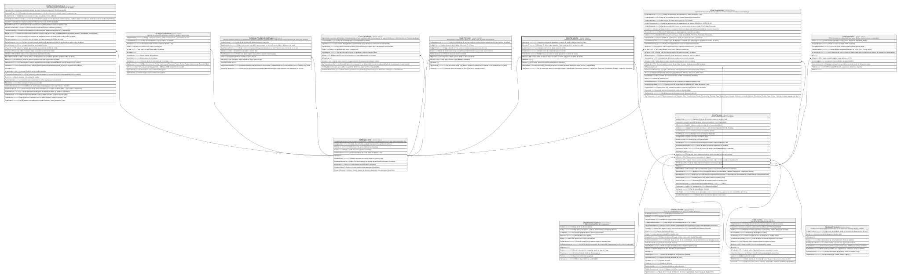

# Core.TarjetaHis

## Description

Historial de cambios de estado de una tarjeta.

## Columns

| Name           | Type         | Default         | Nullable | Children | Parents                             | Comment                                                                                                                                                  |
| -------------- | ------------ | --------------- | -------- | -------- | ----------------------------------- | -------------------------------------------------------------------------------------------------------------------------------------------------------- |
| Descripcion    | varchar(500) |                 | false    |          |                                     | Descripcion del evento que genero el cambio de estado, usado en reportes y logs.                                                                         |
| DireccionIP    | varchar(45)  |                 | true     |          |                                     | Direccion IP desde la que se realizo el evento que genero el cambio de estado.                                                                           |
| EstadoAnterior | varchar(10)  |                 | true     |          |                                     | Estado anterior de la tarjeta antes del cambio.                                                                                                          |
| EstadoNuevo    | varchar(10)  |                 | true     |          |                                     | Estado nuevo de la tarjeta despues del cambio.                                                                                                           |
| FechaEvento    | datetime2    | (sysdatetime()) | false    |          |                                     | Fecha en la que se realizo el evento que genero el cambio de estado.                                                                                     |
| IdCanal        | int          |                 | true     |          | [Catalogo.Canal](Catalogo.Canal.md) | FK a Canal, indica el canal por el que se realizo el evento que genero el cambio de estado.                                                              |
| IdHistorial    | bigint       |                 | false    |          |                                     |                                                                                                                                                          |
| IdTarjeta      | int          |                 | false    |          | [Core.Tarjeta](Core.Tarjeta.md)     | FK a Tarjeta, indica la tarjeta a la que pertenece el historial.                                                                                         |
| RealizadoPor   | int          |                 | true     |          |                                     | Usuario que realizo el evento que genero el cambio de estado. Referencia logica (sin FK) a SeguridadDB.                                                  |
| TipoEvento     | varchar(20)  |                 | false    |          |                                     | Tipo de evento que genero el cambio de estado (CambioEstado, Renovacion, Anulacion, CambioCupo, Reposicion, Desbloqueo, Bloqueo, CambioPin, Activacion). |

## Viewpoints

| Name                   | Definition                                           |
| ---------------------- | ---------------------------------------------------- |
| [Core](viewpoint-3.md) | Cuentas, tarjetas, canales y el motor transaccional. |

## Constraints

| Name                     | Type        | Definition                                                                                                                                                                                                                                                            |
| ------------------------ | ----------- | --------------------------------------------------------------------------------------------------------------------------------------------------------------------------------------------------------------------------------------------------------------------- |
| CK_TarjetaHis_TipoEvento | CHECK       | CHECK([TipoEvento]='Activacion' OR [TipoEvento]='CambioPin' OR [TipoEvento]='Bloqueo' OR [TipoEvento]='Desbloqueo' OR [TipoEvento]='Reposicion' OR [TipoEvento]='CambioCupo' OR [TipoEvento]='Anulacion' OR [TipoEvento]='Renovacion' OR [TipoEvento]='CambioEstado') |
| FK_TarjetaHis_Canal      | FOREIGN KEY | FOREIGN KEY(IdCanal) REFERENCES Catalogo.Canal(IdCanal) ON UPDATE NO_ACTION ON DELETE NO_ACTION                                                                                                                                                                       |
| FK_TarjetaHis_Tarjeta    | FOREIGN KEY | FOREIGN KEY(IdTarjeta) REFERENCES Core.Tarjeta(IdTarjeta) ON UPDATE NO_ACTION ON DELETE NO_ACTION                                                                                                                                                                     |
| PK_TarjetaHis            | PRIMARY KEY | CLUSTERED, unique, part of a PRIMARY KEY constraint, [ IdHistorial ]                                                                                                                                                                                                  |

## Indexes

| Name                        | Definition                                                           |
| --------------------------- | -------------------------------------------------------------------- |
| IX_TarjetaHis_Tarjeta_Fecha | NONCLUSTERED, [ IdTarjeta, FechaEvento ]                             |
| PK_TarjetaHis               | CLUSTERED, unique, part of a PRIMARY KEY constraint, [ IdHistorial ] |

## Relations

---

> Generated by [tbls](https://github.com/k1LoW/tbls)
