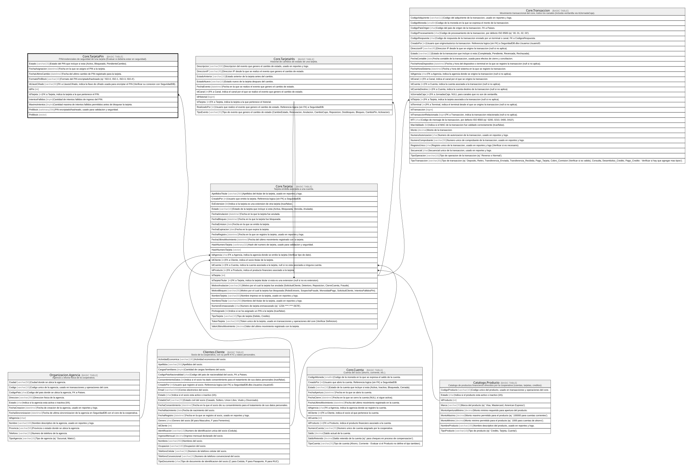

# Core.TarjetaPin

## Description

PIN/credenciales de seguridad de una tarjeta (Evaluar si deberia estar en seguridad).

## Columns

| Name              | Type           | Default                                           | Nullable | Children | Parents                         | Comment                                                                                                             |
| ----------------- | -------------- | ------------------------------------------------- | -------- | -------- | ------------------------------- | ------------------------------------------------------------------------------------------------------------------- |
| Estado            | varchar(15)    | (('Activo') collate SQL_Latin1_General_CP1_CI_AS) | false    |          |                                 | Estado del PIN que incluye si esta (Activo, Bloqueado, PendienteCambio).                                            |
| FechaAsignacion   | datetime2      | (sysdatetime())                                   | false    |          |                                 | Fecha en la que se asigno el PIN a la tarjeta.                                                                      |
| FechaUltimoCambio | datetime2      |                                                   | true     |          |                                 | Fecha del ultimo cambio de PIN registrado para la tarjeta.                                                          |
| FormatoPinBlock   | varchar(10)    | (('ISO-0') collate SQL_Latin1_General_CP1_CI_AS)  | false    |          |                                 | Formato del PIN encriptado/hasheado (ej:' ISO-0, ISO-1, ISO-3, ISO-4').                                             |
| IdLlaveCifrado    | varchar(30)    |                                                   | false    |          |                                 | FK a LlavesCifrado, indica la llave de cifrado usada para encriptar el PIN (Verificar su conexion con SeguridadDB). |
| IdPin             | int            |                                                   | false    |          |                                 |                                                                                                                     |
| IdTarjeta         | int            |                                                   | false    |          | [Core.Tarjeta](Core.Tarjeta.md) | FK a Tarjeta, indica la tarjeta a la que pertenece el PIN.                                                          |
| IntentosFallidos  | tinyint        | ((0))                                             | false    |          |                                 | Cantidad de intentos fallidos de ingreso del PIN.                                                                   |
| MaximoIntentos    | tinyint        | ((3))                                             | false    |          |                                 | Cantidad maxima de intentos fallidos permitidos antes de bloquear la tarjeta.                                       |
| PinBlock          | varbinary(256) |                                                   | false    |          |                                 | PIN encriptado/hasheado, usado para validacion y seguridad.                                                         |
| PinBlock          | vector         |                                                   | false    |          |                                 |                                                                                                                     |

## Viewpoints

| Name                   | Definition                                           |
| ---------------------- | ---------------------------------------------------- |
| [Core](viewpoint-3.md) | Cuentas, tarjetas, canales y el motor transaccional. |

## Constraints

| Name                   | Type        | Definition                                                                                                              |
| ---------------------- | ----------- | ----------------------------------------------------------------------------------------------------------------------- |
| CK_TarjetaPin_Estado   | CHECK       | CHECK([Estado]='PendienteCambio' OR [Estado]='Bloqueado' OR [Estado]='Activo')                                          |
| CK_TarjetaPin_Formato  | CHECK       | CHECK([FormatoPinBlock]='ISO-4' OR [FormatoPinBlock]='ISO-3' OR [FormatoPinBlock]='ISO-1' OR [FormatoPinBlock]='ISO-0') |
| CK_TarjetaPin_Intentos | CHECK       | CHECK([IntentosFallidos]>=(0) AND [IntentosFallidos]<=[MaximoIntentos])                                                 |
| CK_TarjetaPin_Maximo   | CHECK       | CHECK([MaximoIntentos]>=(1) AND [MaximoIntentos]<=(5))                                                                  |
| FK_TarjetaPin_Tarjeta  | FOREIGN KEY | FOREIGN KEY(IdTarjeta) REFERENCES Core.Tarjeta(IdTarjeta) ON UPDATE NO_ACTION ON DELETE NO_ACTION                       |
| PK_TarjetaPin          | PRIMARY KEY | CLUSTERED, unique, part of a PRIMARY KEY constraint, [ IdPin ]                                                          |
| UQ_TarjetaPin_Tarjeta  | UNIQUE      | NONCLUSTERED, unique, part of a UNIQUE constraint, [ IdTarjeta ]                                                        |

## Indexes

| Name                  | Definition                                                       |
| --------------------- | ---------------------------------------------------------------- |
| PK_TarjetaPin         | CLUSTERED, unique, part of a PRIMARY KEY constraint, [ IdPin ]   |
| UQ_TarjetaPin_Tarjeta | NONCLUSTERED, unique, part of a UNIQUE constraint, [ IdTarjeta ] |

## Relations

---

> Generated by [tbls](https://github.com/k1LoW/tbls)
