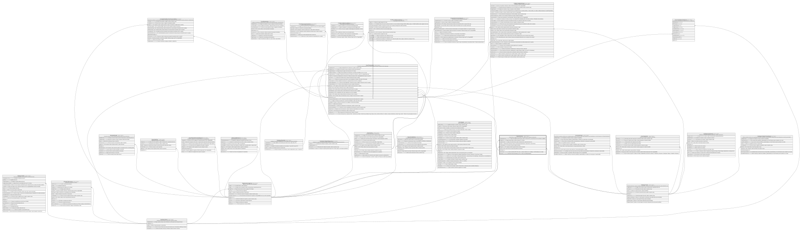

# Core.Terminal

## Description

Terminal fisico o logico (POS, cajero, etc.) desde el que se origina una operacion.

## Columns

| Name             | Type         | Default                                        | Nullable | Children                                | Parents                                         | Comment                                                                                                     |
| ---------------- | ------------ | ---------------------------------------------- | -------- | --------------------------------------- | ----------------------------------------------- | ----------------------------------------------------------------------------------------------------------- |
| CodigoAdquirente | varchar(11)  |                                                | false    |                                         |                                                 | Codigo del adquiriente del terminal, usado en transacciones y operaciones del core (Verificar su utilidad). |
| CodigoPais       | char         | (('ECU') collate SQL_Latin1_General_CP1_CI_AS) | false    |                                         | [Catalogo.Paises](Catalogo.Paises.md)           | Codigo del pais donde se ubica el terminal, FK a Paises.                                                    |
| CodigoTerminal   | char         |                                                | false    |                                         |                                                 | Codigo unico del terminal, usado en transacciones y operaciones del core.                                   |
| Estado           | char         | (('A') collate SQL_Latin1_General_CP1_CI_AS)   | false    |                                         |                                                 | Estado del terminal que incluye si esta (M para Mantenimiento, A para Activo, I para Inactivo).             |
| FechaInstalacion | date         |                                                | false    |                                         |                                                 | Fecha en la que se instalo el terminal.                                                                     |
| IdAgencia        | char         |                                                | true     |                                         | [Organizacion.Agencia](Organizacion.Agencia.md) | FK a Agencia, indica la agencia donde se ubica el terminal.                                                 |
| IdCanal          | int          |                                                | false    |                                         | [Catalogo.Canal](Catalogo.Canal.md)             | FK a Canal, indica el canal al que pertenece el terminal.                                                   |
| IdTerminal       | int          |                                                | false    | [Core.Transaccion](Core.Transaccion.md) |                                                 |                                                                                                             |
| TipoTerminal     | varchar(10)  |                                                | false    |                                         |                                                 | Tipo de terminal (ATM, POS, Kiosco - Evaluar si deberia ser un catalogo o si ATM deberia ser un canal).     |
| Ubicacion        | varchar(200) |                                                | true     |                                         |                                                 | Ubicacion fisica del terminal (ej:' Piso 1, frente a la entrada principal').                                |

## Viewpoints

| Name                   | Definition                                           |
| ---------------------- | ---------------------------------------------------- |
| [Core](viewpoint-3.md) | Cuentas, tarjetas, canales y el motor transaccional. |

## Constraints

| Name                | Type        | Definition                                                                                                |
| ------------------- | ----------- | --------------------------------------------------------------------------------------------------------- |
| CK_Terminal_Estado  | CHECK       | CHECK([Estado]='M' OR [Estado]='I' OR [Estado]='A')                                                       |
| CK_Terminal_Tipo    | CHECK       | CHECK([TipoTerminal]='Kiosco' OR [TipoTerminal]='POS' OR [TipoTerminal]='ATM')                            |
| FK_Terminal_Agencia | FOREIGN KEY | FOREIGN KEY(IdAgencia) REFERENCES Organizacion.Agencia(IdAgencia) ON UPDATE NO_ACTION ON DELETE NO_ACTION |
| FK_Terminal_Canal   | FOREIGN KEY | FOREIGN KEY(IdCanal) REFERENCES Catalogo.Canal(IdCanal) ON UPDATE NO_ACTION ON DELETE NO_ACTION           |
| FK_Terminal_Pais    | FOREIGN KEY | FOREIGN KEY(CodigoPais) REFERENCES Catalogo.Paises(CodigoPais) ON UPDATE NO_ACTION ON DELETE NO_ACTION    |
| PK_Terminal         | PRIMARY KEY | CLUSTERED, unique, part of a PRIMARY KEY constraint, [ IdTerminal ]                                       |
| UQ_Terminal_Codigo  | UNIQUE      | NONCLUSTERED, unique, part of a UNIQUE constraint, [ CodigoTerminal ]                                     |

## Indexes

| Name                  | Definition                                                            |
| --------------------- | --------------------------------------------------------------------- |
| IX_Terminal_IdAgencia | NONCLUSTERED, [ IdAgencia ]                                           |
| PK_Terminal           | CLUSTERED, unique, part of a PRIMARY KEY constraint, [ IdTerminal ]   |
| UQ_Terminal_Codigo    | NONCLUSTERED, unique, part of a UNIQUE constraint, [ CodigoTerminal ] |

## Relations

---

> Generated by [tbls](https://github.com/k1LoW/tbls)
