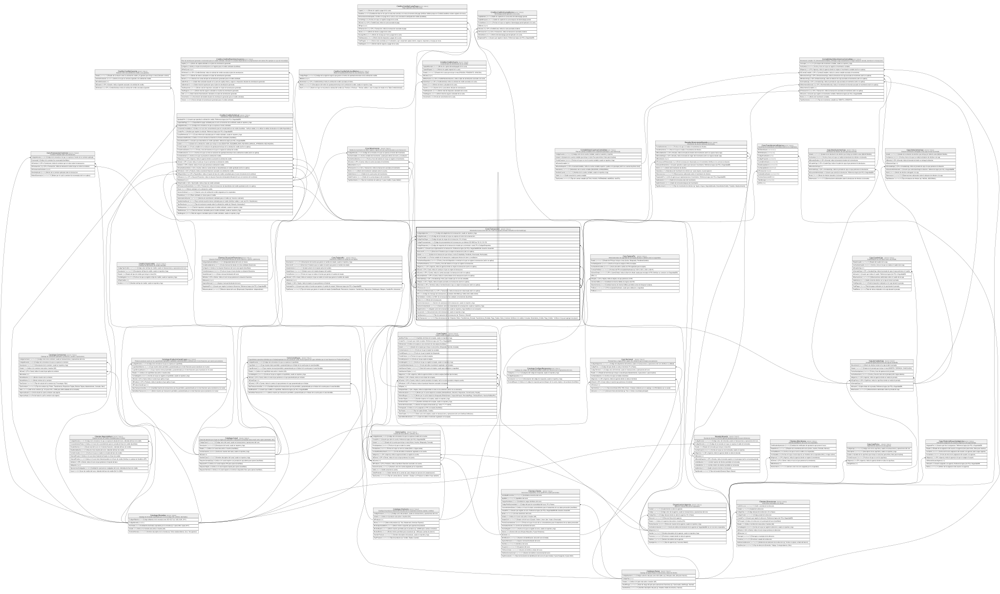

# Core.Transaccion

## Description

Movimiento transaccional del core, todos los canales (incluida ventanilla via IdJornadaCaja).

## Columns

| Name                     | Type        | Default                                               | Nullable | Children                                                                                                                                                                                                                                                                                                                                                                                                                                                                                                  | Parents                                                   | Comment                                                                                                                                                                                                                                  |
| ------------------------ | ----------- | ----------------------------------------------------- | -------- | --------------------------------------------------------------------------------------------------------------------------------------------------------------------------------------------------------------------------------------------------------------------------------------------------------------------------------------------------------------------------------------------------------------------------------------------------------------------------------------------------------- | --------------------------------------------------------- | ---------------------------------------------------------------------------------------------------------------------------------------------------------------------------------------------------------------------------------------- |
| CodigoAdquirente         | varchar(11) |                                                       | true     |                                                                                                                                                                                                                                                                                                                                                                                                                                                                                                           |                                                           | Codigo del adquiriente de la transaccion, usado en reportes y logs.                                                                                                                                                                      |
| CodigoMoneda             | smallint    | ((840))                                               | false    |                                                                                                                                                                                                                                                                                                                                                                                                                                                                                                           | [Catalogo.Monedas](Catalogo.Monedas.md)                   | Codigo de la moneda en la que se expresa el monto de la transaccion.                                                                                                                                                                     |
| CodigoPaisOrigen         | char        | (('ECU') collate SQL_Latin1_General_CP1_CI_AS)        | false    |                                                                                                                                                                                                                                                                                                                                                                                                                                                                                                           | [Catalogo.Paises](Catalogo.Paises.md)                     | Codigo del pais de origen de la transaccion, FK a Paises.                                                                                                                                                                                |
| CodigoProcesamiento      | char        |                                                       | false    |                                                                                                                                                                                                                                                                                                                                                                                                                                                                                                           |                                                           | Codigo de procesamiento de la transaccion, por defecto ISO 8583 (ej:' 00, 01, 02, 03').                                                                                                                                                  |
| CodigoRespuesta          | char        | (('00') collate SQL_Latin1_General_CP1_CI_AS)         | false    |                                                                                                                                                                                                                                                                                                                                                                                                                                                                                                           | [Catalogo.CodigosRespuesta](Catalogo.CodigosRespuesta.md) | Codigo de respuesta de la transaccion enviado por un terminal o canal, FK a CodigosRespuesta.                                                                                                                                            |
| CreadoPor                | int         |                                                       | true     |                                                                                                                                                                                                                                                                                                                                                                                                                                                                                                           |                                                           | Usuario que origino/autorizo la transaccion. Referencia logica (sin FK) a SeguridadDB.dbo.Usuarios.UsuarioID.                                                                                                                            |
| DireccionIP              | varchar(45) |                                                       | true     |                                                                                                                                                                                                                                                                                                                                                                                                                                                                                                           |                                                           | Direccion IP desde la que se origino la transaccion (null si no aplica).                                                                                                                                                                 |
| Estado                   | varchar(12) | (('Completada') collate SQL_Latin1_General_CP1_CI_AS) | false    |                                                                                                                                                                                                                                                                                                                                                                                                                                                                                                           |                                                           | Estado de la transaccion que incluye si esta (Completada, Pendiente, Reversada, Rechazada).                                                                                                                                              |
| FechaContable            | date        |                                                       | false    |                                                                                                                                                                                                                                                                                                                                                                                                                                                                                                           |                                                           | Fecha contable de la transaccion, usada para efectos de cierre y conciliacion.                                                                                                                                                           |
| FechaHoraDispositivo     | datetime2   |                                                       | false    |                                                                                                                                                                                                                                                                                                                                                                                                                                                                                                           |                                                           | Fecha y hora del dispositivo o terminal en la que se registro la transaccion (null si no aplica).                                                                                                                                        |
| FechaHoraSistema         | datetime2   | (sysdatetime())                                       | false    |                                                                                                                                                                                                                                                                                                                                                                                                                                                                                                           |                                                           | Fecha y hora del sistema en la que se registro la transaccion.                                                                                                                                                                           |
| IdAgencia                | char        |                                                       | true     |                                                                                                                                                                                                                                                                                                                                                                                                                                                                                                           | [Organizacion.Agencia](Organizacion.Agencia.md)           | FK a Agencia, indica la agencia donde se origino la transaccion (null si no aplica).                                                                                                                                                     |
| IdCanal                  | int         |                                                       | false    |                                                                                                                                                                                                                                                                                                                                                                                                                                                                                                           | [Catalogo.Canal](Catalogo.Canal.md)                       | FK a Canal, indica el canal por el que se origino la transaccion.                                                                                                                                                                        |
| IdCuenta                 | int         |                                                       | false    |                                                                                                                                                                                                                                                                                                                                                                                                                                                                                                           | [Core.Cuenta](Core.Cuenta.md)                             | FK a Cuenta, indica la cuenta asociada a la transaccion (null si no aplica).                                                                                                                                                             |
| IdCuentaDestino          | int         |                                                       | true     |                                                                                                                                                                                                                                                                                                                                                                                                                                                                                                           | [Core.Cuenta](Core.Cuenta.md)                             | FK a Cuenta, indica la cuenta destino de la transaccion (null si no aplica).                                                                                                                                                             |
| IdJornadaCaja            | int         |                                                       | true     |                                                                                                                                                                                                                                                                                                                                                                                                                                                                                                           | [Caja.JornadasCaja](Caja.JornadasCaja.md)                 | FK a JornadasCaja. NULL para canales que no son de ventanilla.                                                                                                                                                                           |
| IdTarjeta                | int         |                                                       | true     |                                                                                                                                                                                                                                                                                                                                                                                                                                                                                                           | [Core.Tarjeta](Core.Tarjeta.md)                           | FK a Tarjeta, indica la tarjeta asociada a la transaccion (null si no aplica).                                                                                                                                                           |
| IdTerminal               | int         |                                                       | true     |                                                                                                                                                                                                                                                                                                                                                                                                                                                                                                           | [Core.Terminal](Core.Terminal.md)                         | FK a Terminal, indica el terminal desde el que se origino la transaccion (null si no aplica).                                                                                                                                            |
| IdTransaccion            | bigint      |                                                       | false    | [Boveda.MovimientoBoveda](Boveda.MovimientoBoveda.md) [Contabilidad.MovimientosContables](Contabilidad.MovimientosContables.md) [Core.Movimiento](Core.Movimiento.md) [Core.Transaccion](Core.Transaccion.md) [Core.TransaccionComision](Core.TransaccionComision.md) [Core.TransferenciaExterna](Core.TransferenciaExterna.md) [Credito.CreditoCuotaAbono](Credito.CreditoCuotaAbono.md) [Credito.CreditoCuotaPago](Credito.CreditoCuotaPago.md) [Credito.CreditoSolicitud](Credito.CreditoSolicitud.md) |                                                           |                                                                                                                                                                                                                                          |
| IdTransaccionRelacionada | bigint      |                                                       | true     |                                                                                                                                                                                                                                                                                                                                                                                                                                                                                                           | [Core.Transaccion](Core.Transaccion.md)                   | FK a Transaccion, indica la transaccion relacionada (null si no aplica).                                                                                                                                                                 |
| MTI                      | char        | (('0200') collate SQL_Latin1_General_CP1_CI_AS)       | false    |                                                                                                                                                                                                                                                                                                                                                                                                                                                                                                           |                                                           | Codigo de mensaje de la transaccion, por defecto ISO 8583 (ej:' 0200, 0210, 0400, 0410').                                                                                                                                                |
| MacValidado              | bit         | ((0))                                                 | false    |                                                                                                                                                                                                                                                                                                                                                                                                                                                                                                           |                                                           | Indica si el MAC de la transaccion fue validado correctamente (true/false).                                                                                                                                                              |
| Monto                    | decimal     |                                                       | false    |                                                                                                                                                                                                                                                                                                                                                                                                                                                                                                           |                                                           | Monto de la transaccion.                                                                                                                                                                                                                 |
| NumeroAutorizacion       | char        |                                                       | true     |                                                                                                                                                                                                                                                                                                                                                                                                                                                                                                           |                                                           | Numero de autorizacion de la transaccion, usado en reportes y logs.                                                                                                                                                                      |
| NumeroComprobante        | varchar(30) |                                                       | false    |                                                                                                                                                                                                                                                                                                                                                                                                                                                                                                           |                                                           | Numero unico de comprobante de la transaccion, usado en reportes y logs.                                                                                                                                                                 |
| RegistroUnico            | char        |                                                       | false    |                                                                                                                                                                                                                                                                                                                                                                                                                                                                                                           |                                                           | Registro unico de la transaccion, usado en reportes y logs (Verificar si es necesario).                                                                                                                                                  |
| Secuencial               | char        |                                                       | false    |                                                                                                                                                                                                                                                                                                                                                                                                                                                                                                           |                                                           | Secuencial unico de la transaccion, usado en reportes y logs.                                                                                                                                                                            |
| TipoOperacion            | varchar(10) | (('Normal') collate SQL_Latin1_General_CP1_CI_AS)     | false    |                                                                                                                                                                                                                                                                                                                                                                                                                                                                                                           |                                                           | Tipo de operacion de la transaccion (ej:' Reverso o Normal').                                                                                                                                                                            |
| TipoTransaccion          | varchar(30) |                                                       | false    |                                                                                                                                                                                                                                                                                                                                                                                                                                                                                                           |                                                           | Tipo de transaccion (ej:' Deposito, Retiro, Transferencia_Enviada, Transferencia_Recibida, Pago_Tarjeta, Cobro_Comision (Verificar si es valido), Consulta, Desembolso_Credito, Pago_Credito - Verificar si hay que agregar mas tipos'). |

## Viewpoints

| Name                   | Definition                                           |
| ---------------------- | ---------------------------------------------------- |
| [Core](viewpoint-3.md) | Cuentas, tarjetas, canales y el motor transaccional. |

## Constraints

| Name                          | Type        | Definition                                                                                                                                                                                                                                                                                                                                           |
| ----------------------------- | ----------- | ---------------------------------------------------------------------------------------------------------------------------------------------------------------------------------------------------------------------------------------------------------------------------------------------------------------------------------------------------- |
| CK_Transaccion_Autoreferencia | CHECK       | CHECK([IdTransaccionRelacionada] IS NULL OR [IdTransaccionRelacionada]<>[IdTransaccion])                                                                                                                                                                                                                                                             |
| CK_Transaccion_Destino        | CHECK       | CHECK([IdCuentaDestino] IS NULL OR [IdCuentaDestino]<>[IdCuenta])                                                                                                                                                                                                                                                                                    |
| CK_Transaccion_Estado         | CHECK       | CHECK([Estado]='Rechazada' OR [Estado]='Reversada' OR [Estado]='Pendiente' OR [Estado]='Completada')                                                                                                                                                                                                                                                 |
| CK_Transaccion_MTI            | CHECK       | CHECK([TipoOperacion]='Normal' AND [MTI]='0200' OR [TipoOperacion]='Reverso' AND [MTI]='0400' AND [IdTransaccionRelacionada] IS NOT NULL)                                                                                                                                                                                                            |
| CK_Transaccion_Monto          | CHECK       | CHECK([Monto]>(0))                                                                                                                                                                                                                                                                                                                                   |
| CK_Transaccion_Rechazo        | CHECK       | CHECK([Estado]='Rechazada' AND [CodigoRespuesta]<>'00' OR [Estado]<>'Rechazada' AND [CodigoRespuesta]='00')                                                                                                                                                                                                                                          |
| CK_Transaccion_Tipo           | CHECK       | CHECK([TipoTransaccion]='Pago_Credito' OR [TipoTransaccion]='Desembolso_Credito' OR [TipoTransaccion]='Consulta' OR [TipoTransaccion]='Cobro_Comision' OR [TipoTransaccion]='Pago_Tarjeta' OR [TipoTransaccion]='Transferencia_Recibida' OR [TipoTransaccion]='Transferencia_Enviada' OR [TipoTransaccion]='Retiro' OR [TipoTransaccion]='Deposito') |
| CK_Transaccion_TipoOperacion  | CHECK       | CHECK([TipoOperacion]='Reverso' OR [TipoOperacion]='Normal')                                                                                                                                                                                                                                                                                         |
| FK_Transaccion_Agencia        | FOREIGN KEY | FOREIGN KEY(IdAgencia) REFERENCES Organizacion.Agencia(IdAgencia) ON UPDATE NO_ACTION ON DELETE NO_ACTION                                                                                                                                                                                                                                            |
| FK_Transaccion_Canal          | FOREIGN KEY | FOREIGN KEY(IdCanal) REFERENCES Catalogo.Canal(IdCanal) ON UPDATE NO_ACTION ON DELETE NO_ACTION                                                                                                                                                                                                                                                      |
| FK_Transaccion_Cuenta         | FOREIGN KEY | FOREIGN KEY(IdCuenta) REFERENCES Core.Cuenta(IdCuenta) ON UPDATE NO_ACTION ON DELETE NO_ACTION                                                                                                                                                                                                                                                       |
| FK_Transaccion_CuentaDestino  | FOREIGN KEY | FOREIGN KEY(IdCuentaDestino) REFERENCES Core.Cuenta(IdCuenta) ON UPDATE NO_ACTION ON DELETE NO_ACTION                                                                                                                                                                                                                                                |
| FK_Transaccion_JornadaCaja    | FOREIGN KEY | FOREIGN KEY(IdJornadaCaja) REFERENCES Caja.JornadasCaja(IdJornadaCaja) ON UPDATE NO_ACTION ON DELETE NO_ACTION                                                                                                                                                                                                                                       |
| FK_Transaccion_Moneda         | FOREIGN KEY | FOREIGN KEY(CodigoMoneda) REFERENCES Catalogo.Monedas(CodigoMoneda) ON UPDATE NO_ACTION ON DELETE NO_ACTION                                                                                                                                                                                                                                          |
| FK_Transaccion_Pais           | FOREIGN KEY | FOREIGN KEY(CodigoPaisOrigen) REFERENCES Catalogo.Paises(CodigoPais) ON UPDATE NO_ACTION ON DELETE NO_ACTION                                                                                                                                                                                                                                         |
| FK_Transaccion_Relacionada    | FOREIGN KEY | FOREIGN KEY(IdTransaccionRelacionada) REFERENCES Core.Transaccion(IdTransaccion) ON UPDATE NO_ACTION ON DELETE NO_ACTION                                                                                                                                                                                                                             |
| FK_Transaccion_Respuesta      | FOREIGN KEY | FOREIGN KEY(CodigoRespuesta) REFERENCES Catalogo.CodigosRespuesta(CodigoRespuesta) ON UPDATE NO_ACTION ON DELETE NO_ACTION                                                                                                                                                                                                                           |
| FK_Transaccion_Tarjeta        | FOREIGN KEY | FOREIGN KEY(IdTarjeta) REFERENCES Core.Tarjeta(IdTarjeta) ON UPDATE NO_ACTION ON DELETE NO_ACTION                                                                                                                                                                                                                                                    |
| FK_Transaccion_Terminal       | FOREIGN KEY | FOREIGN KEY(IdTerminal) REFERENCES Core.Terminal(IdTerminal) ON UPDATE NO_ACTION ON DELETE NO_ACTION                                                                                                                                                                                                                                                 |
| PK_Transaccion                | PRIMARY KEY | CLUSTERED, unique, part of a PRIMARY KEY constraint, [ IdTransaccion ]                                                                                                                                                                                                                                                                               |
| UQ_Transaccion_Comprobante    | UNIQUE      | NONCLUSTERED, unique, part of a UNIQUE constraint, [ NumeroComprobante ]                                                                                                                                                                                                                                                                             |
| UQ_Transaccion_RegistroUnico  | UNIQUE      | NONCLUSTERED, unique, part of a UNIQUE constraint, [ RegistroUnico ]                                                                                                                                                                                                                                                                                 |

## Indexes

| Name                           | Definition                                                               |
| ------------------------------ | ------------------------------------------------------------------------ |
| IX_Transaccion_Cuenta_Fecha    | NONCLUSTERED, [ IdCuenta, FechaContable ]                                |
| IX_Transaccion_FechaContable   | NONCLUSTERED, [ FechaContable, Estado ]                                  |
| IX_Transaccion_IdAgencia       | NONCLUSTERED, [ IdAgencia ]                                              |
| IX_Transaccion_IdCanal         | NONCLUSTERED, [ IdCanal ]                                                |
| IX_Transaccion_IdCuentaDestino | NONCLUSTERED, [ IdCuentaDestino ]                                        |
| IX_Transaccion_IdTerminal      | NONCLUSTERED, [ IdTerminal ]                                             |
| IX_Transaccion_JornadaCaja     | NONCLUSTERED, [ IdJornadaCaja ]                                          |
| IX_Transaccion_Relacionada     | NONCLUSTERED, [ IdTransaccionRelacionada ]                               |
| IX_Transaccion_Tarjeta_Fecha   | NONCLUSTERED, [ IdTarjeta, FechaContable ]                               |
| PK_Transaccion                 | CLUSTERED, unique, part of a PRIMARY KEY constraint, [ IdTransaccion ]   |
| UQ_Transaccion_Comprobante     | NONCLUSTERED, unique, part of a UNIQUE constraint, [ NumeroComprobante ] |
| UQ_Transaccion_RegistroUnico   | NONCLUSTERED, unique, part of a UNIQUE constraint, [ RegistroUnico ]     |

## Relations

---

> Generated by [tbls](https://github.com/k1LoW/tbls)
