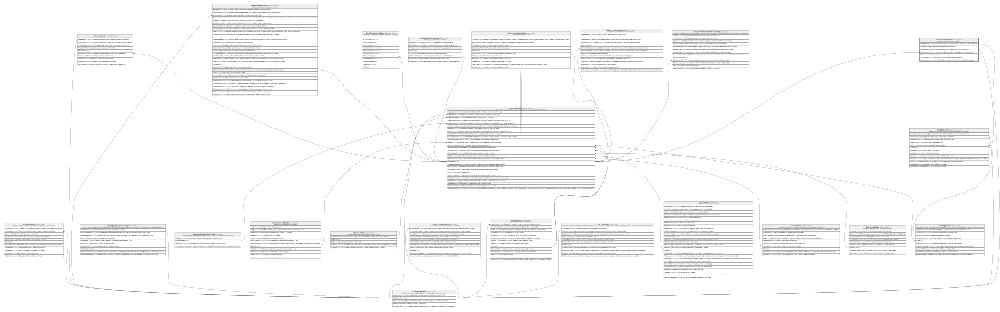

# Core.TransaccionComision

## Description

Comision cobrada sobre una transaccion.

## Columns

| Name                  | Type         | Default | Nullable | Children | Parents                                       | Comment                                                                    |
| --------------------- | ------------ | ------- | -------- | -------- | --------------------------------------------- | -------------------------------------------------------------------------- |
| CodigoMoneda          | smallint     | ((840)) | false    |          | [Catalogo.Monedas](Catalogo.Monedas.md)       | Codigo de la moneda en la que se expresa el monto de la comision aplicada. |
| Exonerada             | bit          | ((0))   | false    |          |                                               | Indica si la comision fue exonerada (true/false).                          |
| IdComision            | int          |         | false    |          | [Catalogo.Comisiones](Catalogo.Comisiones.md) | FK a Comisiones, indica la comision que se cobro sobre la transaccion.     |
| IdTransaccion         | bigint       |         | false    |          | [Core.Transaccion](Core.Transaccion.md)       | FK a Transaccion, indica la transaccion sobre la que se cobro la comision. |
| IdTransaccionComision | bigint       |         | false    |          |                                               |                                                                            |
| MontoAplicado         | decimal      |         | false    |          |                                               | Monto de la comision aplicada sobre la transaccion.                        |
| MotivoExoneracion     | varchar(100) |         | true     |          |                                               | Motivo por el cual la comision fue exonerada (null si no aplica).          |

## Viewpoints

| Name                   | Definition                                           |
| ---------------------- | ---------------------------------------------------- |
| [Core](viewpoint-3.md) | Cuentas, tarjetas, canales y el motor transaccional. |

## Constraints

| Name                               | Type        | Definition                                                                                                                            |
| ---------------------------------- | ----------- | ------------------------------------------------------------------------------------------------------------------------------------- |
| CK_TransaccionComision_Exoneracion | CHECK       | CHECK([Exonerada]=(0) AND [MotivoExoneracion] IS NULL OR [Exonerada]=(1) AND [MotivoExoneracion] IS NOT NULL AND [MontoAplicado]=(0)) |
| CK_TransaccionComision_Monto       | CHECK       | CHECK([MontoAplicado]>=(0))                                                                                                           |
| FK_TransaccionComision_Comision    | FOREIGN KEY | FOREIGN KEY(IdComision) REFERENCES Catalogo.Comisiones(IdComision) ON UPDATE NO_ACTION ON DELETE NO_ACTION                            |
| FK_TransaccionComision_Moneda      | FOREIGN KEY | FOREIGN KEY(CodigoMoneda) REFERENCES Catalogo.Monedas(CodigoMoneda) ON UPDATE NO_ACTION ON DELETE NO_ACTION                           |
| FK_TransaccionComision_Transaccion | FOREIGN KEY | FOREIGN KEY(IdTransaccion) REFERENCES Core.Transaccion(IdTransaccion) ON UPDATE NO_ACTION ON DELETE NO_ACTION                         |
| PK_TransaccionComision             | PRIMARY KEY | CLUSTERED, unique, part of a PRIMARY KEY constraint, [ IdTransaccionComision ]                                                        |
| UQ_TransaccionComision             | UNIQUE      | NONCLUSTERED, unique, part of a UNIQUE constraint, [ IdTransaccion, IdComision ]                                                      |

## Indexes

| Name                                 | Definition                                                                       |
| ------------------------------------ | -------------------------------------------------------------------------------- |
| IX_TransaccionComision_IdComision    | NONCLUSTERED, [ IdComision ]                                                     |
| IX_TransaccionComision_IdTransaccion | NONCLUSTERED, [ IdTransaccion ]                                                  |
| PK_TransaccionComision               | CLUSTERED, unique, part of a PRIMARY KEY constraint, [ IdTransaccionComision ]   |
| UQ_TransaccionComision               | NONCLUSTERED, unique, part of a UNIQUE constraint, [ IdTransaccion, IdComision ] |

## Relations

---

> Generated by [tbls](https://github.com/k1LoW/tbls)
