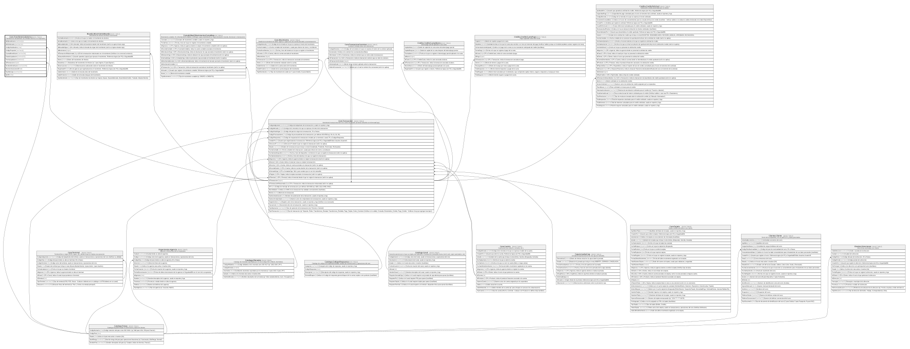

# Core.TransferenciaExterna

## Description

Transferencia hacia/desde una entidad externa a la cooperativa.

## Columns

| Name                | Type         | Default                                              | Nullable | Children | Parents                                 | Comment |
| ------------------- | ------------ | ---------------------------------------------------- | -------- | -------- | --------------------------------------- | ------- |
| BICBeneficiario     | varchar(11)  |                                                      | false    |          |                                         |         |
| BICOrdenante        | varchar(11)  |                                                      | false    |          |                                         |         |
| CodigoPaisDestino   | char         |                                                      | false    |          | [Catalogo.Paises](Catalogo.Paises.md)   |         |
| CodigoProposito     | varchar(4)   |                                                      | false    |          |                                         |         |
| CuentaBeneficiario  | varchar(34)  |                                                      | false    |          |                                         |         |
| EstadoLiquidacion   | varchar(15)  | (('Pendiente') collate SQL_Latin1_General_CP1_CI_AS) | false    |          |                                         |         |
| FechaLiquidacion    | datetime2    |                                                      | true     |          |                                         |         |
| IdTransaccion       | bigint       |                                                      | false    |          | [Core.Transaccion](Core.Transaccion.md) |         |
| NombreBeneficiario  | varchar(140) |                                                      | false    |          |                                         |         |
| RevisionSancionesOK | bit          | ((0))                                                | false    |          |                                         |         |
| TipoMensaje         | varchar(10)  |                                                      | false    |          |                                         |         |
| UETR                | char         |                                                      | false    |          |                                         |         |

## Viewpoints

| Name                   | Definition                                           |
| ---------------------- | ---------------------------------------------------- |
| [Core](viewpoint-3.md) | Cuentas, tarjetas, canales y el motor transaccional. |

## Constraints

| Name                                | Type        | Definition                                                                                                                                                                                                           |
| ----------------------------------- | ----------- | -------------------------------------------------------------------------------------------------------------------------------------------------------------------------------------------------------------------- |
| CK_TransferenciaExterna_BIC         | CHECK       | CHECK((len([BICOrdenante])=(11) OR len([BICOrdenante])=(8)) AND (len([BICBeneficiario])=(11) OR len([BICBeneficiario])=(8)))                                                                                         |
| CK_TransferenciaExterna_Estado      | CHECK       | CHECK([EstadoLiquidacion]='Rechazada' OR [EstadoLiquidacion]='Confirmada' OR [EstadoLiquidacion]='Enviada' OR [EstadoLiquidacion]='Pendiente')                                                                       |
| CK_TransferenciaExterna_Liquidacion | CHECK       | CHECK(([EstadoLiquidacion]='Enviada' OR [EstadoLiquidacion]='Pendiente') AND [FechaLiquidacion] IS NULL OR ([EstadoLiquidacion]='Rechazada' OR [EstadoLiquidacion]='Confirmada') AND [FechaLiquidacion] IS NOT NULL) |
| CK_TransferenciaExterna_Mensaje     | CHECK       | CHECK([TipoMensaje]='pacs.004' OR [TipoMensaje]='pacs.002' OR [TipoMensaje]='pacs.008')                                                                                                                              |
| CK_TransferenciaExterna_Proposito   | CHECK       | CHECK([CodigoProposito]='OTHR' OR [CodigoProposito]='LOAN' OR [CodigoProposito]='GDDS' OR [CodigoProposito]='EDUC' OR [CodigoProposito]='FAMI' OR [CodigoProposito]='TRAD' OR [CodigoProposito]='SALA')              |
| CK_TransferenciaExterna_Sanciones   | CHECK       | CHECK([EstadoLiquidacion]<>'Confirmada' OR [RevisionSancionesOK]=(1))                                                                                                                                                |
| FK_TransferenciaExterna_Pais        | FOREIGN KEY | FOREIGN KEY(CodigoPaisDestino) REFERENCES Catalogo.Paises(CodigoPais) ON UPDATE NO_ACTION ON DELETE NO_ACTION                                                                                                        |
| FK_TransferenciaExterna_Transaccion | FOREIGN KEY | FOREIGN KEY(IdTransaccion) REFERENCES Core.Transaccion(IdTransaccion) ON UPDATE NO_ACTION ON DELETE NO_ACTION                                                                                                        |
| PK_TransferenciaExterna             | PRIMARY KEY | CLUSTERED, unique, part of a PRIMARY KEY constraint, [ IdTransaccion ]                                                                                                                                               |
| UQ_TransferenciaExterna_UETR        | UNIQUE      | NONCLUSTERED, unique, part of a UNIQUE constraint, [ UETR ]                                                                                                                                                          |

## Indexes

| Name                           | Definition                                                             |
| ------------------------------ | ---------------------------------------------------------------------- |
| IX_TransferenciaExterna_Estado | NONCLUSTERED, [ EstadoLiquidacion ]                                    |
| PK_TransferenciaExterna        | CLUSTERED, unique, part of a PRIMARY KEY constraint, [ IdTransaccion ] |
| UQ_TransferenciaExterna_UETR   | NONCLUSTERED, unique, part of a UNIQUE constraint, [ UETR ]            |

## Relations

---

> Generated by [tbls](https://github.com/k1LoW/tbls)
