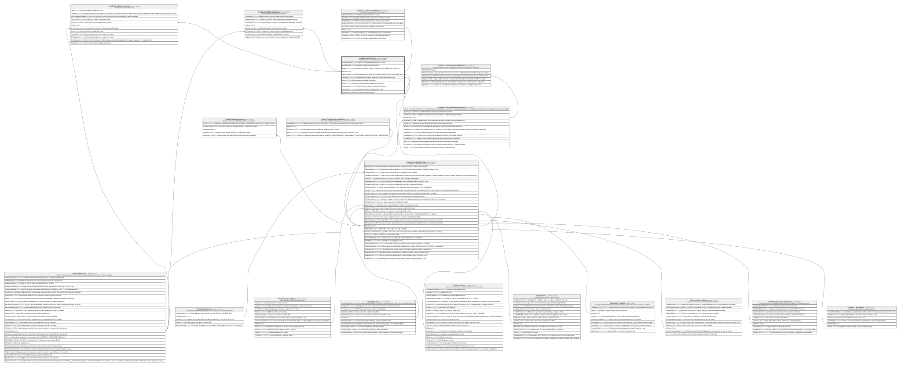

# Credito.CreditoCuota

## Description

Cuota del plan de amortizacion de un credito.

## Columns

| Name            | Type        | Default                                              | Nullable | Children                                                                                                                                                                  | Parents                                                               | Comment                                                                           |
| --------------- | ----------- | ---------------------------------------------------- | -------- | ------------------------------------------------------------------------------------------------------------------------------------------------------------------------- | --------------------------------------------------------------------- | --------------------------------------------------------------------------------- |
| CapitalAbonado  | decimal     | ((0))                                                | false    |                                                                                                                                                                           |                                                                       | Monto de capital abonado/pagado de la cuota.                                      |
| CapitalOriginal | decimal     |                                                      | false    |                                                                                                                                                                           |                                                                       | Monto de capital original de la cuota.                                            |
| Estado          | varchar(10) | (('PENDIENTE') collate SQL_Latin1_General_CP1_CI_AS) | false    |                                                                                                                                                                           |                                                                       | Estado de la cuota que incluye si esta (PAGADA, PENDIENTE, VENCIDA).              |
| IdCuota         | bigint      |                                                      | false    | [Credito.CreditoCuotaAbono](Credito.CreditoCuotaAbono.md) [Credito.CreditoCuotaMora](Credito.CreditoCuotaMora.md) [Credito.CreditoCuotaPago](Credito.CreditoCuotaPago.md) |                                                                       |                                                                                   |
| IdPlanCuota     | bigint      |                                                      | false    |                                                                                                                                                                           | [Credito.CreditoPlanAmortizacion](Credito.CreditoPlanAmortizacion.md) | FK a CreditoPlanAmortizacion, indica el plan de amortizacion asociado a la cuota. |
| IdSolicitud     | bigint      |                                                      | false    |                                                                                                                                                                           | [Credito.CreditoSolicitud](Credito.CreditoSolicitud.md)               | FK a CreditoSolicitud, indica la solicitud de credito asociada a la cuota.        |
| Interes         | decimal     |                                                      | false    |                                                                                                                                                                           |                                                                       | Monto de interes calculado de la cuota.                                           |
| Numero          | smallint    |                                                      | false    |                                                                                                                                                                           |                                                                       | Numero de la cuota dentro del plan de amortizacion.                               |
| TotalImpuestos  | decimal     | ((0))                                                | false    |                                                                                                                                                                           |                                                                       | Monto total de impuestos calculado de la cuota.                                   |
| TotalSeguros    | decimal     | ((0))                                                | false    |                                                                                                                                                                           |                                                                       | Monto total de seguros calculado de la cuota.                                     |
| Vencimiento     | date        |                                                      | false    |                                                                                                                                                                           |                                                                       | Fecha de vencimiento de la cuota.                                                 |

## Viewpoints

| Name                      | Definition                                                            |
| ------------------------- | --------------------------------------------------------------------- |
| [Credito](viewpoint-7.md) | Aprobacion de credito, plan de pagos, garantias y politica de riesgo. |

## Constraints

| Name                      | Type        | Definition                                                                                                                                                          |
| ------------------------- | ----------- | ------------------------------------------------------------------------------------------------------------------------------------------------------------------- |
| CK_CreditoCuota_Estado    | CHECK       | CHECK([Estado]='PAGADA' OR [Estado]='PENDIENTE' OR [Estado]='VENCIDA')                                                                                              |
| CK_CreditoCuota_Valores   | CHECK       | CHECK([CapitalOriginal]>(0) AND [CapitalAbonado]>=(0) AND [CapitalAbonado]<=[CapitalOriginal] AND [Interes]>=(0) AND [TotalSeguros]>=(0) AND [TotalImpuestos]>=(0)) |
| FK_CreditoCuota_PlanCuota | FOREIGN KEY | FOREIGN KEY(IdPlanCuota) REFERENCES Credito.CreditoPlanAmortizacion(IdPlanCuota) ON UPDATE NO_ACTION ON DELETE NO_ACTION                                            |
| FK_CreditoCuota_Solicitud | FOREIGN KEY | FOREIGN KEY(IdSolicitud) REFERENCES Credito.CreditoSolicitud(IdSolicitud) ON UPDATE NO_ACTION ON DELETE NO_ACTION                                                   |
| PK_CreditoCuota           | PRIMARY KEY | CLUSTERED, unique, part of a PRIMARY KEY constraint, [ IdCuota ]                                                                                                    |
| UQ_CreditoCuota           | UNIQUE      | NONCLUSTERED, unique, part of a UNIQUE constraint, [ IdSolicitud, Numero ]                                                                                          |

## Indexes

| Name                       | Definition                                                                 |
| -------------------------- | -------------------------------------------------------------------------- |
| IX_CreditoCuota_Pendientes | NONCLUSTERED, [ IdSolicitud, Vencimiento ]                                 |
| PK_CreditoCuota            | CLUSTERED, unique, part of a PRIMARY KEY constraint, [ IdCuota ]           |
| UQ_CreditoCuota            | NONCLUSTERED, unique, part of a UNIQUE constraint, [ IdSolicitud, Numero ] |

## Relations

---

> Generated by [tbls](https://github.com/k1LoW/tbls)
