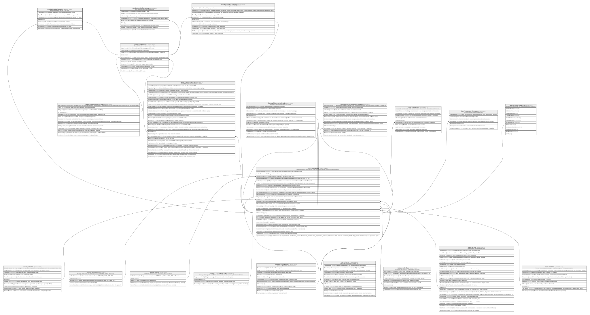

# Credito.CreditoCuotaAbono

## Description

Abono/pago parcial aplicado a una cuota.

## Columns

| Name           | Type      | Default         | Nullable | Children | Parents                                         | Comment                                                                  |
| -------------- | --------- | --------------- | -------- | -------- | ----------------------------------------------- | ------------------------------------------------------------------------ |
| CapitalAntes   | decimal   |                 | false    |          |                                                 | Saldo de capital de la cuota antes del abono/pago parcial.               |
| CapitalDespues | decimal   |                 | false    |          |                                                 | Saldo de capital de la cuota despues del abono/pago parcial              |
| FechaAbono     | datetime2 | (sysdatetime()) | false    |          |                                                 | Fecha en la que se registra el abono/pago parcial aplicado a la cuota.   |
| IdAbono        | bigint    |                 | false    |          |                                                 |                                                                          |
| IdCuota        | bigint    |                 | false    |          | [Credito.CreditoCuota](Credito.CreditoCuota.md) | FK a CreditoCuota, indica la cuota asociada al abono.                    |
| IdTransaccion  | bigint    |                 | true     |          | [Core.Transaccion](Core.Transaccion.md)         | FK a Transaccion, indica la transaccion asociada al abono.               |
| MontoAbono     | decimal   |                 | false    |          |                                                 | Monto del abono/pago parcial aplicado a la cuota.                        |
| RegistradoPor  | int       |                 | false    |          |                                                 | Usuario que registro el abono. Referencia logica (sin FK) a SeguridadDB. |

## Viewpoints

| Name                      | Definition                                                            |
| ------------------------- | --------------------------------------------------------------------- |
| [Credito](viewpoint-7.md) | Aprobacion de credito, plan de pagos, garantias y politica de riesgo. |

## Constraints

| Name                             | Type        | Definition                                                                                                    |
| -------------------------------- | ----------- | ------------------------------------------------------------------------------------------------------------- |
| CK_CreditoCuotaAbono_Cuadre      | CHECK       | CHECK([CapitalDespues]=([CapitalAntes]-[MontoAbono]) AND [CapitalDespues]>=(0))                               |
| CK_CreditoCuotaAbono_Monto       | CHECK       | CHECK([MontoAbono]>(0))                                                                                       |
| FK_CreditoCuotaAbono_Cuota       | FOREIGN KEY | FOREIGN KEY(IdCuota) REFERENCES Credito.CreditoCuota(IdCuota) ON UPDATE NO_ACTION ON DELETE NO_ACTION         |
| FK_CreditoCuotaAbono_Transaccion | FOREIGN KEY | FOREIGN KEY(IdTransaccion) REFERENCES Core.Transaccion(IdTransaccion) ON UPDATE NO_ACTION ON DELETE NO_ACTION |
| PK_CreditoCuotaAbono             | PRIMARY KEY | CLUSTERED, unique, part of a PRIMARY KEY constraint, [ IdAbono ]                                              |

## Indexes

| Name                       | Definition                                                       |
| -------------------------- | ---------------------------------------------------------------- |
| IX_CreditoCuotaAbono_Cuota | NONCLUSTERED, [ IdCuota, FechaAbono ]                            |
| PK_CreditoCuotaAbono       | CLUSTERED, unique, part of a PRIMARY KEY constraint, [ IdAbono ] |

## Relations

---

> Generated by [tbls](https://github.com/k1LoW/tbls)
