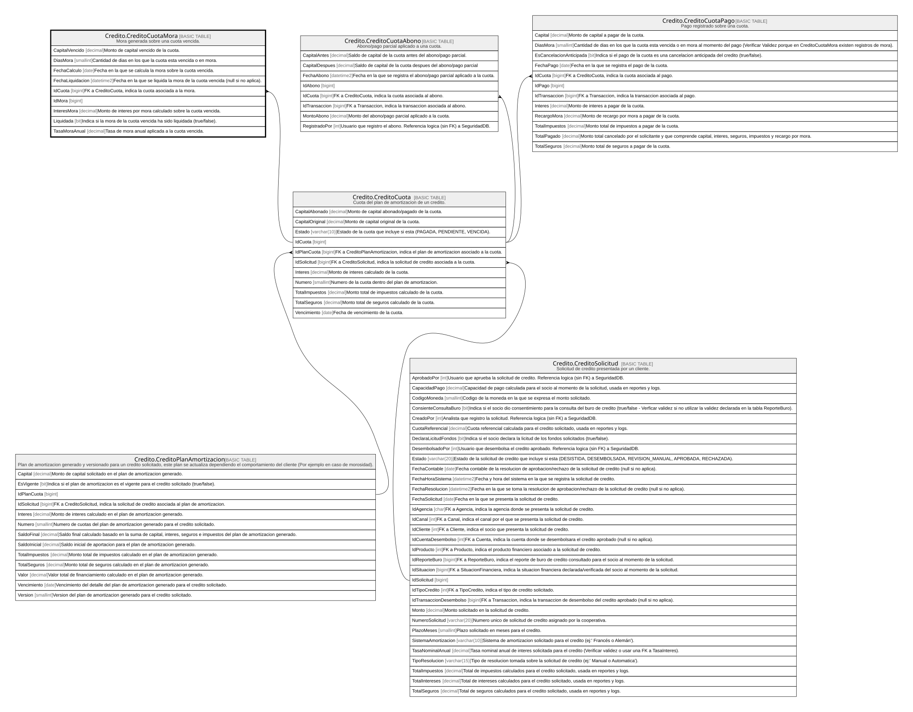

# Credito.CreditoCuotaMora

## Description

Mora generada sobre una cuota vencida.

## Columns

| Name             | Type      | Default | Nullable | Children | Parents                                         | Comment                                                                     |
| ---------------- | --------- | ------- | -------- | -------- | ----------------------------------------------- | --------------------------------------------------------------------------- |
| CapitalVencido   | decimal   |         | false    |          |                                                 | Monto de capital vencido de la cuota.                                       |
| DiasMora         | smallint  |         | false    |          |                                                 | Cantidad de dias en los que la cuota esta vencida o en mora.                |
| FechaCalculo     | date      |         | false    |          |                                                 | Fecha en la que se calcula la mora sobre la cuota vencida.                  |
| FechaLiquidacion | datetime2 |         | true     |          |                                                 | Fecha en la que se liquida la mora de la cuota vencida (null si no aplica). |
| IdCuota          | bigint    |         | false    |          | [Credito.CreditoCuota](Credito.CreditoCuota.md) | FK a CreditoCuota, indica la cuota asociada a la mora.                      |
| IdMora           | bigint    |         | false    |          |                                                 |                                                                             |
| InteresMora      | decimal   |         | false    |          |                                                 | Monto de interes por mora calculado sobre la cuota vencida.                 |
| Liquidada        | bit       | ((0))   | false    |          |                                                 | Indica si la mora de la cuota vencida ha sido liquidada (true/false).       |
| TasaMoraAnual    | decimal   |         | false    |          |                                                 | Tasa de mora anual aplicada a la cuota vencida.                             |

## Viewpoints

| Name                      | Definition                                                            |
| ------------------------- | --------------------------------------------------------------------- |
| [Credito](viewpoint-7.md) | Aprobacion de credito, plan de pagos, garantias y politica de riesgo. |

## Constraints

| Name                            | Type        | Definition                                                                                            |
| ------------------------------- | ----------- | ----------------------------------------------------------------------------------------------------- |
| CK_CreditoCuotaMora_Capital     | CHECK       | CHECK([CapitalVencido]>(0))                                                                           |
| CK_CreditoCuotaMora_Dias        | CHECK       | CHECK([DiasMora]>=(0))                                                                                |
| CK_CreditoCuotaMora_Interes     | CHECK       | CHECK([InteresMora]>=(0))                                                                             |
| CK_CreditoCuotaMora_Liquidacion | CHECK       | CHECK([Liquidada]=(0) OR [FechaLiquidacion] IS NOT NULL)                                              |
| CK_CreditoCuotaMora_Tasa        | CHECK       | CHECK([TasaMoraAnual]>=(0))                                                                           |
| FK_CreditoCuotaMora_Cuota       | FOREIGN KEY | FOREIGN KEY(IdCuota) REFERENCES Credito.CreditoCuota(IdCuota) ON UPDATE NO_ACTION ON DELETE NO_ACTION |
| PK_CreditoCuotaMora             | PRIMARY KEY | CLUSTERED, unique, part of a PRIMARY KEY constraint, [ IdMora ]                                       |

## Indexes

| Name                      | Definition                                                      |
| ------------------------- | --------------------------------------------------------------- |
| IX_CreditoCuotaMora_Cuota | NONCLUSTERED, [ IdCuota, FechaCalculo ]                         |
| PK_CreditoCuotaMora       | CLUSTERED, unique, part of a PRIMARY KEY constraint, [ IdMora ] |

## Relations

---

> Generated by [tbls](https://github.com/k1LoW/tbls)
