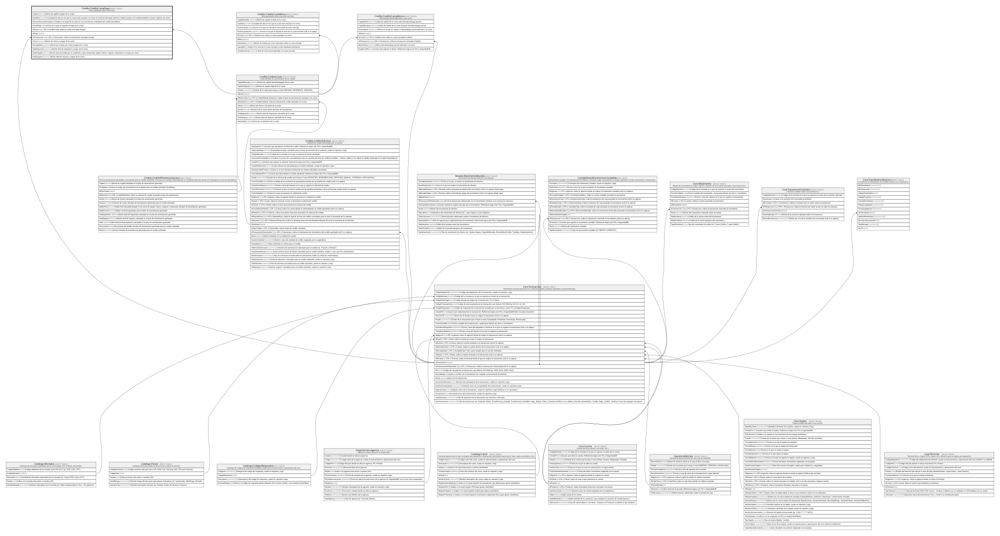

# Credito.CreditoCuotaPago

## Description

Pago registrado sobre una cuota.

## Columns

| Name                    | Type     | Default | Nullable | Children | Parents                                         | Comment                                                                                                                                                   |
| ----------------------- | -------- | ------- | -------- | -------- | ----------------------------------------------- | --------------------------------------------------------------------------------------------------------------------------------------------------------- |
| Capital                 | decimal  |         | false    |          |                                                 | Monto de capital a pagar de la cuota.                                                                                                                     |
| DiasMora                | smallint | ((0))   | false    |          |                                                 | Cantidad de dias en los que la cuota esta vencida o en mora al momento del pago (Verificar Validez porque en CreditoCuotaMora existen registros de mora). |
| EsCancelacionAnticipada | bit      | ((0))   | false    |          |                                                 | Indica si el pago de la cuota es una cancelacion anticipada del credito (true/false).                                                                     |
| FechaPago               | date     |         | false    |          |                                                 | Fecha en la que se registra el pago de la cuota.                                                                                                          |
| IdCuota                 | bigint   |         | false    |          | [Credito.CreditoCuota](Credito.CreditoCuota.md) | FK a CreditoCuota, indica la cuota asociada al pago.                                                                                                      |
| IdPago                  | bigint   |         | false    |          |                                                 |                                                                                                                                                           |
| IdTransaccion           | bigint   |         | false    |          | [Core.Transaccion](Core.Transaccion.md)         | FK a Transaccion, indica la transaccion asociada al pago.                                                                                                 |
| Interes                 | decimal  |         | false    |          |                                                 | Monto de interes a pagar de la cuota.                                                                                                                     |
| RecargoMora             | decimal  | ((0))   | false    |          |                                                 | Monto de recargo por mora a pagar de la cuota.                                                                                                            |
| TotalImpuestos          | decimal  | ((0))   | false    |          |                                                 | Monto total de impuestos a pagar de la cuota.                                                                                                             |
| TotalPagado             | decimal  |         | false    |          |                                                 | Monto total cancelado por el solicitante y que comprende capital, interes, seguros, impuestos y recargo por mora.                                         |
| TotalSeguros            | decimal  | ((0))   | false    |          |                                                 | Monto total de seguros a pagar de la cuota.                                                                                                               |

## Viewpoints

| Name                      | Definition                                                            |
| ------------------------- | --------------------------------------------------------------------- |
| [Credito](viewpoint-7.md) | Aprobacion de credito, plan de pagos, garantias y politica de riesgo. |

## Constraints

| Name                            | Type        | Definition                                                                                                                            |
| ------------------------------- | ----------- | ------------------------------------------------------------------------------------------------------------------------------------- |
| CK_CreditoCuotaPago_Total       | CHECK       | CHECK([TotalPagado]=(((([Capital]+[Interes])+[TotalSeguros])+[TotalImpuestos])+[RecargoMora]))                                        |
| CK_CreditoCuotaPago_Valores     | CHECK       | CHECK([Capital]>=(0) AND [Interes]>=(0) AND [TotalSeguros]>=(0) AND [TotalImpuestos]>=(0) AND [RecargoMora]>=(0) AND [DiasMora]>=(0)) |
| FK_CreditoCuotaPago_Cuota       | FOREIGN KEY | FOREIGN KEY(IdCuota) REFERENCES Credito.CreditoCuota(IdCuota) ON UPDATE NO_ACTION ON DELETE NO_ACTION                                 |
| FK_CreditoCuotaPago_Transaccion | FOREIGN KEY | FOREIGN KEY(IdTransaccion) REFERENCES Core.Transaccion(IdTransaccion) ON UPDATE NO_ACTION ON DELETE NO_ACTION                         |
| PK_CreditoCuotaPago             | PRIMARY KEY | CLUSTERED, unique, part of a PRIMARY KEY constraint, [ IdPago ]                                                                       |
| UQ_CreditoCuotaPago_Cuota       | UNIQUE      | NONCLUSTERED, unique, part of a UNIQUE constraint, [ IdCuota ]                                                                        |

## Indexes

| Name                              | Definition                                                      |
| --------------------------------- | --------------------------------------------------------------- |
| IX_CreditoCuotaPago_IdTransaccion | NONCLUSTERED, [ IdTransaccion ]                                 |
| PK_CreditoCuotaPago               | CLUSTERED, unique, part of a PRIMARY KEY constraint, [ IdPago ] |
| UQ_CreditoCuotaPago_Cuota         | NONCLUSTERED, unique, part of a UNIQUE constraint, [ IdCuota ]  |

## Relations

---

> Generated by [tbls](https://github.com/k1LoW/tbls)
