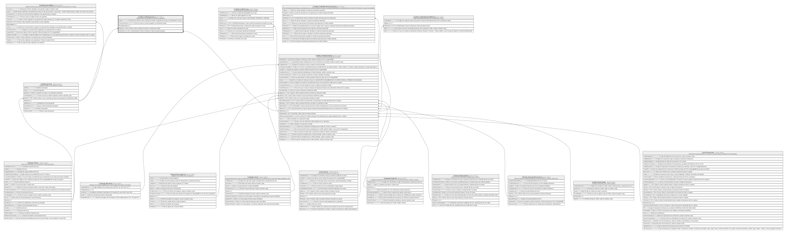

# Credito.CreditoGarante

## Description

Relacion entre una solicitud de credito y sus garantes.

## Columns

| Name             | Type        | Default                                           | Nullable | Children | Parents                                                 | Comment                                                                                                   |
| ---------------- | ----------- | ------------------------------------------------- | -------- | -------- | ------------------------------------------------------- | --------------------------------------------------------------------------------------------------------- |
| Estado           | varchar(10) | (('Activo') collate SQL_Latin1_General_CP1_CI_AS) | false    |          |                                                         | Estado de la relacion entre la solicitud de credito y el garante que incluye si esta (Liberado o Activo). |
| FechaVinculacion | datetime2   | (sysdatetime())                                   | false    |          |                                                         | Fecha en la que se vincula el garante a la solicitud de credito.                                          |
| IdCreditoGarante | int         |                                                   | false    |          |                                                         |                                                                                                           |
| IdGarante        | int         |                                                   | false    |          | [Credito.Garante](Credito.Garante.md)                   | FK a Garante, indica el garante asociado a la solicitud de credito.                                       |
| IdSolicitud      | bigint      |                                                   | false    |          | [Credito.CreditoSolicitud](Credito.CreditoSolicitud.md) | FK a CreditoSolicitud, indica la solicitud de credito asociada al garante.                                |

## Viewpoints

| Name                      | Definition                                                            |
| ------------------------- | --------------------------------------------------------------------- |
| [Credito](viewpoint-7.md) | Aprobacion de credito, plan de pagos, garantias y politica de riesgo. |

## Constraints

| Name                        | Type        | Definition                                                                                                        |
| --------------------------- | ----------- | ----------------------------------------------------------------------------------------------------------------- |
| CK_CreditoGarante_Estado    | CHECK       | CHECK([Estado]='Liberado' OR [Estado]='Activo')                                                                   |
| FK_CreditoGarante_Garante   | FOREIGN KEY | FOREIGN KEY(IdGarante) REFERENCES Credito.Garante(IdGarante) ON UPDATE NO_ACTION ON DELETE NO_ACTION              |
| FK_CreditoGarante_Solicitud | FOREIGN KEY | FOREIGN KEY(IdSolicitud) REFERENCES Credito.CreditoSolicitud(IdSolicitud) ON UPDATE NO_ACTION ON DELETE NO_ACTION |
| PK_CreditoGarante           | PRIMARY KEY | CLUSTERED, unique, part of a PRIMARY KEY constraint, [ IdCreditoGarante ]                                         |
| UQ_CreditoGarante           | UNIQUE      | NONCLUSTERED, unique, part of a UNIQUE constraint, [ IdSolicitud, IdGarante ]                                     |

## Indexes

| Name                        | Definition                                                                    |
| --------------------------- | ----------------------------------------------------------------------------- |
| IX_CreditoGarante_IdGarante | NONCLUSTERED, [ IdGarante ]                                                   |
| PK_CreditoGarante           | CLUSTERED, unique, part of a PRIMARY KEY constraint, [ IdCreditoGarante ]     |
| UQ_CreditoGarante           | NONCLUSTERED, unique, part of a UNIQUE constraint, [ IdSolicitud, IdGarante ] |

## Relations

---

> Generated by [tbls](https://github.com/k1LoW/tbls)
