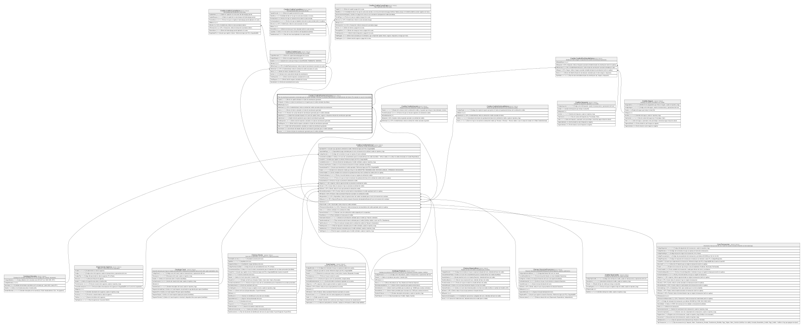

# Credito.CreditoPlanAmortizacion

## Description

Plan de amortizacion generado y versionado para un credito solicitado, este plan se actualiza dependiendo el comportamiento del cliente (Por ejemplo en caso de morosidad).

## Columns

| Name           | Type     | Default | Nullable | Children                                                                                                              | Parents                                                 | Comment                                                                                                             |
| -------------- | -------- | ------- | -------- | --------------------------------------------------------------------------------------------------------------------- | ------------------------------------------------------- | ------------------------------------------------------------------------------------------------------------------- |
| Capital        | decimal  |         | false    |                                                                                                                       |                                                         | Monto de capital solicitado en el plan de amortizacion generado.                                                    |
| EsVigente      | bit      | ((1))   | false    |                                                                                                                       |                                                         | Indica si el plan de amortizacion es el vigente para el credito solicitado (true/false).                            |
| IdPlanCuota    | bigint   |         | false    | [Credito.CreditoCuota](Credito.CreditoCuota.md) [Credito.CreditoPlanDetalleRubro](Credito.CreditoPlanDetalleRubro.md) |                                                         |                                                                                                                     |
| IdSolicitud    | bigint   |         | false    |                                                                                                                       | [Credito.CreditoSolicitud](Credito.CreditoSolicitud.md) | FK a CreditoSolicitud, indica la solicitud de credito asociada al plan de amortizacion.                             |
| Interes        | decimal  |         | false    |                                                                                                                       |                                                         | Monto de interes calculado en el plan de amortizacion generado.                                                     |
| Numero         | smallint |         | false    |                                                                                                                       |                                                         | Numero de cuotas del plan de amortizacion generado para el credito solicitado.                                      |
| SaldoFinal     | decimal  |         | false    |                                                                                                                       |                                                         | Saldo final calculado basado en la suma de capital, interes, seguros e impuestos del plan de amortizacion generado. |
| SaldoInicial   | decimal  |         | false    |                                                                                                                       |                                                         | Saldo inicial de aportacion para el plan de amortizacion generado.                                                  |
| TotalImpuestos | decimal  | ((0))   | false    |                                                                                                                       |                                                         | Monto total de impuestos calculado en el plan de amortizacion generado.                                             |
| TotalSeguros   | decimal  | ((0))   | false    |                                                                                                                       |                                                         | Monto total de seguros calculado en el plan de amortizacion generado.                                               |
| Valor          | decimal  |         | false    |                                                                                                                       |                                                         | Valor total de financiamiento calculado en el plan de amortizacion generado.                                        |
| Vencimiento    | date     |         | false    |                                                                                                                       |                                                         | Vencimiento del detalle del plan de amortizacion generado para el credito solicitado.                               |
| Version        | smallint | ((1))   | false    |                                                                                                                       |                                                         | Version del plan de amortizacion generado para el credito solicitado.                                               |

## Viewpoints

| Name                      | Definition                                                            |
| ------------------------- | --------------------------------------------------------------------- |
| [Credito](viewpoint-7.md) | Aprobacion de credito, plan de pagos, garantias y politica de riesgo. |

## Constraints

| Name                                 | Type        | Definition                                                                                                                              |
| ------------------------------------ | ----------- | --------------------------------------------------------------------------------------------------------------------------------------- |
| CK_CreditoPlanAmortizacion_Cuadre    | CHECK       | CHECK([Valor]=((([Capital]+[Interes])+[TotalSeguros])+[TotalImpuestos]) AND [SaldoFinal]=([SaldoInicial]-[Capital]))                    |
| CK_CreditoPlanAmortizacion_Valores   | CHECK       | CHECK([SaldoInicial]>=(0) AND [SaldoFinal]>=(0) AND [Interes]>=(0) AND [Capital]>(0) AND [TotalSeguros]>=(0) AND [TotalImpuestos]>=(0)) |
| FK_CreditoPlanAmortizacion_Solicitud | FOREIGN KEY | FOREIGN KEY(IdSolicitud) REFERENCES Credito.CreditoSolicitud(IdSolicitud) ON UPDATE NO_ACTION ON DELETE NO_ACTION                       |
| PK_CreditoPlanAmortizacion           | PRIMARY KEY | CLUSTERED, unique, part of a PRIMARY KEY constraint, [ IdPlanCuota ]                                                                    |
| UQ_CreditoPlanAmortizacion           | UNIQUE      | NONCLUSTERED, unique, part of a UNIQUE constraint, [ IdSolicitud, Version, Numero ]                                                     |

## Indexes

| Name                                 | Definition                                                                          |
| ------------------------------------ | ----------------------------------------------------------------------------------- |
| IX_CreditoPlanAmortizacion_Solicitud | NONCLUSTERED, [ IdSolicitud, EsVigente ]                                            |
| PK_CreditoPlanAmortizacion           | CLUSTERED, unique, part of a PRIMARY KEY constraint, [ IdPlanCuota ]                |
| UQ_CreditoPlanAmortizacion           | NONCLUSTERED, unique, part of a UNIQUE constraint, [ IdSolicitud, Version, Numero ] |

## Relations

---

> Generated by [tbls](https://github.com/k1LoW/tbls)
