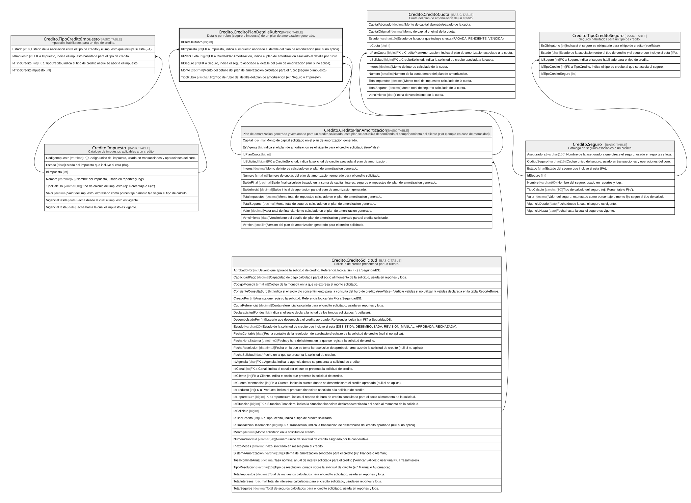

# Credito.CreditoPlanDetalleRubro

## Description

Detalle por rubro (seguro o impuesto) de un plan de amortizacion generado.

## Columns

| Name           | Type        | Default | Nullable | Children | Parents                                                               | Comment                                                                                             |
| -------------- | ----------- | ------- | -------- | -------- | --------------------------------------------------------------------- | --------------------------------------------------------------------------------------------------- |
| IdDetalleRubro | bigint      |         | false    |          |                                                                       |                                                                                                     |
| IdImpuesto     | int         |         | true     |          | [Credito.Impuesto](Credito.Impuesto.md)                               | FK a Impuesto, indica el impuesto asociado al detalle del plan de amortizacion (null si no aplica). |
| IdPlanCuota    | bigint      |         | false    |          | [Credito.CreditoPlanAmortizacion](Credito.CreditoPlanAmortizacion.md) | FK a CreditoPlanAmortizacion, indica el plan de amortizacion asociado al detalle por rubro.         |
| IdSeguro       | int         |         | true     |          | [Credito.Seguro](Credito.Seguro.md)                                   | FK a Seguro, indica el seguro asociado al detalle del plan de amortizacion (null si no aplica).     |
| Monto          | decimal     |         | false    |          |                                                                       | Monto del detalle del plan de amortizacion calculado para el rubro (seguro o impuesto).             |
| TipoRubro      | varchar(10) |         | false    |          |                                                                       | Tipo de rubro del detalle del plan de amortizacion (ej:' Seguro o Impuesto').                       |

## Viewpoints

| Name                      | Definition                                                            |
| ------------------------- | --------------------------------------------------------------------- |
| [Credito](viewpoint-7.md) | Aprobacion de credito, plan de pagos, garantias y politica de riesgo. |

## Constraints

| Name                                  | Type        | Definition                                                                                                                                                    |
| ------------------------------------- | ----------- | ------------------------------------------------------------------------------------------------------------------------------------------------------------- |
| CK_CreditoPlanDetalleRubro_Monto      | CHECK       | CHECK([Monto]>=(0))                                                                                                                                           |
| CK_CreditoPlanDetalleRubro_Referencia | CHECK       | CHECK([TipoRubro]='Seguro' AND [IdSeguro] IS NOT NULL AND [IdImpuesto] IS NULL OR [TipoRubro]='Impuesto' AND [IdImpuesto] IS NOT NULL AND [IdSeguro] IS NULL) |
| CK_CreditoPlanDetalleRubro_Tipo       | CHECK       | CHECK([TipoRubro]='Seguro' OR [TipoRubro]='Impuesto')                                                                                                         |
| FK_CreditoPlanDetalleRubro_Impuesto   | FOREIGN KEY | FOREIGN KEY(IdImpuesto) REFERENCES Credito.Impuesto(IdImpuesto) ON UPDATE NO_ACTION ON DELETE NO_ACTION                                                       |
| FK_CreditoPlanDetalleRubro_PlanCuota  | FOREIGN KEY | FOREIGN KEY(IdPlanCuota) REFERENCES Credito.CreditoPlanAmortizacion(IdPlanCuota) ON UPDATE NO_ACTION ON DELETE NO_ACTION                                      |
| FK_CreditoPlanDetalleRubro_Seguro     | FOREIGN KEY | FOREIGN KEY(IdSeguro) REFERENCES Credito.Seguro(IdSeguro) ON UPDATE NO_ACTION ON DELETE NO_ACTION                                                             |
| PK_CreditoPlanDetalleRubro            | PRIMARY KEY | CLUSTERED, unique, part of a PRIMARY KEY constraint, [ IdDetalleRubro ]                                                                                       |

## Indexes

| Name                                 | Definition                                                              |
| ------------------------------------ | ----------------------------------------------------------------------- |
| IX_CreditoPlanDetalleRubro_PlanCuota | NONCLUSTERED, [ IdPlanCuota ]                                           |
| PK_CreditoPlanDetalleRubro           | CLUSTERED, unique, part of a PRIMARY KEY constraint, [ IdDetalleRubro ] |

## Relations

---

> Generated by [tbls](https://github.com/k1LoW/tbls)
