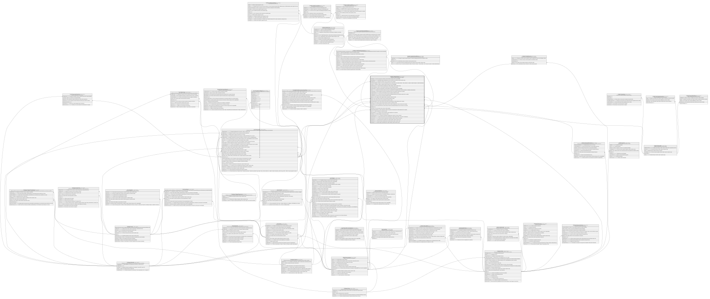

# Credito.CreditoSolicitud

## Description

Solicitud de credito presentada por un cliente.

## Columns

| Name                    | Type        | Default                         | Nullable | Children                                                                                                                                                                                                                                      | Parents                                                         | Comment                                                                                                                                                                 |
| ----------------------- | ----------- | ------------------------------- | -------- | --------------------------------------------------------------------------------------------------------------------------------------------------------------------------------------------------------------------------------------------- | --------------------------------------------------------------- | ----------------------------------------------------------------------------------------------------------------------------------------------------------------------- |
| AprobadoPor             | int         |                                 | true     |                                                                                                                                                                                                                                               |                                                                 | Usuario que aprueba la solicitud de credito. Referencia logica (sin FK) a SeguridadDB.                                                                                  |
| CapacidadPago           | decimal     |                                 | false    |                                                                                                                                                                                                                                               |                                                                 | Capacidad de pago calculada para el socio al momento de la solicitud, usada en reportes y logs.                                                                         |
| CodigoMoneda            | smallint    | ((840))                         | false    |                                                                                                                                                                                                                                               | [Catalogo.Monedas](Catalogo.Monedas.md)                         | Codigo de la moneda en la que se expresa el monto solicitado.                                                                                                           |
| ConsienteConsultaBuro   | bit         | ((0))                           | false    |                                                                                                                                                                                                                                               |                                                                 | Indica si el socio dio consentimiento para la consulta del buro de credito (true/false - Verficar validez si no utilizar la validez declarada en la tabla ReporteBuro). |
| CreadoPor               | int         |                                 | false    |                                                                                                                                                                                                                                               |                                                                 | Analista que registro la solicitud. Referencia logica (sin FK) a SeguridadDB.                                                                                           |
| CuotaReferencial        | decimal     |                                 | false    |                                                                                                                                                                                                                                               |                                                                 | Cuota referencial calculada para el credito solicitado, usada en reportes y logs.                                                                                       |
| DeclaraLicitudFondos    | bit         | ((0))                           | false    |                                                                                                                                                                                                                                               |                                                                 | Indica si el socio declara la licitud de los fondos solicitados (true/false).                                                                                           |
| DesembolsadoPor         | int         |                                 | true     |                                                                                                                                                                                                                                               |                                                                 | Usuario que desembolsa el credito aprobado. Referencia logica (sin FK) a SeguridadDB.                                                                                   |
| Estado                  | varchar(20) |                                 | false    |                                                                                                                                                                                                                                               |                                                                 | Estado de la solicitud de credito que incluye si esta (DESISTIDA, DESEMBOLSADA, REVISION_MANUAL, APROBADA, RECHAZADA).                                                  |
| FechaContable           | date        | (CONVERT([date],sysdatetime())) | false    |                                                                                                                                                                                                                                               |                                                                 | Fecha contable de la resolucion de aprobacion/rechazo de la solicitud de credito (null si no aplica).                                                                   |
| FechaHoraSistema        | datetime2   | (sysdatetime())                 | false    |                                                                                                                                                                                                                                               |                                                                 | Fecha y hora del sistema en la que se registra la solicitud de credito.                                                                                                 |
| FechaResolucion         | datetime2   |                                 | true     |                                                                                                                                                                                                                                               |                                                                 | Fecha en la que se toma la resolucion de aprobacion/rechazo de la solicitud de credito (null si no aplica).                                                             |
| FechaSolicitud          | date        |                                 | false    |                                                                                                                                                                                                                                               |                                                                 | Fecha en la que se presenta la solicitud de credito.                                                                                                                    |
| IdAgencia               | char        |                                 | false    |                                                                                                                                                                                                                                               | [Organizacion.Agencia](Organizacion.Agencia.md)                 | FK a Agencia, indica la agencia donde se presenta la solicitud de credito.                                                                                              |
| IdCanal                 | int         |                                 | false    |                                                                                                                                                                                                                                               | [Catalogo.Canal](Catalogo.Canal.md)                             | FK a Canal, indica el canal por el que se presenta la solicitud de credito.                                                                                             |
| IdCliente               | int         |                                 | false    |                                                                                                                                                                                                                                               | [Clientes.Cliente](Clientes.Cliente.md)                         | FK a Cliente, indica el socio que presenta la solicitud de credito.                                                                                                     |
| IdCuentaDesembolso      | int         |                                 | false    |                                                                                                                                                                                                                                               | [Core.Cuenta](Core.Cuenta.md)                                   | FK a Cuenta, indica la cuenta donde se desembolsara el credito aprobado (null si no aplica).                                                                            |
| IdProducto              | int         |                                 | false    |                                                                                                                                                                                                                                               | [Catalogo.Producto](Catalogo.Producto.md)                       | FK a Producto, indica el producto financiero asociado a la solicitud de credito.                                                                                        |
| IdReporteBuro           | bigint      |                                 | true     |                                                                                                                                                                                                                                               | [Clientes.ReporteBuro](Clientes.ReporteBuro.md)                 | FK a ReporteBuro, indica el reporte de buro de credito consultado para el socio al momento de la solicitud.                                                             |
| IdSituacion             | bigint      |                                 | false    |                                                                                                                                                                                                                                               | [Clientes.SituacionFinanciera](Clientes.SituacionFinanciera.md) | FK a SituacionFinanciera, indica la situacion financiera declarada/verificada del socio al momento de la solicitud.                                                     |
| IdSolicitud             | bigint      |                                 | false    | [Credito.CreditoCuota](Credito.CreditoCuota.md) [Credito.CreditoGarante](Credito.CreditoGarante.md) [Credito.CreditoPlanAmortizacion](Credito.CreditoPlanAmortizacion.md) [Credito.CreditoSolicitudMotivo](Credito.CreditoSolicitudMotivo.md) |                                                                 |                                                                                                                                                                         |
| IdTipoCredito           | int         |                                 | false    |                                                                                                                                                                                                                                               | [Credito.TipoCredito](Credito.TipoCredito.md)                   | FK a TipoCredito, indica el tipo de credito solicitado.                                                                                                                 |
| IdTransaccionDesembolso | bigint      |                                 | true     |                                                                                                                                                                                                                                               | [Core.Transaccion](Core.Transaccion.md)                         | FK a Transaccion, indica la transaccion de desembolso del credito aprobado (null si no aplica).                                                                         |
| Monto                   | decimal     |                                 | false    |                                                                                                                                                                                                                                               |                                                                 | Monto solicitado en la solicitud de credito.                                                                                                                            |
| NumeroSolicitud         | varchar(20) |                                 | false    |                                                                                                                                                                                                                                               |                                                                 | Numero unico de solicitud de credito asignado por la cooperativa.                                                                                                       |
| PlazoMeses              | smallint    |                                 | false    |                                                                                                                                                                                                                                               |                                                                 | Plazo solicitado en meses para el credito.                                                                                                                              |
| SistemaAmortizacion     | varchar(10) |                                 | false    |                                                                                                                                                                                                                                               |                                                                 | Sistema de amortizacion solicitado para el credito (ej:' Francés o Alemán').                                                                                            |
| TasaNominalAnual        | decimal     |                                 | false    |                                                                                                                                                                                                                                               |                                                                 | Tasa nominal anual de interes solicitada para el credito (Verificar validez o usar una FK a TasaInteres).                                                               |
| TipoResolucion          | varchar(15) |                                 | true     |                                                                                                                                                                                                                                               |                                                                 | Tipo de resolucion tomada sobre la solicitud de credito (ej:' Manual o Automatica').                                                                                    |
| TotalImpuestos          | decimal     | ((0))                           | false    |                                                                                                                                                                                                                                               |                                                                 | Total de impuestos calculados para el credito solicitado, usada en reportes y logs.                                                                                     |
| TotalIntereses          | decimal     |                                 | false    |                                                                                                                                                                                                                                               |                                                                 | Total de intereses calculados para el credito solicitado, usada en reportes y logs.                                                                                     |
| TotalSeguros            | decimal     |                                 | false    |                                                                                                                                                                                                                                               |                                                                 | Total de seguros calculados para el credito solicitado, usada en reportes y logs.                                                                                       |

## Viewpoints

| Name                      | Definition                                                            |
| ------------------------- | --------------------------------------------------------------------- |
| [Credito](viewpoint-7.md) | Aprobacion de credito, plan de pagos, garantias y politica de riesgo. |

## Constraints

| Name                                    | Type        | Definition                                                                                                                          |
| --------------------------------------- | ----------- | ----------------------------------------------------------------------------------------------------------------------------------- |
| CK_CreditoSolicitud_AprobadoPor         | CHECK       | CHECK([TipoResolucion]<>'Manual' OR [AprobadoPor] IS NOT NULL)                                                                      |
| CK_CreditoSolicitud_DesembolsadoPor     | CHECK       | CHECK([Estado]<>'DESEMBOLSADA' OR [DesembolsadoPor] IS NOT NULL)                                                                    |
| CK_CreditoSolicitud_DesembolsoCoherente | CHECK       | CHECK([Estado]<>'DESEMBOLSADA' OR [IdTransaccionDesembolso] IS NOT NULL)                                                            |
| CK_CreditoSolicitud_Estado              | CHECK       | CHECK([Estado]='DESISTIDA' OR [Estado]='DESEMBOLSADA' OR [Estado]='REVISION_MANUAL' OR [Estado]='RECHAZADA' OR [Estado]='APROBADA') |
| CK_CreditoSolicitud_Monto               | CHECK       | CHECK([Monto]>(0))                                                                                                                  |
| CK_CreditoSolicitud_Plazo               | CHECK       | CHECK([PlazoMeses]>(0))                                                                                                             |
| CK_CreditoSolicitud_Resolucion          | CHECK       | CHECK([Estado]='REVISION_MANUAL' OR [Estado]='APROBADA' OR [FechaResolucion] IS NOT NULL)                                           |
| CK_CreditoSolicitud_Sistema             | CHECK       | CHECK([SistemaAmortizacion]='ALEMAN' OR [SistemaAmortizacion]='FRANCES')                                                            |
| CK_CreditoSolicitud_TipoResolucion      | CHECK       | CHECK([TipoResolucion] IS NULL OR [TipoResolucion]='Automatica' OR [TipoResolucion]='Manual')                                       |
| FK_CreditoSolicitud_Agencia             | FOREIGN KEY | FOREIGN KEY(IdAgencia) REFERENCES Organizacion.Agencia(IdAgencia) ON UPDATE NO_ACTION ON DELETE NO_ACTION                           |
| FK_CreditoSolicitud_Buro                | FOREIGN KEY | FOREIGN KEY(IdReporteBuro) REFERENCES Clientes.ReporteBuro(IdReporte) ON UPDATE NO_ACTION ON DELETE NO_ACTION                       |
| FK_CreditoSolicitud_Canal               | FOREIGN KEY | FOREIGN KEY(IdCanal) REFERENCES Catalogo.Canal(IdCanal) ON UPDATE NO_ACTION ON DELETE NO_ACTION                                     |
| FK_CreditoSolicitud_Cliente             | FOREIGN KEY | FOREIGN KEY(IdCliente) REFERENCES Clientes.Cliente(IdCliente) ON UPDATE NO_ACTION ON DELETE NO_ACTION                               |
| FK_CreditoSolicitud_Cuenta              | FOREIGN KEY | FOREIGN KEY(IdCuentaDesembolso) REFERENCES Core.Cuenta(IdCuenta) ON UPDATE NO_ACTION ON DELETE NO_ACTION                            |
| FK_CreditoSolicitud_Desembolso          | FOREIGN KEY | FOREIGN KEY(IdTransaccionDesembolso) REFERENCES Core.Transaccion(IdTransaccion) ON UPDATE NO_ACTION ON DELETE NO_ACTION             |
| FK_CreditoSolicitud_Moneda              | FOREIGN KEY | FOREIGN KEY(CodigoMoneda) REFERENCES Catalogo.Monedas(CodigoMoneda) ON UPDATE NO_ACTION ON DELETE NO_ACTION                         |
| FK_CreditoSolicitud_Producto            | FOREIGN KEY | FOREIGN KEY(IdProducto) REFERENCES Catalogo.Producto(IdProducto) ON UPDATE NO_ACTION ON DELETE NO_ACTION                            |
| FK_CreditoSolicitud_Situacion           | FOREIGN KEY | FOREIGN KEY(IdSituacion) REFERENCES Clientes.SituacionFinanciera(IdSituacion) ON UPDATE NO_ACTION ON DELETE NO_ACTION               |
| FK_CreditoSolicitud_TipoCredito         | FOREIGN KEY | FOREIGN KEY(IdTipoCredito) REFERENCES Credito.TipoCredito(IdTipoCredito) ON UPDATE NO_ACTION ON DELETE NO_ACTION                    |
| PK_CreditoSolicitud                     | PRIMARY KEY | CLUSTERED, unique, part of a PRIMARY KEY constraint, [ IdSolicitud ]                                                                |
| UQ_CreditoSolicitud_Numero              | UNIQUE      | NONCLUSTERED, unique, part of a UNIQUE constraint, [ NumeroSolicitud ]                                                              |

## Indexes

| Name                        | Definition                                                             |
| --------------------------- | ---------------------------------------------------------------------- |
| IX_CreditoSolicitud_Cliente | NONCLUSTERED, [ IdCliente, Estado ]                                    |
| PK_CreditoSolicitud         | CLUSTERED, unique, part of a PRIMARY KEY constraint, [ IdSolicitud ]   |
| UQ_CreditoSolicitud_Numero  | NONCLUSTERED, unique, part of a UNIQUE constraint, [ NumeroSolicitud ] |

## Relations

---

> Generated by [tbls](https://github.com/k1LoW/tbls)
