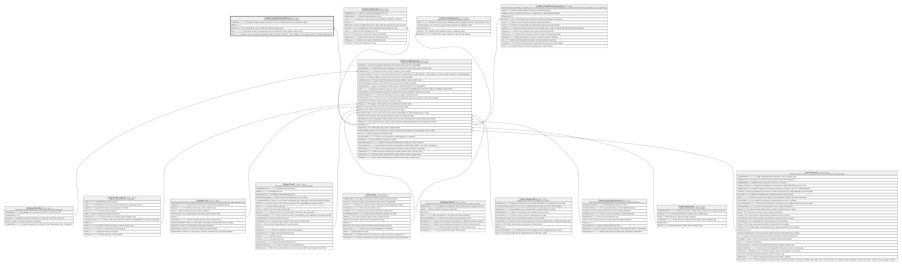

# Credito.CreditoSolicitudMotivo

## Description

Motivo de aprobacion/rechazo de una solicitud de credito.

## Columns

| Name        | Type         | Default | Nullable | Children | Parents                                                 | Comment                                                                                                                                                    |
| ----------- | ------------ | ------- | -------- | -------- | ------------------------------------------------------- | ---------------------------------------------------------------------------------------------------------------------------------------------------------- |
| CodigoRegla | varchar(30)  |         | false    |          |                                                         | Codigo de la regla de negocio que genero el motivo de aprobacion/rechazo de la solicitud de credito.                                                       |
| IdMotivo    | bigint       |         | false    |          |                                                         |                                                                                                                                                            |
| IdSolicitud | bigint       |         | false    |          | [Credito.CreditoSolicitud](Credito.CreditoSolicitud.md) | FK a CreditoSolicitud, indica la solicitud de credito asociada al motivo.                                                                                  |
| Motivo      | varchar(300) |         | false    |          |                                                         | Descripcion del motivo de aprobacion/rechazo de la solicitud de credito, usada en reportes y logs.                                                         |
| Nivel       | varchar(10)  |         | false    |          |                                                         | Nivel en el que se encuentra la solicitud del credito (ej:' Revision o Rechazo' - Revisar validez o usar el campo de estado en la Tabla CreditoSolicitud). |

## Viewpoints

| Name                      | Definition                                                            |
| ------------------------- | --------------------------------------------------------------------- |
| [Credito](viewpoint-7.md) | Aprobacion de credito, plan de pagos, garantias y politica de riesgo. |

## Constraints

| Name                                | Type        | Definition                                                                                                        |
| ----------------------------------- | ----------- | ----------------------------------------------------------------------------------------------------------------- |
| CK_CreditoSolicitudMotivo_Nivel     | CHECK       | CHECK([Nivel]='REVISION' OR [Nivel]='RECHAZO')                                                                    |
| FK_CreditoSolicitudMotivo_Solicitud | FOREIGN KEY | FOREIGN KEY(IdSolicitud) REFERENCES Credito.CreditoSolicitud(IdSolicitud) ON UPDATE NO_ACTION ON DELETE NO_ACTION |
| PK_CreditoSolicitudMotivo           | PRIMARY KEY | CLUSTERED, unique, part of a PRIMARY KEY constraint, [ IdMotivo ]                                                 |

## Indexes

| Name                                  | Definition                                                        |
| ------------------------------------- | ----------------------------------------------------------------- |
| IX_CreditoSolicitudMotivo_IdSolicitud | NONCLUSTERED, [ IdSolicitud ]                                     |
| IX_CreditoSolicitudMotivo_Regla       | NONCLUSTERED, [ CodigoRegla ]                                     |
| PK_CreditoSolicitudMotivo             | CLUSTERED, unique, part of a PRIMARY KEY constraint, [ IdMotivo ] |

## Relations

---

> Generated by [tbls](https://github.com/k1LoW/tbls)
