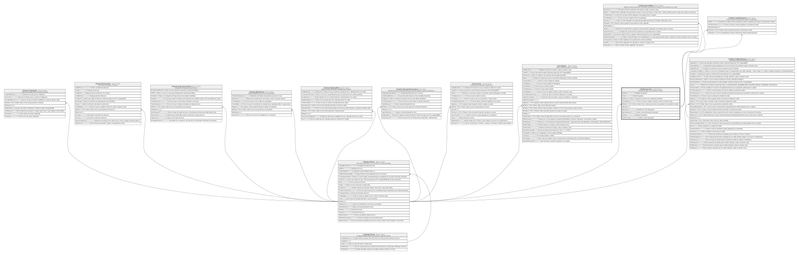

# Credito.Garante

## Description

Garante asociado a una solicitud de credito.

## Columns

| Name            | Type         | Default         | Nullable | Children                                                                                          | Parents                                 | Comment                                                                                    |
| --------------- | ------------ | --------------- | -------- | ------------------------------------------------------------------------------------------------- | --------------------------------------- | ------------------------------------------------------------------------------------------ |
| Apellidos       | varchar(250) |                 | true     |                                                                                                   |                                         | Apellidos del garante.                                                                     |
| Email           | varchar(150) |                 | true     |                                                                                                   |                                         | Email del garante.                                                                         |
| EsExterno       | bit          |                 | false    |                                                                                                   |                                         | Indica si el garante es externo a la cooperativa (true/false).                             |
| FechaRegistro   | datetime2    | (sysdatetime()) | false    |                                                                                                   |                                         | Fecha en la que se registro el garante, usado en reportes y logs.                          |
| IdCliente       | int          |                 | true     |                                                                                                   | [Clientes.Cliente](Clientes.Cliente.md) | FK a Cliente, indica el socio o persona que actua como garante de la solicitud de credito. |
| IdGarante       | int          |                 | false    | [Credito.CreditoGarante](Credito.CreditoGarante.md) [Credito.GaranteBien](Credito.GaranteBien.md) |                                         |                                                                                            |
| Identificacion  | varchar(13)  |                 | false    |                                                                                                   |                                         | Identificacion unica del garante.                                                          |
| IngresoMensual  | decimal      |                 | true     |                                                                                                   |                                         | Ingreso mensual declarado del garante.                                                     |
| Nombres         | varchar(250) |                 | false    |                                                                                                   |                                         | Nombres del garante.                                                                       |
| TelefonoCelular | varchar(15)  |                 | false    |                                                                                                   |                                         | Telefono celular del garante.                                                              |

## Viewpoints

| Name                      | Definition                                                            |
| ------------------------- | --------------------------------------------------------------------- |
| [Credito](viewpoint-7.md) | Aprobacion de credito, plan de pagos, garantias y politica de riesgo. |

## Constraints

| Name                      | Type        | Definition                                                                                            |
| ------------------------- | ----------- | ----------------------------------------------------------------------------------------------------- |
| CK_Garante_Ingreso        | CHECK       | CHECK([IngresoMensual] IS NULL OR [IngresoMensual]>=(0))                                              |
| CK_Garante_Origen         | CHECK       | CHECK([EsExterno]=(0) AND [IdCliente] IS NOT NULL OR [EsExterno]=(1) AND [IdCliente] IS NULL)         |
| FK_Garante_Cliente        | FOREIGN KEY | FOREIGN KEY(IdCliente) REFERENCES Clientes.Cliente(IdCliente) ON UPDATE NO_ACTION ON DELETE NO_ACTION |
| PK_Garante                | PRIMARY KEY | CLUSTERED, unique, part of a PRIMARY KEY constraint, [ IdGarante ]                                    |
| UQ_Garante_Identificacion | UNIQUE      | NONCLUSTERED, unique, part of a UNIQUE constraint, [ Identificacion ]                                 |

## Indexes

| Name                      | Definition                                                            |
| ------------------------- | --------------------------------------------------------------------- |
| IX_Garante_IdCliente      | NONCLUSTERED, [ IdCliente ]                                           |
| PK_Garante                | CLUSTERED, unique, part of a PRIMARY KEY constraint, [ IdGarante ]    |
| UQ_Garante_Identificacion | NONCLUSTERED, unique, part of a UNIQUE constraint, [ Identificacion ] |

## Relations

---

> Generated by [tbls](https://github.com/k1LoW/tbls)
