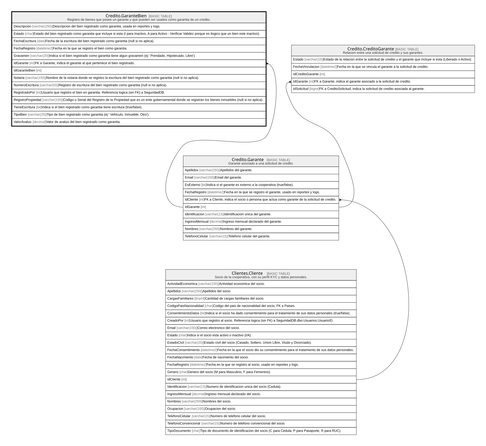

# Credito.GaranteBien

## Description

Registro de bienes que posee un garante y que pueden ser usados como garantia de un credito.

## Columns

| Name              | Type         | Default                                          | Nullable | Children | Parents                               | Comment                                                                                                                                                        |
| ----------------- | ------------ | ------------------------------------------------ | -------- | -------- | ------------------------------------- | -------------------------------------------------------------------------------------------------------------------------------------------------------------- |
| Descripcion       | varchar(250) |                                                  | false    |          |                                       | Descripcion del bien registrado como garantia, usada en reportes y logs.                                                                                       |
| Estado            | char         | (('A') collate SQL_Latin1_General_CP1_CI_AS)     | false    |          |                                       | Estado del bien registrado como garantia que incluye si esta (I para Inactivo, A para Activo - Verificar Validez porque es ilogico que un bien este inactivo). |
| FechaEscritura    | date         |                                                  | true     |          |                                       | Fecha de la escritura del bien registrado como garantia (null si no aplica).                                                                                   |
| FechaRegistro     | datetime2    | (sysdatetime())                                  | false    |          |                                       | Fecha en la que se registro el bien como garantia.                                                                                                             |
| Gravamen          | varchar(20)  | (('Libre') collate SQL_Latin1_General_CP1_CI_AS) | false    |          |                                       | Indica si el bien registrado como garantia tiene algun gravamen (ej:' Prendado, Hipotecado, Libre').                                                           |
| IdGarante         | int          |                                                  | false    |          | [Credito.Garante](Credito.Garante.md) | FK a Garante, indica el garante al que pertenece el bien registrado.                                                                                           |
| IdGaranteBien     | int          |                                                  | false    |          |                                       |                                                                                                                                                                |
| Notaria           | varchar(150) |                                                  | true     |          |                                       | Nombre de la notaria donde se registro la escritura del bien registrado como garantia (null si no aplica).                                                     |
| NumeroEscritura   | varchar(50)  |                                                  | true     |          |                                       | Registro de escritura del bien registrado como garantia (null si no aplica).                                                                                   |
| RegistradoPor     | int          |                                                  | false    |          |                                       | Usuario que registro el bien en garantia. Referencia logica (sin FK) a SeguridadDB.                                                                            |
| RegistroPropiedad | varchar(150) |                                                  | true     |          |                                       | Codigo o Serial del Registro de la Propiedad que es un ente gubernamental donde se registran los bienes inmuebles (null si no aplica).                         |
| TieneEscritura    | bit          | ((0))                                            | false    |          |                                       | Indica si el bien registrado como garantia tiene escritura (true/false).                                                                                       |
| TipoBien          | varchar(20)  |                                                  | false    |          |                                       | Tipo de bien registrado como garantia (ej:' Vehiculo, Inmueble, Otro').                                                                                        |
| ValorAvaluo       | decimal      |                                                  | false    |          |                                       | Valor de avaluo del bien registrado como garantia.                                                                                                             |

## Viewpoints

| Name                      | Definition                                                            |
| ------------------------- | --------------------------------------------------------------------- |
| [Credito](viewpoint-7.md) | Aprobacion de credito, plan de pagos, garantias y politica de riesgo. |

## Constraints

| Name                     | Type        | Definition                                                                                                              |
| ------------------------ | ----------- | ----------------------------------------------------------------------------------------------------------------------- |
| CK_GaranteBien_Avaluo    | CHECK       | CHECK([ValorAvaluo]>=(0))                                                                                               |
| CK_GaranteBien_Escritura | CHECK       | CHECK([TieneEscritura]=(0) OR [NumeroEscritura] IS NOT NULL AND [Notaria] IS NOT NULL AND [FechaEscritura] IS NOT NULL) |
| CK_GaranteBien_Estado    | CHECK       | CHECK([Estado]='A' OR [Estado]='I')                                                                                     |
| CK_GaranteBien_Gravamen  | CHECK       | CHECK([Gravamen]='Libre' OR [Gravamen]='Hipotecado' OR [Gravamen]='Prendado')                                           |
| CK_GaranteBien_Tipo      | CHECK       | CHECK([TipoBien]='Inmueble' OR [TipoBien]='Vehiculo' OR [TipoBien]='Otro')                                              |
| FK_GaranteBien_Garante   | FOREIGN KEY | FOREIGN KEY(IdGarante) REFERENCES Credito.Garante(IdGarante) ON UPDATE NO_ACTION ON DELETE NO_ACTION                    |
| PK_GaranteBien           | PRIMARY KEY | CLUSTERED, unique, part of a PRIMARY KEY constraint, [ IdGaranteBien ]                                                  |

## Indexes

| Name                   | Definition                                                             |
| ---------------------- | ---------------------------------------------------------------------- |
| IX_GaranteBien_Garante | NONCLUSTERED, [ IdGarante ]                                            |
| PK_GaranteBien         | CLUSTERED, unique, part of a PRIMARY KEY constraint, [ IdGaranteBien ] |

## Relations

---

> Generated by [tbls](https://github.com/k1LoW/tbls)
