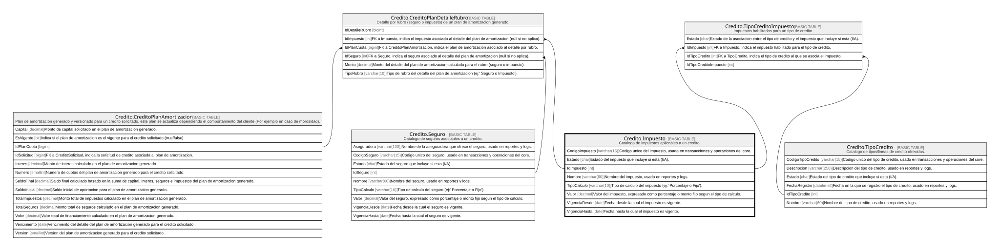

# Credito.Impuesto

## Description

Catalogo de impuestos aplicables a un credito.

## Columns

| Name           | Type        | Default                                      | Nullable | Children                                                                                                                            | Parents | Comment                                                                              |
| -------------- | ----------- | -------------------------------------------- | -------- | ----------------------------------------------------------------------------------------------------------------------------------- | ------- | ------------------------------------------------------------------------------------ |
| CodigoImpuesto | varchar(15) |                                              | false    |                                                                                                                                     |         | Codigo unico del impuesto, usado en transacciones y operaciones del core.            |
| Estado         | char        | (('A') collate SQL_Latin1_General_CP1_CI_AS) | false    |                                                                                                                                     |         | Estado del impuesto que incluye si esta (I/A).                                       |
| IdImpuesto     | int         |                                              | false    | [Credito.CreditoPlanDetalleRubro](Credito.CreditoPlanDetalleRubro.md) [Credito.TipoCreditoImpuesto](Credito.TipoCreditoImpuesto.md) |         |                                                                                      |
| Nombre         | varchar(60) |                                              | false    |                                                                                                                                     |         | Nombre del impuesto, usado en reportes y logs.                                       |
| TipoCalculo    | varchar(10) |                                              | false    |                                                                                                                                     |         | Tipo de calculo del impuesto (ej:' Porcentaje o Fijo').                              |
| Valor          | decimal     |                                              | false    |                                                                                                                                     |         | Valor del impuesto, expresado como porcentaje o monto fijo segun el tipo de calculo. |
| VigenciaDesde  | date        |                                              | false    |                                                                                                                                     |         | Fecha desde la cual el impuesto es vigente.                                          |
| VigenciaHasta  | date        |                                              | true     |                                                                                                                                     |         | Fecha hasta la cual el impuesto es vigente.                                          |

## Viewpoints

| Name                      | Definition                                                            |
| ------------------------- | --------------------------------------------------------------------- |
| [Credito](viewpoint-7.md) | Aprobacion de credito, plan de pagos, garantias y politica de riesgo. |

## Constraints

| Name                   | Type        | Definition                                                            |
| ---------------------- | ----------- | --------------------------------------------------------------------- |
| CK_Impuesto_Calculo    | CHECK       | CHECK([TipoCalculo]='Porcentaje' OR [TipoCalculo]='Fijo')             |
| CK_Impuesto_Estado     | CHECK       | CHECK([Estado]='I' OR [Estado]='A')                                   |
| CK_Impuesto_Porcentaje | CHECK       | CHECK([TipoCalculo]<>'Porcentaje' OR [Valor]<=(100))                  |
| CK_Impuesto_Valor      | CHECK       | CHECK([Valor]>=(0))                                                   |
| CK_Impuesto_Vigencia   | CHECK       | CHECK([VigenciaHasta] IS NULL OR [VigenciaHasta]>[VigenciaDesde])     |
| PK_Impuesto            | PRIMARY KEY | CLUSTERED, unique, part of a PRIMARY KEY constraint, [ IdImpuesto ]   |
| UQ_Impuesto_Codigo     | UNIQUE      | NONCLUSTERED, unique, part of a UNIQUE constraint, [ CodigoImpuesto ] |

## Indexes

| Name               | Definition                                                            |
| ------------------ | --------------------------------------------------------------------- |
| PK_Impuesto        | CLUSTERED, unique, part of a PRIMARY KEY constraint, [ IdImpuesto ]   |
| UQ_Impuesto_Codigo | NONCLUSTERED, unique, part of a UNIQUE constraint, [ CodigoImpuesto ] |

## Relations

---

> Generated by [tbls](https://github.com/k1LoW/tbls)
