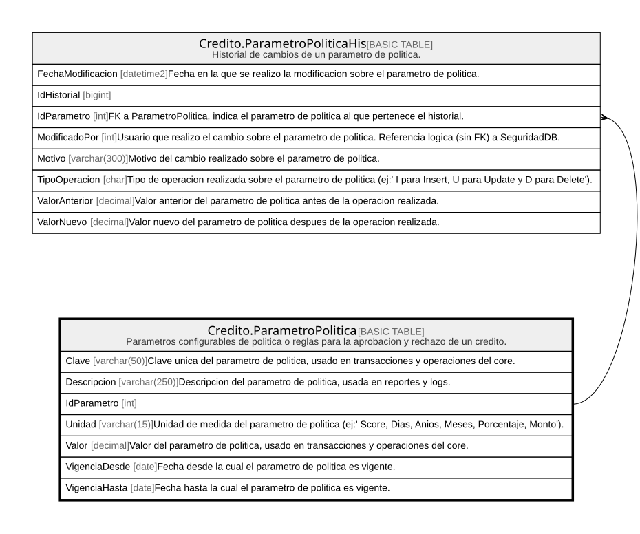

# Credito.ParametroPolitica

## Description

Parametros configurables de politica o reglas para la aprobacion y rechazo de un credito.

## Columns

| Name          | Type         | Default | Nullable | Children                                                        | Parents | Comment                                                                                          |
| ------------- | ------------ | ------- | -------- | --------------------------------------------------------------- | ------- | ------------------------------------------------------------------------------------------------ |
| Clave         | varchar(50)  |         | false    |                                                                 |         | Clave unica del parametro de politica, usado en transacciones y operaciones del core.            |
| Descripcion   | varchar(250) |         | true     |                                                                 |         | Descripcion del parametro de politica, usada en reportes y logs.                                 |
| IdParametro   | int          |         | false    | [Credito.ParametroPoliticaHis](Credito.ParametroPoliticaHis.md) |         |                                                                                                  |
| Unidad        | varchar(15)  |         | false    |                                                                 |         | Unidad de medida del parametro de politica (ej:' Score, Dias, Anios, Meses, Porcentaje, Monto'). |
| Valor         | decimal      |         | false    |                                                                 |         | Valor del parametro de politica, usado en transacciones y operaciones del core.                  |
| VigenciaDesde | date         |         | false    |                                                                 |         | Fecha desde la cual el parametro de politica es vigente.                                         |
| VigenciaHasta | date         |         | true     |                                                                 |         | Fecha hasta la cual el parametro de politica es vigente.                                         |

## Viewpoints

| Name                      | Definition                                                            |
| ------------------------- | --------------------------------------------------------------------- |
| [Credito](viewpoint-7.md) | Aprobacion de credito, plan de pagos, garantias y politica de riesgo. |

## Constraints

| Name                          | Type        | Definition                                                                                                                      |
| ----------------------------- | ----------- | ------------------------------------------------------------------------------------------------------------------------------- |
| CK_ParametroPolitica_Unidad   | CHECK       | CHECK([Unidad]='Score' OR [Unidad]='Dias' OR [Unidad]='Anios' OR [Unidad]='Meses' OR [Unidad]='Porcentaje' OR [Unidad]='Monto') |
| CK_ParametroPolitica_Vigencia | CHECK       | CHECK([VigenciaHasta] IS NULL OR [VigenciaHasta]>[VigenciaDesde])                                                               |
| PK_ParametroPolitica          | PRIMARY KEY | CLUSTERED, unique, part of a PRIMARY KEY constraint, [ IdParametro ]                                                            |

## Indexes

| Name                         | Definition                                                           |
| ---------------------------- | -------------------------------------------------------------------- |
| PK_ParametroPolitica         | CLUSTERED, unique, part of a PRIMARY KEY constraint, [ IdParametro ] |
| UX_ParametroPolitica_Vigente | NONCLUSTERED, unique, [ Clave ]                                      |

## Relations

---

> Generated by [tbls](https://github.com/k1LoW/tbls)
