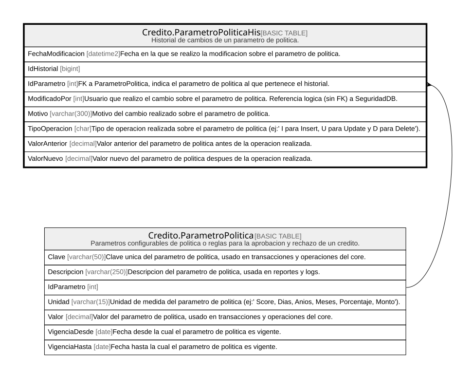

# Credito.ParametroPoliticaHis

## Description

Historial de cambios de un parametro de politica.

## Columns

| Name              | Type         | Default         | Nullable | Children | Parents                                                   | Comment                                                                                                          |
| ----------------- | ------------ | --------------- | -------- | -------- | --------------------------------------------------------- | ---------------------------------------------------------------------------------------------------------------- |
| FechaModificacion | datetime2    | (sysdatetime()) | false    |          |                                                           | Fecha en la que se realizo la modificacion sobre el parametro de politica.                                       |
| IdHistorial       | bigint       |                 | false    |          |                                                           |                                                                                                                  |
| IdParametro       | int          |                 | false    |          | [Credito.ParametroPolitica](Credito.ParametroPolitica.md) | FK a ParametroPolitica, indica el parametro de politica al que pertenece el historial.                           |
| ModificadoPor     | int          |                 | false    |          |                                                           | Usuario que realizo el cambio sobre el parametro de politica. Referencia logica (sin FK) a SeguridadDB.          |
| Motivo            | varchar(300) |                 | true     |          |                                                           | Motivo del cambio realizado sobre el parametro de politica.                                                      |
| TipoOperacion     | char         |                 | false    |          |                                                           | Tipo de operacion realizada sobre el parametro de politica (ej:' I para Insert, U para Update y D para Delete'). |
| ValorAnterior     | decimal      |                 | true     |          |                                                           | Valor anterior del parametro de politica antes de la operacion realizada.                                        |
| ValorNuevo        | decimal      |                 | true     |          |                                                           | Valor nuevo del parametro de politica despues de la operacion realizada.                                         |

## Viewpoints

| Name                      | Definition                                                            |
| ------------------------- | --------------------------------------------------------------------- |
| [Credito](viewpoint-7.md) | Aprobacion de credito, plan de pagos, garantias y politica de riesgo. |

## Constraints

| Name                              | Type        | Definition                                                                                                         |
| --------------------------------- | ----------- | ------------------------------------------------------------------------------------------------------------------ |
| CK_ParametroPoliticaHis_Tipo      | CHECK       | CHECK([TipoOperacion]='I' OR [TipoOperacion]='U' OR [TipoOperacion]='D')                                           |
| FK_ParametroPoliticaHis_Parametro | FOREIGN KEY | FOREIGN KEY(IdParametro) REFERENCES Credito.ParametroPolitica(IdParametro) ON UPDATE NO_ACTION ON DELETE NO_ACTION |
| PK_ParametroPoliticaHis           | PRIMARY KEY | CLUSTERED, unique, part of a PRIMARY KEY constraint, [ IdHistorial ]                                               |

## Indexes

| Name                              | Definition                                                           |
| --------------------------------- | -------------------------------------------------------------------- |
| IX_ParametroPoliticaHis_Parametro | NONCLUSTERED, [ IdParametro, FechaModificacion ]                     |
| PK_ParametroPoliticaHis           | CLUSTERED, unique, part of a PRIMARY KEY constraint, [ IdHistorial ] |

## Relations

---

> Generated by [tbls](https://github.com/k1LoW/tbls)
