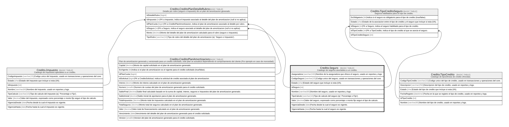

# Credito.Seguro

## Description

Catalogo de seguros asociables a un credito.

## Columns

| Name          | Type         | Default                                      | Nullable | Children                                                                                                                        | Parents | Comment                                                                            |
| ------------- | ------------ | -------------------------------------------- | -------- | ------------------------------------------------------------------------------------------------------------------------------- | ------- | ---------------------------------------------------------------------------------- |
| Aseguradora   | varchar(100) |                                              | true     |                                                                                                                                 |         | Nombre de la aseguradora que ofrece el seguro, usado en reportes y logs.           |
| CodigoSeguro  | varchar(15)  |                                              | false    |                                                                                                                                 |         | Codigo unico del seguro, usado en transacciones y operaciones del core.            |
| Estado        | char         | (('A') collate SQL_Latin1_General_CP1_CI_AS) | false    |                                                                                                                                 |         | Estado del seguro que incluye si esta (I/A).                                       |
| IdSeguro      | int          |                                              | false    | [Credito.CreditoPlanDetalleRubro](Credito.CreditoPlanDetalleRubro.md) [Credito.TipoCreditoSeguro](Credito.TipoCreditoSeguro.md) |         |                                                                                    |
| Nombre        | varchar(60)  |                                              | false    |                                                                                                                                 |         | Nombre del seguro, usado en reportes y logs.                                       |
| TipoCalculo   | varchar(10)  |                                              | false    |                                                                                                                                 |         | Tipo de calculo del seguro (ej:' Porcentaje o Fijo').                              |
| Valor         | decimal      |                                              | false    |                                                                                                                                 |         | Valor del seguro, expresado como porcentaje o monto fijo segun el tipo de calculo. |
| VigenciaDesde | date         |                                              | false    |                                                                                                                                 |         | Fecha desde la cual el seguro es vigente.                                          |
| VigenciaHasta | date         |                                              | true     |                                                                                                                                 |         | Fecha hasta la cual el seguro es vigente.                                          |

## Viewpoints

| Name                      | Definition                                                            |
| ------------------------- | --------------------------------------------------------------------- |
| [Credito](viewpoint-7.md) | Aprobacion de credito, plan de pagos, garantias y politica de riesgo. |

## Constraints

| Name                 | Type        | Definition                                                          |
| -------------------- | ----------- | ------------------------------------------------------------------- |
| CK_Seguro_Calculo    | CHECK       | CHECK([TipoCalculo]='Porcentaje' OR [TipoCalculo]='Fijo')           |
| CK_Seguro_Estado     | CHECK       | CHECK([Estado]='I' OR [Estado]='A')                                 |
| CK_Seguro_Porcentaje | CHECK       | CHECK([TipoCalculo]<>'Porcentaje' OR [Valor]<=(100))                |
| CK_Seguro_Valor      | CHECK       | CHECK([Valor]>=(0))                                                 |
| CK_Seguro_Vigencia   | CHECK       | CHECK([VigenciaHasta] IS NULL OR [VigenciaHasta]>[VigenciaDesde])   |
| PK_Seguro            | PRIMARY KEY | CLUSTERED, unique, part of a PRIMARY KEY constraint, [ IdSeguro ]   |
| UQ_Seguro_Codigo     | UNIQUE      | NONCLUSTERED, unique, part of a UNIQUE constraint, [ CodigoSeguro ] |

## Indexes

| Name             | Definition                                                          |
| ---------------- | ------------------------------------------------------------------- |
| PK_Seguro        | CLUSTERED, unique, part of a PRIMARY KEY constraint, [ IdSeguro ]   |
| UQ_Seguro_Codigo | NONCLUSTERED, unique, part of a UNIQUE constraint, [ CodigoSeguro ] |

## Relations

---

> Generated by [tbls](https://github.com/k1LoW/tbls)
