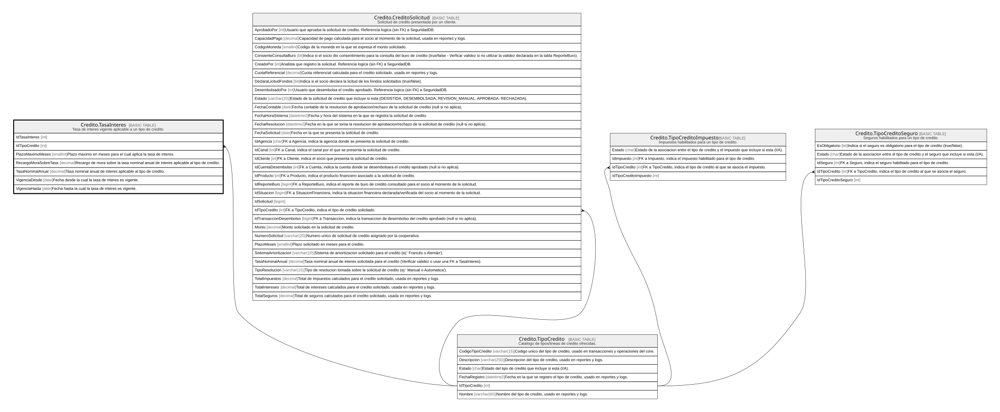

# Credito.TasaInteres

## Description

Tasa de interes vigente aplicable a un tipo de credito.

## Columns

| Name                 | Type     | Default | Nullable | Children | Parents                                       | Comment                                                                              |
| -------------------- | -------- | ------- | -------- | -------- | --------------------------------------------- | ------------------------------------------------------------------------------------ |
| IdTasaInteres        | int      |         | false    |          |                                               |                                                                                      |
| IdTipoCredito        | int      |         | false    |          | [Credito.TipoCredito](Credito.TipoCredito.md) |                                                                                      |
| PlazoMaximoMeses     | smallint |         | false    |          |                                               | Plazo maximo en meses para el cual aplica la tasa de interes.                        |
| RecargoMoraSobreTasa | decimal  | ((0))   | false    |          |                                               | Recargo de mora sobre la tasa nominal anual de interes aplicable al tipo de credito. |
| TasaNominalAnual     | decimal  |         | false    |          |                                               | Tasa nominal anual de interes aplicable al tipo de credito.                          |
| VigenciaDesde        | date     |         | false    |          |                                               | Fecha desde la cual la tasa de interes es vigente.                                   |
| VigenciaHasta        | date     |         | true     |          |                                               | Fecha hasta la cual la tasa de interes es vigente.                                   |

## Viewpoints

| Name                      | Definition                                                            |
| ------------------------- | --------------------------------------------------------------------- |
| [Credito](viewpoint-7.md) | Aprobacion de credito, plan de pagos, garantias y politica de riesgo. |

## Constraints

| Name                       | Type        | Definition                                                                                                       |
| -------------------------- | ----------- | ---------------------------------------------------------------------------------------------------------------- |
| CK_TasaInteres_Plazo       | CHECK       | CHECK([PlazoMaximoMeses]>(0))                                                                                    |
| CK_TasaInteres_Tasa        | CHECK       | CHECK([TasaNominalAnual]>(0) AND [TasaNominalAnual]<=(1))                                                        |
| CK_TasaInteres_Vigencia    | CHECK       | CHECK([VigenciaHasta] IS NULL OR [VigenciaHasta]>[VigenciaDesde])                                                |
| FK_TasaInteres_TipoCredito | FOREIGN KEY | FOREIGN KEY(IdTipoCredito) REFERENCES Credito.TipoCredito(IdTipoCredito) ON UPDATE NO_ACTION ON DELETE NO_ACTION |
| PK_TasaInteres             | PRIMARY KEY | CLUSTERED, unique, part of a PRIMARY KEY constraint, [ IdTasaInteres ]                                           |

## Indexes

| Name                       | Definition                                                             |
| -------------------------- | ---------------------------------------------------------------------- |
| IX_TasaInteres_TipoCredito | NONCLUSTERED, [ IdTipoCredito ]                                        |
| PK_TasaInteres             | CLUSTERED, unique, part of a PRIMARY KEY constraint, [ IdTasaInteres ] |

## Relations

---

> Generated by [tbls](https://github.com/k1LoW/tbls)
